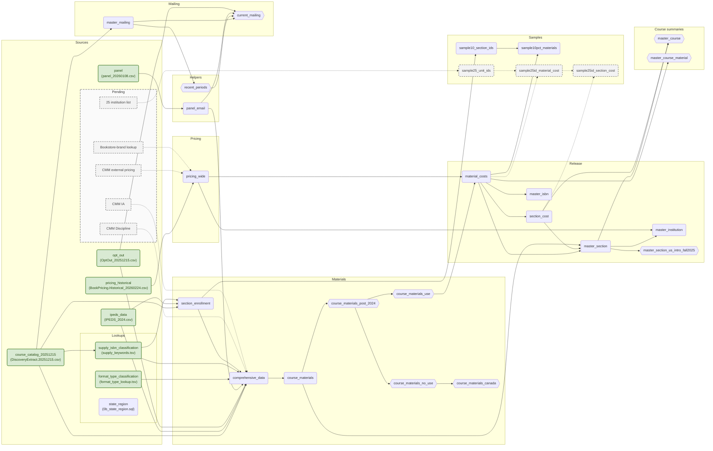

# Data flow

## Exports

```mermaid
flowchart TB
    subgraph course_exports["Materials"]
        direction LR
        course_materials("course_materials")
        materials_post{{"course_materials_post_2024"}}
        materials_use{{"course_materials_use"}}
        materials_nouse{{"course_materials_no_use"}}
        materials_canada{{"course_materials_canada"}}
        course_file["course_materials[_&lt;YYYY_N&gt;]_&lt;YYYYMMDD&gt;.csv"]
        post_file["course_materials_post_2024[_&lt;YYYY_N&gt;]_&lt;YYYYMMDD&gt;.csv"]
        use_file["course_materials_use_post_2024[_&lt;YYYY_N&gt;]_&lt;YYYYMMDD&gt;.csv"]
        nouse_file["course_materials_nouse_post_2024[_&lt;YYYY_N&gt;]_&lt;YYYYMMDD&gt;.csv"]
        canada_file["course_materials_can_post_2024[_&lt;YYYY_N&gt;]_&lt;YYYYMMDD&gt;.csv"]
        course_materials --> course_file
        materials_post --> post_file
        materials_use --> use_file
        materials_nouse --> nouse_file
        materials_canada --> canada_file
    end

    subgraph release_exports["Release"]
        direction LR
        material_costs("material_costs")
        master_section("master_section")
        master_institution("master_institution")
        master_isbn("master_isbn")
        cost_files["40_material_costs_by_term.csv<br/>material_costs_&lt;YYYY_N&gt;_&lt;YYYYMMDD&gt;.csv"]
        section_files["31_master_section.csv<br/>master_section_&lt;YYYY_N&gt;_&lt;YYYYMMDD&gt;.csv"]
        institution_files["35_master_institution_by_term.csv<br/>master_institution_&lt;YYYY_N&gt;_&lt;YYYYMMDD&gt;.csv"]
        isbn_files["36_master_isbn_by_term.csv<br/>master_isbn_&lt;YYYY_N&gt;_&lt;YYYYMMDD&gt;.csv"]
        material_costs --> cost_files
        master_section --> section_files
        master_institution --> institution_files
        master_isbn --> isbn_files
    end

    subgraph course_summary_exports["Course summaries"]
        direction LR
        master_course{{"master_course"}}
        master_course_material{{"master_course_material"}}
        course_files["32_master_course.csv"]
        distribution_files["33_master_course_material.csv"]
        master_course --> course_files
        master_course_material --> distribution_files
    end

    subgraph mailing_exports["Mailing"]
        direction LR
        master_mailing("master_mailing")
        current_mailing{{"current_mailing"}}
        master_file["10_master_mailing.csv"]
        mailing_files["11_current_mailing.csv<br/>11_recent_mailing.csv"]
        geography_files["20_california_mailing.csv<br/>21_texas_mailing.csv<br/>22_florida_mailing.csv<br/>23_newyork_mailing.csv<br/>24_texas_fall_series.csv<br/>25_pennsylvania_mailing.csv<br/>26_canada_mailing.csv<br/>27_other_mailing.csv"]
        master_mailing --> master_file
        current_mailing --> mailing_files
        current_mailing --> geography_files
    end

    subgraph analysis_exports["Analysis"]
        direction LR
        comprehensive("comprehensive_data")
        master_section_analysis("master_section")
        sample10_materials("sample10pct_materials")
        random_file["01_sample_records.csv"]
        faculty_file["30_faculty_records.csv"]
        sample_file["34_sample10pct_materials.csv<br/>sample10pct_materials.parquet"]
        subset_files["fall2025_setA_required.parquet<br/>fall2025_setB_no_required.parquet"]
        comprehensive --> random_file
        comprehensive --> faculty_file
        sample10_materials --> sample_file
        master_section_analysis --> subset_files
    end

    subgraph pending_sample_exports["Pending 25-institution samples"]
        direction LR
        section_cost("section_cost")
        sample25_ids("sample25_unit_ids")
        sample25_material("sample25id_material_cost")
        sample25_section("sample25id_section_cost")
        sample25_material_file["sample25id_material_cost.csv"]
        sample25_section_file["sample25id_section_cost.csv"]
        material_costs -.-> sample25_material
        sample25_ids -.-> sample25_material
        section_cost -.-> sample25_section
        sample25_material -.-> sample25_section
        sample25_section -.-> sample25_section_file
        sample25_material -.-> sample25_material_file
    end

    classDef file fill:#fff2cc,stroke:#9c7227,color:#222;
    class course_file,post_file,use_file,nouse_file,canada_file,cost_files,section_files,course_files,distribution_files,institution_files,isbn_files,master_file,mailing_files,geography_files,random_file,faculty_file,sample_file,subset_files file;
    classDef expected fill:#f3f3f3,stroke:#777,stroke-width:2px,stroke-dasharray:6 4,color:#444;
    class sample25_ids,sample25_material,sample25_section,sample25_material_file,sample25_section_file expected;
```

`YYYY_N` is the term; `YYYYMMDD` is the export date. Brackets mark an optional term suffix.

## Table logic

Arrows above identify inputs. “Section” includes term; grain means one row per key.

| Table / view | Grain | Logic / filter |
|---|---|---|
| `course_catalog_20251215` | Source row | Normalize fields; derive course, section, term IDs. |
| `ipeds_data` | Institution | Import institution attributes. |
| `opt_out` | Source row | Normalize email; retain duplicates. |
| `panel` | Source row | Import response history. |
| `panel_email` | Email | Latest response year; duplicate/year-variant counts. |
| `format_type_classification` | FormatType | Map OER/IA. |
| `state_region` | State/province | Map reporting region; query-time only. |
| `supply_isbn_classification` | ISBN | Apply CMM-owned title rules to 2024+ ISBNs. |
| `section_enrollment` | Section | From source catalog/IPEDS/supply classification; direct requiredness and enrollment assignment. |
| `comprehensive_data` | Source row | Add institution, contact, classification, section context, required-inference, population fields. |
| `course_materials` | Section × ISBN | Deterministic representative; retain conflicts/counts and one NULL-ISBN row per section. |
| `course_materials_post_2024` | Section × ISBN | 2024+ export/report boundary. |
| `course_materials_use` | Section × ISBN | Use filter below. |
| `course_materials_no_use` | Section × ISBN | Remaining 2024+ rows. |
| `course_materials_canada` | Section × ISBN | NoUse with state `CAN`. |
| `pricing_historical` | Section × ISBN × option × condition × format × rental term | Remove exact/instructor-only duplicates; latest dated offer. |
| `pricing_wide` | Section × ISBN | Pivot offers; no catalog enrichment. |
| `material_costs` | Use section × ISBN | Exact LEFT join; retain unmatched/unpriced items. |
| `section_cost` | Material-bearing section | Sum required/optional and buy-only price bounds. |
| `master_section` | Material-bearing section | Combine items, costs, assigned enrollment, excluded-row counts. |
| `master_course` | Course × term | Auxiliary section/cost summary. |
| `master_course_material` | Course × term × publisher × status | Auxiliary publisher/status distribution. |
| `master_institution` | Institution × term | Roll up sections; same-term bookstore URL; retain unknown institution. |
| `master_isbn` | ISBN × term | Roll up material rows. |
| `sample10_section_ids` | Section | Internal fixed 10% hash membership. |
| `sample10pct_materials` | Section × ISBN | Selected section clusters from `material_costs`. |
| `master_section_us_intro_fall2025` | Section | Fall 2025; required-bearing; introductory/intermediate; nonblank, non-Canada state. |
| `master_mailing` | Email | Nonblank; newest term, largest enrollment, stable tie-breakers. |
| `recent_periods` | Term | Newest 12 terms represented after `master_mailing` selection. |
| `current_mailing` | Email | Recent terms; add history; exclude opt-outs. |

### Use filter

2024+, non-Canada, ISBN present; exclude supplies, `*No Book Details*`,
`*No Books Required*`, and other no-material placeholders. Any qualifying source row admits
the key; conflicts remain recorded. Pre-2024 rows stay upstream. Exclusion reasons may overlap.

### Reading results

- `section_enrollment` includes sections without materials; `master_section` does not.
- Exact section × ISBN matching only; no normalization or broader-key fallback.
- Match ≠ valid price. NULL price/cost ≠ zero.
- `price_avg = (price_min + price_max) / 2`, not mean offer price.
- Enrollment-weighted results must report `enrollment_source`.

## Metabase

| Reports | Tables / views |
|---|---|
| Release | `material_costs`, `master_section`, `master_institution`, `master_isbn`, `master_section_us_intro_fall2025` |
| Populations | `course_materials` and its routing views; `section_enrollment` |

Geographic reports join `state_region` at query time.

## Pending

| Item | Boundary |
|---|---|
| CMM Discipline | Department mapping; keys/normalization await lookup. |
| CMM IA | Campus availability, distinct from FormatType IA; grain/dates/precedence unresolved. |
| CMM external pricing | Feed the pricing-wide stage; fields/grain await source. |
| Bookstore-brand lookup | Enrich `pricing_wide`; key and file scope await lookup. |
| 25 institution list | Feed `sample25id_material_cost` and `sample25id_section_cost`; #60. |
| Course summaries | #24: retain, rename, or retire; publisher/status seats are non-additive and blank publishers are excluded. |

Refreshes reuse existing source boxes. Missing arrows mean destination undecided.
“Keep History” is a pending retention decision, not a source.
