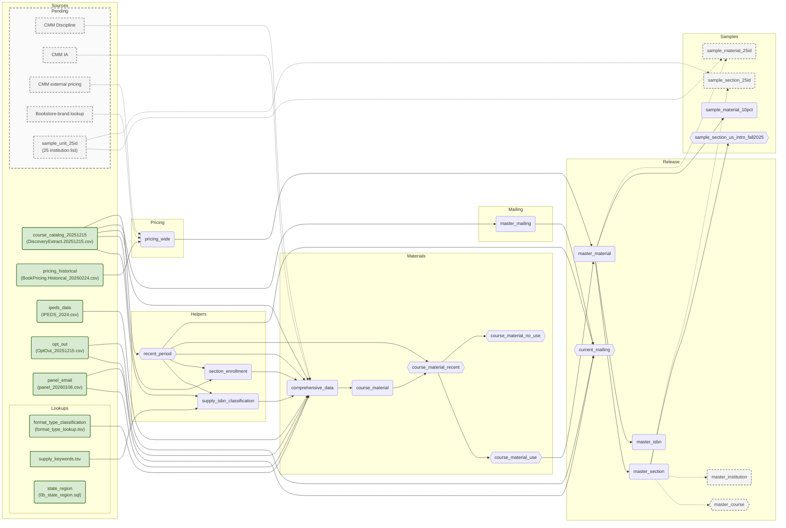

# Data flow

## Sources

- `course_catalog_20251215`: BMG source rows; normalize fields/email and derive course, section, and term IDs. Keep duplicate/contact rows.
- `pricing_historical`: BMG bookstore observations; normalization and deduplication below.
- `ipeds_data`: institution attributes, joined by UNITID.
- `opt_out`: BVA exclusions, matched by cleaned email.
- `panel_email`: BVA history grouped by cleaned email; latest response year and source/variant counts.

### Lookups

`format_type_classification` maps FormatType to OER/IA. `supply_keywords.tsv` contains title
rules, not ISBN assignments. `state_region` maps catalog state codes to reporting regions at query time.

### Pending inputs

| Source | Intended destination |
|---|---|
| CMM Discipline | Department mapping in `comprehensive_data`; keys pending (#52). |
| CMM IA | Campus availability in `comprehensive_data`; distinct from FormatType IA; rules pending (#57). |
| CMM external pricing | `pricing_wide`; fields/grain pending (#23). |
| Bookstore-brand lookup | `pricing_wide`; key/scope pending (#72). |
| 25 institution list | Imported `sample_unit_25id`; sample outputs below (#60). |

Source refreshes reuse existing boxes. History retention is a separate pending decision (#76).

## Logic

### Materials

1. `recent_period` selects the newest 12 distinct non-NULL catalog terms. Materials and mailing share this window; older terms remain upstream.
2. `supply_isbn_classification` applies the title rules to recent catalog ISBN/title variants, producing one classified row per ISBN.
3. `section_enrollment` groups recent catalog sections, including those without materials. It takes maximum reported enrollment/seats and finds sibling availability; no IPEDS or supply dependency.
4. `comprehensive_data` enriches every source row with lookups, institution/contact history, section enrollment, and classification flags. Contact history does not filter materials.
5. `course_material` groups by term × section × ISBN. Require non-NULL term/section; retain `UNKNOWN` ID components and one NULL-ISBN group per section when present. Keep source counts and metadata/contact conflicts; choose a deterministic representative. Both tables remain: source-row and item grain serve different reports.

Enrollment assignment happens in `comprehensive_data`: own enrollment → own usable seats
(`<9999`) → course/term medians (enrollment, then seats) → control/level/term median →
level/term median → NULL. Reference medians use intro/intermediate/non-degree/uncategorized
courses at public, nonprofit, or for-profit two-/four-year institutions.
Carry `enrollment_assigned` and `enrollment_source` downstream.

`is_required_direct` means literal required, non-supply evidence. Within recent terms,
`is_required_inferred` selects required rows when their section has direct evidence;
otherwise it selects NULL-status rows. Item booleans combine source evidence with `BOOL_OR`;
conflict flags record disagreement.

`course_material_recent` applies the shared window. `course_material_use` keeps keys with
any source row that is non-Canada, ISBN-present, non-supply, and not `*No Book Details*`,
`*No Books Required*`, or supply category `placeholder_no_material`.
`course_material_no_use` is the remaining recent-term population. Exclusions
may overlap; both routing flags are false outside the window.

### Pricing

`pricing_historical` removes exact duplicates, combines instructor-only variants, then
keeps the latest observation per section × ISBN × option × condition × format × rental term.
It retains source status and identifiers; catalog-derived classifications do not feed back.

`pricing_wide` pivots to one section × ISBN row. Prices `>=9999` become NULL; each of the
18 offer cells uses `MAX(price)`. Preserve rental-term bounds, offered-format counts,
buy/rent availability, and bookstore URL. `price_avg = (price_min + price_max) / 2`, not mean offer price.

### Mailing

`master_mailing` selects one raw catalog row per nonblank email: newest term, largest
enrollment, then stable tie-breakers. It keeps separate co-instructor emails, independently
of material deduplication. `current_mailing` restricts those contacts to `recent_period`,
adds `panel_email` history, and excludes any matching `opt_out` email.

### Release

- `master_material`: LEFT-enrich every Use item from `pricing_wide` by exact section × ISBN; retain unmatched/unpriced items. [Encoding mismatch remains unresolved](PRICING-CATALOG-MATCHING.md).
- `master_section`: group `master_material` by section; count materials/classifications and sum per-item price bounds, split by inferred required/optional and all-offer/buy-only cost. NULL price/cost is not zero. Inherit enrollment and section audit values once, never sum their repeated copies.
- `master_isbn`: group `master_material` by term × ISBN; summarize adoptions, institutions, enrollment, metadata conflicts, and price-cell availability.
- Dashed `master_course`, `master_institution`: executable provisional section rollups by term × course/institution; final definitions remain pending (#87).

Section bookstore URL is the most frequent nonblank item URL; institution URL is the
most frequent section URL. Ties resolve lexically; NULL-institution URLs remain NULL.

## Samples & exports

| Sample | Selection |
|---|---|
| `sample_material_10pct` | Direct `master_material` sample: first 64 MD5 bits of section ID modulo 10 = 0; keep whole sections. |
| `sample_section_us_intro_fall2025` | `master_section`: Fall 2025, required-bearing, intro/intermediate, nonblank non-Canada state. |
| `sample_material_25id`, `sample_section_25id` | Pending: filter masters by imported `sample_unit_25id`. |

### Files

`YYYY_N` is the term; `YYYYMMDD` is the export date. Brackets mark an optional term suffix.

Canada files filter NoUse by `is_canada`. Geographic mailing files directly filter
`current_mailing`; NULL/blank/other states go to Other. The Texas Fall-series file is
a separate subset, not another partition. The 10% sample is not the random 10,000-row
`01_sample_records` export. Draft master exports remain executable; dashed 25-institution
outputs do not exist yet.

### Reports

| Reports | Tables / views |
|---|---|
| Release | `master_material`, `master_section`, `master_course`, `master_institution`, `master_isbn`, `current_mailing` |
| Samples | `sample_material_10pct`, `sample_section_us_intro_fall2025` |
| Populations | `course_material` and its routing views; `section_enrollment` |
| Source-row lineage/diagnostics | `comprehensive_data`, raw catalog, `pricing_historical`, DQ snapshots |

Geographic reports join `state_region` at query time.

The diagram describes staged SQL, not the live database. Deployment is held.
