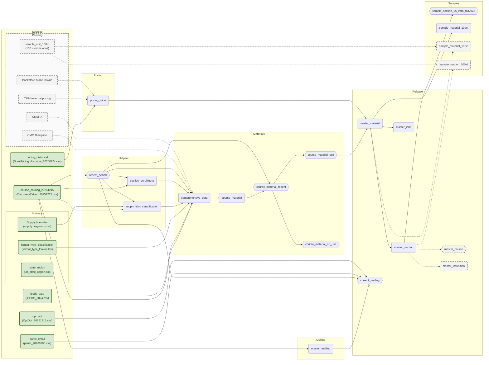

# Data Flow

Staged: #95 ISBN price bounds and #96 mailing-only contact history; the live database and dictionary await rebuild.

## Sources

### course_catalog_20251215

- **Unit of analysis (group by):** Imported source rows; no grouping or deduplication.
- **Joins:** None.
- **Filters (WHERE/HAVING):** None; configured NULL markers are converted during import.
- **Derivations:**

  - Import `DiscoveryExtract.20251215.csv`; treat empty strings, `N/A`, and `Not applicable` as NULL. Keep source rows, including duplicate/contact variants.
  - Copy book fields such as `ISBN13`, `Title`, and `FormatType`; rename `IPED ID → unit_id`, `Dept Code → dept_code`, `Course Number → course_number`, and `Section → section`. Set `book_status = LOWER(TRIM("Book Status"))`; use `TRY_CAST` to produce integer `enrollments` and `seats_taken`, with invalid values becoming NULL.
  - Clean `E-Mail → email`: extract addresses from `email:` / `email ` text, take the first space-separated address when multiple appear, otherwise remove interior spaces from address-like values; then lowercase and trim.
  - Derive `period_sortable` from `Period`: Winter/Spring/Summer/Fall become `YYYY-1/2/3/4`; `period_date` uses January/April/July/October 1. Unrecognized periods yield NULL.
  - Build `course_id` from `IPED ID::Dept Code::Course Number`; append `::Section::period_sortable` for `section_id`. Trim department/course/section components and replace missing components with `UNKNOWN`.

### pricing_historical

- **Unit of analysis (group by):** One latest normalized row per `(section_id, isbn13, book_option, book_condition, book_format, rental_days)`, after exact and instructor-only deduplication.
- **Joins:** None.
- **Filters (WHERE/HAVING):** Keep `ROW_NUMBER() = 1` per offer key by latest `pricing_date`; no catalog classification filter.
- **Derivations:**

  - Import `BookPricing.Historical_20260224.csv`; trim text, rename `IPEDSID → unit_id`, `Address → bookstore_url`, and `Book Pricing Date → pricing_date`; cast prices/dates/rental lengths with `TRY_CAST` and lowercase `book_status`, `book_option`, `book_condition`, and `book_format`.
  - Build IDs/terms with the catalog's formulas, using pricing `IPEDSID`, `Department Code`, `Course Code`, `Section Code`, and `Period`. Source encodings are not reconciled between files (#21).
  - Remove duplicate normalized rows with `DISTINCT`; group rows equal in every field except `instructor_name`, combining names with ordered `STRING_AGG(DISTINCT instructor_name, ', ')`.
  - Keep `ROW_NUMBER() = 1` per `(section_id, isbn13, book_option, book_condition, book_format, rental_days)`, ordered by `pricing_date DESC NULLS LAST`. Same-date ties have no further ordering; each offer's latest date is independent, not a shared snapshot.
  - Set source `required` from `book_status = 'required'`; retain raw status and identifiers without joining catalog classifications. Cross-snapshot history is not implemented.

### ipeds_data

- **Unit of analysis (group by):** Imported institution source rows; no grouping.
- **Joins:** None.
- **Filters (WHERE/HAVING):** None; configured unavailable-value markers are converted to NULL.
- **Derivations:**

  - Import `IPEDS_2024.csv`; use `TRY_CAST` for integer `UNITID → unitid`, `Enroll_24 → enroll_24`, and `DistEnroll_24 → dist_enroll_24`.
  - Retain institution descriptors as text: `INSTNM → instnm`, `SECTOR → sector`, `ICLEVEL → iclevel`, `CONTROL → control`, `INSTSIZE → instsize`, and `InstType → inst_type`. Empty strings, `N/A`, `Not applicable`, `{Not available}`, and `Sector unknown (not active)` become NULL.

### opt_out

- **Unit of analysis (group by):** Imported opt-out source rows; no grouping or email deduplication.
- **Joins:** None.
- **Filters (WHERE/HAVING):** None.
- **Derivations:**

  - Import `OptOut_20251215.csv`: `LOWER(TRIM(Email)) → email`, `Source → source`. The import does not deduplicate email rows.

### panel_email

- **Unit of analysis (group by):** One row per cleaned `email`.
- **Joins:** None.
- **Filters (WHERE/HAVING):** None.
- **Derivations:**

  - Import `panel_20260108.csv` into temporary staging: `LOWER(TRIM(Unique)) → email`, `Year → response_year`.
  - Group by `email`: `MAX(response_year) → panel_response_year`, `COUNT(*) → panel_source_row_count`, and `COUNT(DISTINCT response_year) → panel_response_year_variant_count`. The year label remains text, so its maximum is lexical, not numeric.

### Lookups

#### format_type_classification

- **Unit of analysis (group by):** Imported lookup rows keyed by source-owned `FormatType`; no grouping.
- **Joins:** None.
- **Filters (WHERE/HAVING):** None.
- **Derivations:**

  - Import `format_type_lookup.tsv`: rename `format_type → FormatType`, cast `is_oer` and `is_ia` to BOOLEAN, and retain `oer_category` / `ia_category` for the catalog lookup join.

#### state_region

- **Unit of analysis (group by):** One fixed lookup row per `state`; no grouping.
- **Joins:** None during creation; reports later join on `state`.
- **Filters (WHERE/HAVING):** None.
- **Derivations:**

  - Insert the fixed `(state, region, division)` rows defined in `0b_state_region.sql`; `CAN` gets `'Other'` for both region and division. Reports join on `state`; no catalog join populates this lookup.

#### supply_keywords.tsv

- **Unit of analysis (group by):** One keyword rule per file row; no persistent table.
- **Joins:** Read directly during supply classification; match `pattern` against material titles.
- **Filters (WHERE/HAVING):** `kind = 'include'` supplies candidates; `kind = 'exclude'` vetoes matches.
- **Derivations:** Matching include rules supply `category`.

### Pending inputs

#### CMM Discipline

- Department mapping in `comprehensive_data`; keys pending (#52).

#### CMM IA

- Campus availability keyed by `UNITID`; distinct from FormatType IA. File and rules pending (#57).

#### OER-ready list

- ISBN-keyed input announced; meaning and integration point pending (#101). Not equivalent to FormatType `is_oer`.

#### CMM external pricing

- Feeds `pricing_wide`; fields/grain pending (#23).

#### Bookstore-brand lookup

- Feeds `pricing_wide`; key/scope pending (#72).

#### sample_unit_100id

- Received `CMM_100Inst_Regions_Compacts.xlsx`, sheet `Select100`: 100 unique UNITIDs. Import and sample outputs remain pending (#60).

#### Region / compact lookup

- Received the workbook's `Compact-Region` sheet: 52 codes, with overlapping ND/SD memberships. Import, column names, and missing-value rules remain pending (#98); current `state_region` is unchanged.

## Logic

### Helpers

#### recent_period

- **Unit of analysis (group by):** One row per distinct non-NULL `course_catalog_20251215.period_sortable`; no aggregate grouping.
- **Joins:** None.
- **Filters (WHERE/HAVING):** Require non-NULL `period_sortable`; retain the newest 12 terms by descending order and `LIMIT 12`.
- **Derivations:**

  - Select distinct `course_catalog_20251215.period_sortable` where non-NULL, order descending, and `LIMIT 12`; expose only `period_sortable` as a view.
  - Materials, mailing, supply classification, and section enrollment use this shared membership filter; it does not delete older catalog rows.

#### supply_isbn_classification

- **Unit of analysis (group by):** One selected classification per `isbn13`, after grouping source rows by `(ISBN13, LOWER(Title))`.
- **Joins:** INNER JOIN lowered catalog titles to include rules from `supply_keywords.tsv`; exclude-rule matches are tested against the same titles.
- **Filters (WHERE/HAVING):** Require non-NULL `ISBN13` and `Title`, membership in `recent_period`, an include match, and no exclude match.
- **Derivations:**

  - Read `course_catalog_20251215` where `ISBN13` and `Title` are non-NULL and `period_sortable` belongs to `recent_period`; group by `(ISBN13, LOWER(Title))`, counting source rows per title variant.
  - INNER JOIN lowered titles to include rules from `supply_keywords.tsv` with `title LIKE '%' || pattern || '%'`; reject a title when any exclude rule matches the same way.
  - Select one match per title, then one title per `isbn13`: prefer specific patterns over `>supply<` / `>suppy<`, then longest pattern, then stable lexical ties. Output `title`, `matched_pattern`, and `category`; `n_rows` sums source rows across matching title variants only.
  - Only classified ISBNs enter this table. Downstream joins use `isbn13` without a period key, applying the classification to all catalog history.

#### section_enrollment

- **Unit of analysis (group by):** One recent-section row per `section_id`, with sibling availability aggregated by `(course_id, period_sortable)`.
- **Joins:** Join sibling counts back to sections with NULL-safe equality on `course_id` and `period_sortable`; no IPEDS or supply join.
- **Filters (WHERE/HAVING):** Require non-NULL `section_id` / `period_sortable` and membership in `recent_period`; do not require a material adoption.
- **Derivations:**

  - Read `course_catalog_20251215` with non-NULL `section_id` / `period_sortable` and term membership in `recent_period`; group by `section_id`, including sections with no material adoption.
  - Set `enrollments = MAX(enrollments)` and `seats_taken = MAX(seats_taken)`; retain `unit_id`, `course_id`, and `period_sortable` with `ANY_VALUE`. Select modal `course_level`, breaking ties lexically.
  - Set `has_enrollment` from non-NULL maximum enrollment and `has_enrollment_own_seats` from non-NULL maximum seats `<9999`.
  - Group section flags by `(course_id, period_sortable)` to count available enrollments/seats. Join counts back with NULL-safe equality on both keys; set `has_enrollment_sibling` / `has_enrollment_sibling_seats` when the count minus this section's own flag exceeds zero. No IPEDS or supply join occurs here.

### Materials

#### comprehensive_data

- **Unit of analysis (group by):** Enriched `course_catalog_20251215` source rows; no item grouping or source-row deduplication. Canonical section × ISBN × term grouping begins in `course_material` below; field-variation decisions remain in #94.
- **Joins:** LEFT JOIN classification, supply, IPEDS, recent-section context, and enrollment-median helpers on the keys detailed below; unmatched catalog rows remain.
  - Join `format_type_classification` on catalog `FormatType = FormatType`; copy `is_oer`, `is_ia`, `oer_category`, and `ia_category`.
  - Join `supply_isbn_classification` on catalog `ISBN13 = isbn13`; copy `category → supply_category` and detect supply-match presence.
  - Join `ipeds_data` on catalog `unit_id = unitid`; copy `instnm → institution_name`, `iclevel → level`, `instsize → size`, `enroll_24 → enrollment_2024`, `dist_enroll_24 → distance_enrollment_2024`, `inst_type → institution_type`, `sector`, and `control`.
  - Build assignments from `section_enrollment`, LEFT JOINing `ipeds_data` on `unit_id = unitid`; LEFT JOIN the result to catalog on `(period_sortable, section_id)` as `section_*` context.
  - LEFT JOIN reference medians on `(course_id, period_sortable)`, `(control, iclevel, period_sortable)`, and `(iclevel, period_sortable)`; LEFT JOIN direct-required section evidence on `(period_sortable, section_id)`.
- **Filters (WHERE/HAVING):** None on output rows. Recent-term, reference-population, and valid-seat predicates only build helper context or labels; Use/NoUse flags label rather than exclude rows.
- **Derivations:**

  - Set lookup categories to their matched values or `'unknown'`; unmatched rows retain NULL OER/IA booleans. Set `is_supply` from match presence. Older rows without recent-section context retain raw `enrollments` / `seats_taken` but get NULL section context.
  - Compute reference medians from intro/general undergraduate, intermediate undergraduate, non-degree credit, or uncategorized sections at public/nonprofit/for-profit two-/four-year institutions.
  - Set `section_enrollment_assigned` to the rounded first non-NULL value: section `enrollments` → section `seats_taken` if `<9999` → course median enrollment → course median valid seats → control/level median enrollment → level median enrollment. Set `section_enrollment_source` respectively to `own`, `own_seats`, `sibling_enroll`, `sibling_seats`, `class_median`, `level_median`, or `none` when all are missing.
  - Set `is_required_direct = COALESCE(book_status = 'required' AND NOT is_supply, FALSE)`; combine recent section evidence with `BOOL_OR` as `is_section_required_direct`.
  - Set `is_required_inferred` TRUE only in `recent_period`: use `book_status = 'required'` when `is_section_required_direct` is TRUE, or `book_status IS NULL` when it is FALSE. This inference does not itself exclude supply rows; the Use filter does.

  - Derive `is_recent` from `period_sortable` membership in `recent_period`; `has_isbn` from `ISBN13 IS NOT NULL`; `has_formattype` from nonblank `FormatType`; `has_enrollment` from non-NULL `enrollments`; and `has_enrollment_own_seats` from non-NULL `seats_taken <9999`.
  - Derive `is_canada` from `state = 'CAN'`, `no_details` from `Title = '*No Book Details*'`, and `no_materials` from `Title = '*No Books Required*'` or `supply_category = 'placeholder_no_material'`; missing evidence becomes FALSE.
  - Set `is_course_material_use = is_recent AND NOT is_canada AND has_isbn AND NOT is_supply AND NOT no_details AND NOT no_materials`. Set `is_course_material_no_use` for the other recent rows; both flags are FALSE outside the window. These flags label rows here, not remove them.

#### course_material

- **Unit of analysis (group by):** One canonical row per `(period_sortable, section_id, ISBN13)` from enriched source rows, with `ISBN13 → isbn13`; representative selection supplies descriptive fields while aggregates retain group evidence.
- **Joins:** Rejoin aggregates to representatives on term/section and NULL-safe ISBN; join section aggregates on `(period_sortable, section_id)` and shared ISBN metadata on `(period_sortable, ISBN13)`.
- **Filters (WHERE/HAVING):** Require non-NULL `period_sortable` and `section_id`; retain `UNKNOWN` ID components, one NULL-ISBN audit group per section, and all Use/NoUse classifications. Rejected keys remain in `comprehensive_data` and DQ.
- **Derivations:**

  - Select one representative per group: `is_course_material_use DESC`, then `is_required_inferred DESC`, then `book_status`, book, institution, course, and contact fields ascending with NULLs last. Copy its descriptive columns, including `Title → book_title`, `Author → author`, `Publisher → publisher`, and `FormatType → format_type`.
  - Combine source-row booleans with `BOOL_OR`, not the representative's value. Set `is_optional_or_recommended_direct` from any `book_status IN ('option', 'recommended')`; preserve `is_section_required_direct` across items.
  - Set `is_course_material_use` when any source row passes the upstream Use flag; set `is_course_material_no_use = is_recent AND NOT is_course_material_use`. Mixed-source groups can therefore be Use while also carrying an exclusion flag such as `is_supply`.
  - Derive `source_row_count = COUNT(*)` and filtered Use/NoUse counts. Set `population_classification_conflict` when both filtered counts exceed zero; boolean conflict fields compare `BOOL_OR` with `BOOL_AND`.
  - Count distinct nonblank trimmed book/status/contact values per item as `*_variant_count`; set `catalog_metadata_conflict` or `contact_metadata_conflict` when any corresponding count exceeds one. Rejoin item aggregates to representatives on term/section and NULL-safe ISBN equality.
  - Prefer inherited `section_*` context over representative values with `COALESCE` for `course_id`, `course_level`, `enrollments`, `seats_taken`, institution `sector` / `level` / `control`, and enrollment-presence flags. Copy `section_enrollment_assigned → enrollment_assigned` and `section_enrollment_source → enrollment_source` without replacing raw counts.
  - Group canonical items by `(period_sortable, section_id)` and join those counts/flags back on both keys: `section_course_material_no_use_count`, `section_no_details_count`, `section_no_materials_count`, `section_supply_count`, `is_section_canada`, and `is_section_supply`.
  - Set `is_null_isbn_audit = isbn13 IS NULL`; set `has_nonnull_isbn_in_section` from any non-NULL ISBN in the section, and `is_no_adoption_section` when this is a NULL-ISBN row with no non-NULL sibling.
  - From valid-key `comprehensive_data` Use rows, group by `(period_sortable, ISBN13)`; take `MIN` of nonblank trimmed `Title`, `Author`, and `Publisher` as `isbn_book_title`, `isbn_author`, and `isbn_publisher`, plus distinct variant counts. LEFT JOIN these shared ISBN fields on term/ISBN.

#### course_material_recent

- **Unit of analysis (group by):** Same canonical `(period_sortable, section_id, isbn13)` grain as `course_material`; no grouping.
- **Joins:** INNER JOIN `course_material` to `recent_period` on `period_sortable`.
- **Filters (WHERE/HAVING):** Require `course_material.is_recent` TRUE.
- **Derivations:**

  - Retain `course_material.*` unchanged.

#### course_material_use

- **Unit of analysis (group by):** Same canonical `(period_sortable, section_id, isbn13)` grain as `course_material_recent`; no grouping.
- **Joins:** None.
- **Filters (WHERE/HAVING):** Require `is_course_material_use` TRUE.
- **Derivations:**

  - Retain all columns and reuse the canonical flag rather than reapplying exclusions to representative fields.

#### course_material_no_use

- **Unit of analysis (group by):** Same canonical `(period_sortable, section_id, isbn13)` grain as `course_material_recent`; no grouping.
- **Joins:** None.
- **Filters (WHERE/HAVING):** Require `is_course_material_no_use` TRUE.
- **Derivations:**

  - Retain all columns; this is the complement of Use at canonical item grain, including NULL-ISBN audit groups.

### Pricing

#### pricing_wide

- **Unit of analysis (group by):** One row per `(section_id, isbn13)` from `pricing_historical`.
- **Joins:** None.
- **Filters (WHERE/HAVING):** No source rows are excluded; prices `>=9999` become NULL within aggregates.
- **Derivations:**

  - Take `MAX` of `unit_id`, `institute`, `bookstore_url`, `title`, `author`, `publisher`, and `edition`; set `required = BOOL_OR(required)`.
  - Populate 18 `price_<buy|rental>_<new|used|na>_<physical|digital|na>` cells with `MAX(price)` filtered on the corresponding `book_option`, `book_condition`, and `book_format`; `na` means SQL NULL. Rental lengths collapse within each cell rather than producing separate columns.
  - Set `format_count` to the distinct count of `(book_option, book_condition, book_format)` for buy/rental rows; `has_buy` / `has_rent` use `BOOL_OR(book_option = 'buy' / 'rental')`. These measure offers even when prices are NULL.
  - Derive `price_min = MIN(price)`, `price_max = MAX(price)`, and `price_avg = (MIN(price) + MAX(price)) / 2.0`, not `AVG(price)`. Use filtered MIN/MAX for `price_buy_min` / `price_buy_max` on buy rows and `rental_days_min` / `rental_days_max` on rental rows; all-missing price inputs remain NULL.

### Mailing

#### master_mailing

- **Unit of analysis (group by):** One representative source row per cleaned `email`.
- **Joins:** None.
- **Filters (WHERE/HAVING):** Require non-NULL, nonblank `email`; do not apply `recent_period`, panel history, or opt-outs here.
- **Derivations:**

  - Select one complete contact/course row with `FIRST(struct_pack(...))`, ordered by `period_sortable DESC`, `enrollments DESC`, then institution/course/section/contact fields ascending, all with NULLs last. This keeps fields from the same source row and separate co-instructor emails in separate groups.
  - Project that row's contact, institution, course, term, and enrollment columns; do not join history/opt-outs or apply `recent_period` here.

### Release

#### master_material

- **Unit of analysis (group by):** One canonical Use row per `(period_sortable, section_id, isbn13)`; no further grouping.
- **Joins:** LEFT JOIN `pricing_wide` on exact `section_id` and `CAST(course_material_use.isbn13 AS VARCHAR) = pricing_wide.isbn13`; no fallback match.
- **Filters (WHERE/HAVING):** Start with every `course_material_use` row; unmatched and matched-without-valid-price items remain.
- **Derivations:**

  - Carry catalog/classification/requiredness/enrollment/audit fields from `course_material_use`; add pricing `bookstore_url`, the 18 offer cells, `format_count`, `has_buy`, `has_rent`, price bounds/midrange, and rental-day bounds from `pricing_wide`.
  - Set `has_pricing_match = pricing_wide.section_id IS NOT NULL`. Unmatched items remain with NULL pricing fields; matched rows with no valid prices remain distinguishable.

#### master_section

- **Unit of analysis (group by):** One material-bearing section per `(period_sortable, section_id)` from `master_material`.
- **Joins:** Rejoin staged aggregates on `(period_sortable, section_id)`; no upstream table beyond `master_material`.
- **Filters (WHERE/HAVING):** No section rows are filtered after grouping; aggregate-specific predicates select required, priced, publisher, and URL inputs.
- **Derivations:**

  - Group `master_material` by `(period_sortable, section_id)`; retain inherited institution/enrollment/audit fields with `ANY_VALUE`, not SUM. Select modal `school`, `department`, `course_number`, `section`, `course_title`, and `course_subject`.
  - Set `material_count = COUNT(*)`; `required_count` counts `is_required_inferred` rows and `optional_count` counts the rest. Their `*_priced_count` counterparts additionally require `price_min IS NOT NULL`. Count `is_oer`, `is_ia`, `has_isbn`, and `has_formattype` rows as `oer_count`, `ia_count`, `isbn_count`, and `classified_count`.
  - Combine `is_oer`, `is_ia`, `has_isbn`, and `has_formattype` with `COALESCE(BOOL_OR(...), FALSE)`; derive `is_required_direct` from upstream `is_section_required_direct`, not item requiredness. Copy `section_*` audit counts/flags to `course_material_no_use_count`, `no_details_count`, `no_materials_count`, `supply_count`, `is_canada`, and `is_supply`.
  - Build `publishers = LIST(DISTINCT publisher)` over non-NULL publishers; filter by `is_required_inferred` for `required_publishers` and distinct required-publisher counts. Rejoin staged aggregates on `(period_sortable, section_id)`: INNER JOIN modal descriptors, LEFT JOIN publisher lists and selected URLs.
  - Count nonblank `bookstore_url` values within term/section; take the highest frequency, then lexical first URL on ties. Only `master_material` items participate, not unmatched pricing-only observations.
  - For items where `is_required_inferred`, sum `price_min`, `price_max`, `price_buy_min`, and `price_buy_max` into `required_price_min`, `required_price_max`, `required_price_buy_min`, and `required_price_buy_max`. Sum the same inputs without that filter into the four `all_*` bounds.
  - Derive `required_price_avg = (required_price_min + required_price_max) / 2.0` and `all_price_avg = (all_price_min + all_price_max) / 2.0`: ten summaries in total. These are section midranges; buy-only bounds exclude rentals and have no average.
  - SUM ignores individual NULL inputs, but an all-missing scope remains NULL; genuine zero prices remain zero.

#### master_isbn

- **Unit of analysis (group by):** One row per `(period_sortable, isbn13)` from `master_material`.
- **Joins:** None; do not rejoin raw catalog or pricing.
- **Filters (WHERE/HAVING):** None; aggregate-specific predicates count offer and institution-type presence.
- **Derivations:**

  - Count distinct `unit_id`, `section_id`, and `course_id`. For each of the 18 offer columns, count distinct sections where that column is non-NULL; also count sections by `institution_type`.
  - Eight pricing bounds are staged but not yet live (#95): SUM `price_min`, `price_max`, `price_buy_min`, and `price_buy_max` across canonical `master_material` section-item occurrences, filtered by `is_required_inferred` for the four `required_*` fields and unfiltered for the four `all_*` fields. These are adoption-occurrence sums across sections/institutions, not institution-independent ISBN prices; the existing keys, counts, and 18 offer-presence counts remain unchanged.
  - Name the staged fields `required_price_min`, `required_price_max`, `required_price_buy_min`, `required_price_buy_max`, `all_price_min`, `all_price_max`, `all_price_buy_min`, and `all_price_buy_max`. SUM ignores individual NULLs but leaves an all-missing qualifying scope NULL; genuine zero remains zero, buy bounds exclude rentals, and no average fields are added.
  - Set `has_enrollment = COALESCE(BOOL_OR(enrollment_assigned IS NOT NULL), FALSE)`, `enroll_cnt` to distinct sections with assigned enrollment, and `enroll_tot = COALESCE(SUM(enrollment_assigned), 0)`.
  - Use `ANY_VALUE` to map `isbn_book_title → book_title`, `isbn_author → author`, `isbn_publisher → publisher`, and their `isbn_*_variant_count → *_variant_count`; set `metadata_conflict` when any variant count exceeds one.
  - Set `is_oer` / `is_ia` with `COALESCE(BOOL_OR(...), FALSE)`; explicitly set `is_supply = FALSE` in this output.

#### master_course

- **Unit of analysis (group by):** One provisional row per `(course_id, period_sortable)` from `master_section`.
- **Joins:** None.
- **Filters (WHERE/HAVING):** None.
- **Derivations:**

  - Use `ANY_VALUE` for institution/term fields and `mode()` for course descriptors; `COUNT(DISTINCT section_id) → section_count`. SUM raw `enrollments → enrollment_total`, `seats_taken → seats_taken_total`, `material_count → total_materials`, `required_count → total_required`, and `optional_count → total_optional`.
  - SUM `oer_count`, `ia_count`, `isbn_count`, and `classified_count`; combine `is_oer`, `is_ia`, `has_isbn`, and `has_formattype` with coalesced `BOOL_OR`. Count TRUE section enrollment-availability flags into the corresponding `has_enrollment*_sections` fields.
  - Set `all_publishers = LIST(publishers) FILTER (WHERE publishers IS NOT NULL)`, retaining nested section lists; `unique_required_publishers = SUM(required_publisher_count)` counts section-level publisher occurrences, not course-wide distinct publishers.
  - For the eight required/all price bounds, take MIN of section lower bounds and MAX of section upper bounds, including buy-only bounds. Recompute the two midranges: `required_price_avg = (MIN(required_price_min) + MAX(required_price_max)) / 2.0` and the equivalent `all_price_avg`; never average section midranges or sum section bounds.
  - Extrema ignore individual NULLs; all-missing bounds remain NULL and true zero remains zero. Buy-only bounds exclude rentals and have no average.

#### master_institution

- **Unit of analysis (group by):** One provisional row per `(period_sortable, unit_id)` from `master_section`, including the NULL-`unit_id` group.
- **Joins:** LEFT JOIN the selected bookstore URL on `(period_sortable, unit_id)`; no direct pricing join.
- **Filters (WHERE/HAVING):** Require non-NULL `period_sortable`; URL selection also requires non-NULL institution and nonblank URL. Other predicates are aggregate-specific.
- **Derivations:**

  - Count `material_count >0` sections as `material_section_count`; count `is_required_direct` as `required_section_count` and `required_count >0` as `inferred_required_section_count`. For optional/supply/OER/IA/ISBN and required-/optional-priced sections, count the corresponding upstream `*_count >0`.
  - Count non-NULL `enrollment_assigned` as `enrollment_section_count`; count non-NULL `seats_taken <9999` as `seats_taken_section_count` and mark those rows `has_valid_seats`.
  - Count sections, distinct `course_id`, course-level categories, and sections passing those flags. Set `enrollments_tot = SUM(enrollment_assigned)` and `seats_taken_tot = SUM(seats_taken) FILTER (WHERE has_valid_seats)`; all-missing totals remain NULL. Retain institution fields with `ANY_VALUE`.
  - Rank nonblank section `bookstore_url` values by frequency within non-NULL term/institution, then lexical URL order. LEFT JOIN the winner on `(period_sortable, unit_id)`; NULL-institution groups retain NULL URLs. No direct pricing join occurs.

#### current_mailing

- **Unit of analysis (group by):** Same one-row-per-cleaned-`email` grain as `master_mailing`; no grouping.
- **Joins:** LEFT JOIN `panel_email` on cleaned `email`; test `opt_out` on the same key with `NOT EXISTS`.
- **Filters (WHERE/HAVING):** Require membership in `recent_period` and no matching `opt_out` row.
- **Derivations:**

  - Retain `master_mailing.*` and append `panel_response_year` (NULL when unmatched).

## Samples & exports

### Samples

#### sample_material_10pct

- **Unit of analysis (group by):** Same section × ISBN × term grain as `master_material`; no grouping.
- **Joins:** None.
- **Filters (WHERE/HAVING):** Keep whole sections whose first 64 MD5 bits satisfy modulo 10 = 0.
- **Derivations:**

  - Select `master_material.*` where `CAST('0x' || LEFT(md5(section_id), 16) AS UBIGINT) % 10 = 0`; no join or additional filter. This selects whole sections using their first 64 MD5 bits.
  - The predicate is `md5-prefix64-mod10-v1`; expand only additive section-cluster totals.

#### sample_section_us_intro_fall2025

- **Unit of analysis (group by):** Same section grain as `master_section`; no grouping.
- **Joins:** None.
- **Filters (WHERE/HAVING):** Require Fall 2025, at least one inferred-required item, an introductory/intermediate course level, and nonblank non-Canada `state`.
- **Derivations:**

  - Select `master_section.*` where `period_sortable = '2025-4'`, `required_count >=1`, `course_level IN ('Introductory or general undergraduate', 'Intermediate undergraduate')`, and `state NOT IN ('CAN', '')`; no joins or derived columns.
  - The state predicate also excludes NULL; it does not trim whitespace, so this remains a geographic proxy.

#### sample_material_100id

- **Unit of analysis (group by):** Pending; intended to retain `master_material` grain.
- **Joins:** Pending filter against imported `sample_unit_100id`.
- **Filters (WHERE/HAVING):** Pending institution-list membership (#60).
- **Derivations:** None planned.

#### sample_section_100id

- **Unit of analysis (group by):** Pending; intended to retain `master_section` grain.
- **Joins:** Pending filter against imported `sample_unit_100id`.
- **Filters (WHERE/HAVING):** Pending institution-list membership (#60).
- **Derivations:** None planned.

### Analysis subsets

Fall 2025 Set A/B includes intro/general undergraduate, intermediate, non-degree credit, and
uncategorized courses at public/nonprofit/for-profit two-/four-year institutions.
A requires `required_count >= 1`; B requires zero required materials (optional-only).

### Files

```mermaid
flowchart TB
    subgraph course_exports["Materials"]
        direction LR
        course_material("course_material")
        materials_recent{{"course_material_recent"}}
        materials_use{{"course_material_use"}}
        materials_nouse{{"course_material_no_use"}}
        course_file["course_material[_&lt;YYYY_N&gt;]_&lt;YYYYMMDD&gt;.csv"]
        recent_file["course_material_recent[_&lt;YYYY_N&gt;]_&lt;YYYYMMDD&gt;.csv"]
        use_file["course_material_use_recent[_&lt;YYYY_N&gt;]_&lt;YYYYMMDD&gt;.csv"]
        nouse_file["course_material_no_use_recent[_&lt;YYYY_N&gt;]_&lt;YYYYMMDD&gt;.csv"]
        canada_file["course_material_can_recent[_&lt;YYYY_N&gt;]_&lt;YYYYMMDD&gt;.csv"]
        course_material --> course_file
        materials_recent --> recent_file
        materials_use --> use_file
        materials_nouse --> nouse_file
        materials_nouse --> canada_file
    end

    subgraph release_exports["Release"]
        direction LR
        master_material("master_material")
        master_section("master_section")
        master_course{{"master_course"}}
        master_institution("master_institution")
        master_isbn("master_isbn")
        cost_files["40_master_material_by_term.csv<br/>master_material_&lt;YYYY_N&gt;_&lt;YYYYMMDD&gt;.csv"]
        section_files["31_master_section.csv<br/>master_section_&lt;YYYY_N&gt;_&lt;YYYYMMDD&gt;.csv"]
        institution_files["35_master_institution_by_term.csv<br/>master_institution_&lt;YYYY_N&gt;_&lt;YYYYMMDD&gt;.csv"]
        isbn_files["36_master_isbn_by_term.csv<br/>master_isbn_&lt;YYYY_N&gt;_&lt;YYYYMMDD&gt;.csv"]
        course_files["32_master_course.csv"]
        master_material --> cost_files
        master_section --> section_files
        master_institution -.-> institution_files
        master_course -.-> course_files
        master_isbn --> isbn_files
    end

    subgraph mailing_exports["Mailing"]
        direction LR
        master_mailing("master_mailing")
        current_mailing{{"current_mailing"}}
        master_file["10_master_mailing.csv"]
        mailing_files["11_current_mailing.csv<br/>11_recent_mailing.csv"]
        geography_files["20_california_mailing.csv<br/>21_texas_mailing.csv<br/>22_florida_mailing.csv<br/>23_newyork_mailing.csv<br/>24_texas_fall_series.csv<br/>25_pennsylvania_mailing.csv<br/>26_canada_mailing.csv<br/>27_other_mailing.csv"]
        master_mailing --> master_file
        current_mailing --> mailing_files
        current_mailing --> geography_files
    end

    subgraph analysis_exports["Analysis"]
        direction LR
        comprehensive("comprehensive_data")
        master_section_analysis("master_section")
        sample10_materials("sample_material_10pct")
        random_file["01_sample_records.csv"]
        faculty_file["30_faculty_records.csv"]
        sample_file["34_sample_material_10pct.csv<br/>sample_material_10pct.parquet"]
        subset_files["fall2025_setA_required.parquet<br/>fall2025_setB_no_required.parquet"]
        comprehensive --> random_file
        comprehensive --> faculty_file
        sample10_materials --> sample_file
        master_section_analysis --> subset_files
    end

    subgraph pending_sample_exports["Pending 100-institution samples"]
        direction LR
        sample_unit_100id["sample_unit_100id<br/>(100 institution list)"]
        sample100_material("sample_material_100id")
        sample100_section("sample_section_100id")
        sample100_material_file["sample_material_100id.csv"]
        sample100_section_file["sample_section_100id.csv"]
        master_material -.-> sample100_material
        sample_unit_100id -.-> sample100_material
        sample_unit_100id -.-> sample100_section
        master_section -.-> sample100_section
        sample100_section -.-> sample100_section_file
        sample100_material -.-> sample100_material_file
    end

    classDef file fill:#fff2cc,stroke:#9c7227,color:#222;
    class course_file,recent_file,use_file,nouse_file,canada_file,cost_files,section_files,isbn_files,master_file,mailing_files,geography_files,random_file,faculty_file,sample_file,subset_files file;
    classDef expected fill:#f3f3f3,stroke:#777,stroke-width:2px,stroke-dasharray:6 4,color:#444;
    classDef provisionalFile fill:#fff2cc,stroke:#777,stroke-width:2px,stroke-dasharray:6 4,color:#222;
    class sample_unit_100id,sample100_material,sample100_section,sample100_material_file,sample100_section_file,master_course,master_institution expected;
    class course_files,institution_files provisionalFile;
```

`YYYY_N` is the term; `YYYYMMDD` is the export date. Brackets mark an optional term suffix.

Canada files filter NoUse by `is_canada`. Geographic mailing files directly filter
`current_mailing`; NULL/blank/other states go to Other. The Texas Fall-series file is
a separate subset, not another partition. The 10% sample is not the random 10,000-row
`01_sample_records` export. Draft master exports remain executable and use yellow fill with dashed borders; dashed 100-institution
outputs do not exist yet.

### Reports

| Reports | Tables / views |
|---|---|
| Release | `master_material`, `master_section`, `master_course`, `master_institution`, `master_isbn`, `current_mailing` |
| Samples | `sample_material_10pct`, `sample_section_us_intro_fall2025` |
| Populations | `course_material` and its routing views; `section_enrollment` |
| Source-row lineage/diagnostics | `comprehensive_data`, raw catalog, `pricing_historical`, DQ snapshots |

Geographic reports join `state_region` at query time. Complete-section denominators use
`section_enrollment`, including no-adoption sections; assigned values come from distinct
`comprehensive_data` section context. Release denominators contain material-bearing sections.
Separate exact-match, valid-price, all-offer, and buy-only coverage. OER/IA rates identify
the item/section population and report FormatType coverage. Enrollment-weighted reports
distinguish raw/assigned enrollment and assignment source.

`30_faculty_records.csv` requires instructor, course number, section, and title. It groups
by faculty ID/instructor/school/email/department and counts rows/sections by term; faculty ID
uses email, falling back to instructor + school.

Dashed sources/definitions remain pending. DQ snapshots measure conservation, uniqueness, classification, enrollment,
and pricing coverage; release and sample reconciliations are separate QA outputs.

### Refresh and release checks

Record input filenames/dates, commit, and configuration. Validate source schemas, terms,
lookup uniqueness, grains, and join policy on refresh. Prove raw/canonical conservation,
Use/NoUse partition, release keys/costs, and mailing partitions. DQ snapshots are diagnostics,
not release denominators. Pipeline wrappers export automatically; standalone exports require
their own invocation and validation. Source refreshes reuse existing diagram boxes; history
retention remains a separate pending decision (#76).

<page url="https://app.notion.com/p/3ced9fdd1a1a81cf979cc0c82e965b1e">Course-material populations</page>
<page url="https://app.notion.com/p/3ced9fdd1a1a815fae7debf66b76d4ef">Mailing flow</page>
