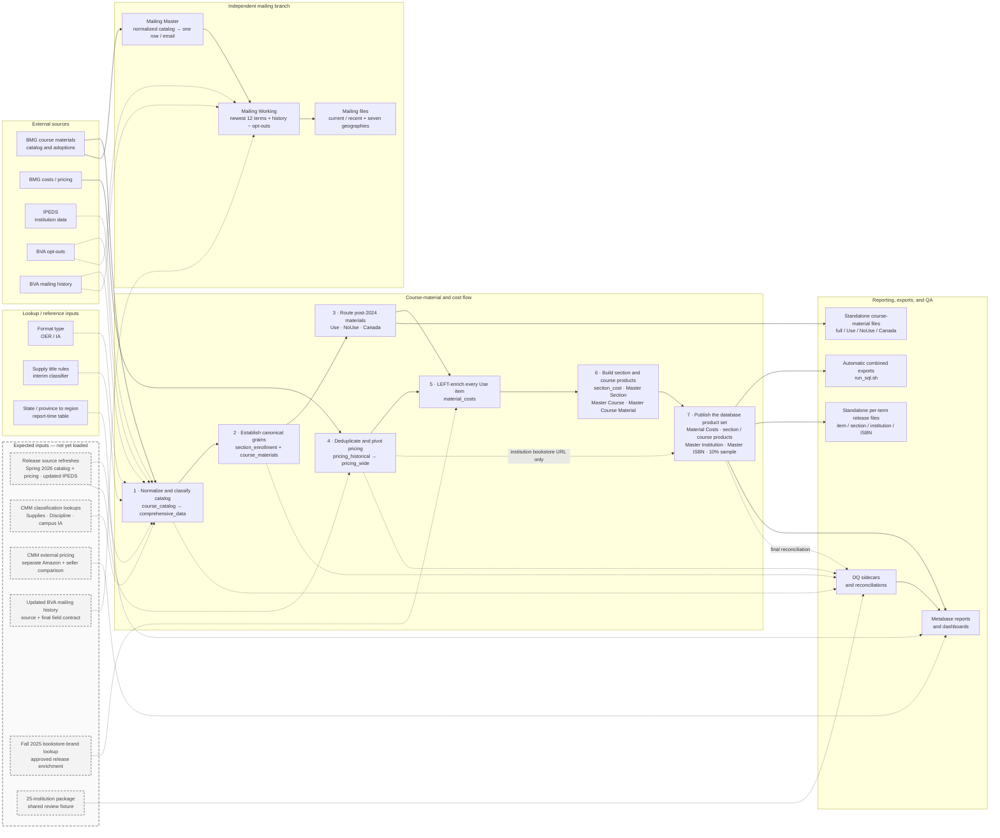

# CMM data flow: sources to reports

Solid arrows carry the implemented primary row population. Dashed arrows from current inputs add implemented
lookup, enrichment, audit, or reporting context. Gray dashed boxes inside **Expected inputs** are not loaded or
implemented; their dashed arrows show the intended destination only.

## Stage 1 · Normalize and classify

| Output | Logic performed | Grain and row handling |
|---|---|---|
| Normalized catalog | Clean email; parse institution, course, section, term, ISBN, and enrollment fields; derive `course_id`, period-specific `section_id`, and sortable term fields. | One row per normalized BMG source row. Missing ISBNs, contacts, or institution matches remain for audit. |
| `panel_email` | Clean mailing-history email; retain the latest recorded response year plus duplicate/year counts. | One row per cleaned email, preventing history joins from multiplying contacts. |
| `pricing_historical` | Remove byte-identical rows, collapse instructor-only variants, then keep the latest pricing date for each detailed offer. | One section × ISBN × option × condition × format × rental term. Valid rental-term variants remain separate. |
| `supply_isbn_classification` | Apply include/exclude title rules to 2024+ ISBNs. | One classified ISBN. Blank and unmatched ISBNs are not marked as supplies. |
| `section_book_status` | Check whether each section contains any required, non-supply item. | One row per period-specific section; supports catalog-owned required inference. |
| `comprehensive_data` | Add IPEDS, OER/IA lookup results, supply status, required inference, mailing-history fields, opt-out presence, and population flags to the catalog. | One enriched normalized catalog row in the validated snapshot. No canonical grouping occurs yet. |

`state_region` is a report-time lookup. It does not alter the catalog or release tables.

## Stage 2 · Establish canonical grains

| Output | Logic performed | Grain and row handling |
|---|---|---|
| `section_enrollment` | Select valid 2024+ sections and assign enrollment from own enrollment, usable own seats, course/term medians, control/level/term median, then level/term median. | One period × section. This is the complete section denominator, including sections without a usable material. |
| `course_materials` | Group catalog rows by period × section × ISBN; choose representative metadata deterministically; retain source-row counts, variants, and conflict flags. | One row per non-NULL ISBN key, plus at most one NULL-ISBN audit row per section. Rows missing period or section stay only in `comprehensive_data` and DQ. |
| `pricing_wide` | Pivot detailed pricing offers into buy/rental × new/used/unknown × physical/digital/unknown cells; calculate availability and price bounds. Prices at or above 9999 are treated as sentinels. | One section × ISBN. It remains pricing-owned: no catalog, OER/IA, IPEDS, or required inference is added. |

### Course-material routing

| Route | Rule | Downstream use |
|---|---|---|
| Use | 2024+; not Canada; ISBN present; not a supply; not `*No Book Details*`; not `*No Books Required*` or another no-material placeholder. | Canonical release item spine and input to `material_costs`. |
| NoUse | Every other post-2024 row. | Explicit excluded/audit population. Exclusion flags can overlap. |
| Canada | NoUse rows whose state is `CAN`. | Separately requested Canadian audit/export subset. |
| Pre-2024 | Neither Use nor NoUse. | Historical catalog context only. |

If duplicate source rows disagree, a canonical key routes to Use when any source row qualifies; the disagreement remains visible in counts and conflict flags.

## Stage 3 · Enrich items and build release products

| Output | Logic performed | Grain and denominator |
|---|---|---|
| `material_costs` | Start with every Use item and LEFT join `pricing_wide` on exact `section_id + ISBN`. Keep pricing match and valid-price coverage separate. | One period × section × ISBN Use item. Pricing never creates catalog items; unmatched and matched-but-unpriced items remain. |
| `section_cost` | Sum valid price bounds by section and inferred required/optional status; calculate buy-only owned bounds separately. | One material-bearing period × section. |
| Master Section | Combine material counts, OER/IA, publisher coverage, cost bounds, excluded-row audit counts, section dimensions, and assigned enrollment. | One section represented in `material_costs`. It is not the complete section denominator. |
| Master Course | Roll Master Section to course and term. | One course × term. |
| Master Course Material | Group `material_costs` by course, term, publisher, and book status. | One course × term × publisher × book-status distribution group. |
| Master Institution | Roll Master Section to institution and term; select a deterministic same-term bookstore URL from pricing when available. | One institution × term, including an explicit unknown-institution bucket. |
| Master ISBN | Roll `material_costs` across sections within a term. | One ISBN × term. |
| Stable 10% sample | Hash complete `section_enrollment` section IDs into a fixed bucket; intersect the same membership with Master Section for the sampled release. | One reusable set of sampled sections; it is never independently resampled by report. |

## Mailing branch

| Output | Logic performed | Grain and filters |
|---|---|---|
| Mailing Master | Keep nonblank cleaned catalog emails; select the newest term, then largest enrollment, then stable source fields. | One row per cleaned email. History, opt-out, geography, and random sampling do not filter Master. |
| Newest terms | Select the newest 12 distinct non-NULL terms represented after Master selection. | At most 12 terms. |
| Mailing Working | Start from Master, keep the newest terms, LEFT join existing `panel_email` history, and exclude any email found in BVA opt-outs. | One eligible email. Missing history does not exclude a contact. |
| Mailing exports | Apply direct, disjoint filters for CA, TX, FL, NY, PA, CAN, and Other; Texas Fall adds a Fall-term filter. | Export leaves, not database views. These are eligibility lists, not guaranteed send-ready addresses. |

## Reporting, exports, and QA

| Surface | Reads from | What it provides |
|---|---|---|
| Automatic combined exports | Top-level export queries run by `run_sql.sh` | Combined item, section, course, course-material, institution, ISBN, faculty, mailing, sample, and reconciliation CSVs. |
| Standalone course-material files | `course_materials`, Use, NoUse, and Canada | Full canonical population plus explicit routing subsets, generated by the separate course-material exporter. |
| Standalone per-term release files | `material_costs`, Master Section, Master Institution, and Master ISBN | Dated per-term item, section, institution, and ISBN files, generated separately from the automatic combined exports. |
| Metabase | Canonical release tables, complete-section tables, DQ sidecars, and `state_region` | Reports and dashboards at their stated grain and denominator. |
| DQ and reconciliations | Source, canonical, pricing, cost, and rollup stages | Row conservation, unique grains, routing equality, match coverage, mailing partitions, and cross-product reconciliation. DQ does not change production rows. |

## Interpretation rules

- Use `section_enrollment` for complete section coverage; Master Section contains material-bearing sections only.
- A pricing match means an exact section × ISBN row exists. It does not guarantee a valid price.
- NULL price or cost is not zero. It means no matching value or no valid bound was available.
- `price_avg` is the legacy midpoint `(price_min + price_max) / 2`, not an arithmetic mean of offers.
- Enrollment-weighted results can include assigned values; report the `enrollment_source` mix.
- Pricing matching remains exact. No case, padding, CRN, or broader-key fallback is active.

## Expected inputs shown as placeholders

| Input | Intended use | Boundary before integration |
|---|---|---|
| Spring 2026 BMG course materials | Refresh catalog normalization and every downstream population. | Files are not local; the validated catalog currently ends at Fall 2025. |
| Additional-term BMG costs/pricing | Refresh detailed pricing, the wide join input, and coverage reporting. | Files, schemas, terms, and catalog-match coverage must be validated first. |
| Updated IPEDS snapshot | Refresh institution attributes during catalog enrichment. | Keep separate from the 25-institution review fixture. |
| Authoritative CMM Supplies | Replace, supplement, or audit the interim title classifier. | Precedence and population impacts are unresolved until the real lookup arrives. |
| CMM Discipline | Add department-to-discipline enrichment to catalog and release products. | Exact keys and normalization follow the received lookup; no fuzzy matching is assumed. |
| Campus-level CMM IA | Add campus availability without conflating it with FormatType-derived IA. | Grain, meaning, effective dates, and precedence remain undefined. |
| CMM external pricing | Create a versioned Amazon/other-seller comparison path. | It stays separate from canonical bookstore costs unless a merge policy is approved. |
| Updated BVA mailing history | Refresh history fields used by Mailing Working. | Source grain and final field contract must be validated before replacing the current snapshot. |
| Fall 2025 bookstore-brand lookup | Enrich approved release records beginning at `material_costs`. | Join key and approved release-file scope await the returned lookup. Raw pricing remains source-owned. |
| 25-institution review package | Drive one shared review fixture and stage-specific extracts. | This is purposive QA scope, not the all-institution production spine or the stable 10% sample. |

“Keep History” is an unresolved snapshot-retention behavior, not a source, so it is not drawn as an input.
