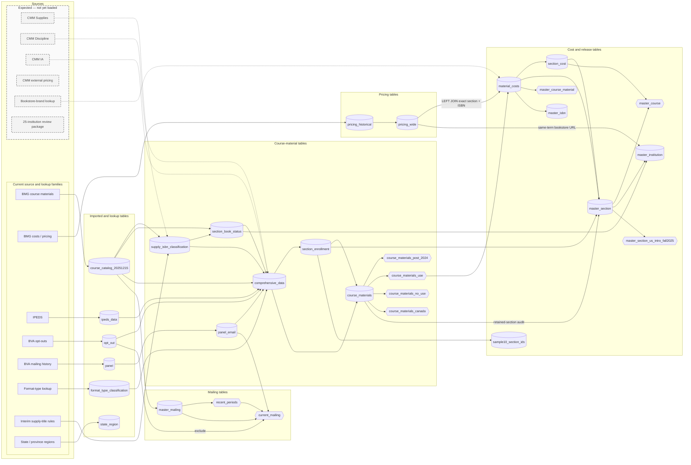

# CMM data lineage: sources, tables, and exports

The diagram follows rows through database tables and views into files and Metabase. Cylinders are tables,
hexagons are views, and tan boxes are file outputs. Gray dashed boxes inside **Sources** are expected source
families that have not been loaded. A refresh of an existing source uses its existing source box.

Dashed arrows from expected sources show intended future destinations, not implemented or approved joins.
Expected sources without an arrow do not yet have an approved receiving table.

## Export lineage

```mermaid
flowchart TB
    subgraph course_exports["Course-material exports"]
        direction LR
        course_materials[("course_materials")]
        materials_post{{"course_materials_post_2024"}}
        materials_use{{"course_materials_use"}}
        materials_nouse{{"course_materials_no_use"}}
        materials_canada{{"course_materials_canada"}}
        course_files["course_materials[_&lt;YYYY_N&gt;]_&lt;YYYYMMDD&gt;.csv<br/>course_materials_post_2024[_&lt;YYYY_N&gt;]_&lt;YYYYMMDD&gt;.csv<br/>course_materials_use_post_2024[_&lt;YYYY_N&gt;]_&lt;YYYYMMDD&gt;.csv<br/>course_materials_nouse_post_2024[_&lt;YYYY_N&gt;]_&lt;YYYYMMDD&gt;.csv<br/>course_materials_can_post_2024[_&lt;YYYY_N&gt;]_&lt;YYYYMMDD&gt;.csv"]
        course_materials --> course_files
        materials_post --> course_files
        materials_use --> course_files
        materials_nouse --> course_files
        materials_canada --> course_files
    end

    subgraph release_exports["Release exports"]
        direction LR
        material_costs[("material_costs")]
        master_section[("master_section")]
        master_course{{"master_course"}}
        master_course_material{{"master_course_material"}}
        master_institution[("master_institution")]
        master_isbn[("master_isbn")]
        release_files["All-term CSVs<br/>31_master_section.csv<br/>32_master_course.csv<br/>33_master_course_material.csv<br/>35_master_institution_by_term.csv<br/>36_master_isbn_by_term.csv<br/>40_material_costs_by_term.csv"]
        term_files["Dated per-term CSVs<br/>master_section_&lt;YYYY_N&gt;_&lt;YYYYMMDD&gt;.csv<br/>master_institution_&lt;YYYY_N&gt;_&lt;YYYYMMDD&gt;.csv<br/>master_isbn_&lt;YYYY_N&gt;_&lt;YYYYMMDD&gt;.csv<br/>material_costs_&lt;YYYY_N&gt;_&lt;YYYYMMDD&gt;.csv"]
        material_costs --> release_files
        master_section --> release_files
        master_course --> release_files
        master_course_material --> release_files
        master_institution --> release_files
        master_isbn --> release_files
        material_costs --> term_files
        master_section --> term_files
        master_institution --> term_files
        master_isbn --> term_files
    end

    subgraph mailing_exports["Mailing exports"]
        direction LR
        master_mailing[("master_mailing")]
        current_mailing{{"current_mailing"}}
        mailing_files["Population CSVs<br/>10_master_mailing.csv<br/>11_current_mailing.csv<br/>11_recent_mailing.csv"]
        geography_files["Geography CSVs<br/>20_california_mailing.csv<br/>21_texas_mailing.csv<br/>22_florida_mailing.csv<br/>23_newyork_mailing.csv<br/>24_texas_fall_series.csv<br/>25_pennsylvania_mailing.csv<br/>26_canada_mailing.csv<br/>27_other_mailing.csv"]
        master_mailing --> mailing_files
        current_mailing --> mailing_files
        current_mailing --> geography_files
    end

    subgraph analysis_exports["Analysis exports"]
        direction LR
        comprehensive[("comprehensive_data")]
        master_section_analysis[("master_section")]
        sample10[("sample10_section_ids")]
        random_file["01_sample_records.csv"]
        faculty_file["30_faculty_records.csv"]
        sample_file["34_master_section_sample10pct.csv"]
        subset_files["fall2025_setA_required.parquet<br/>fall2025_setB_no_required.parquet"]
        comprehensive --> random_file
        comprehensive --> faculty_file
        master_section_analysis --> sample_file
        sample10 --> sample_file
        master_section_analysis --> subset_files
    end

    classDef file fill:#fff2cc,stroke:#9c7227,color:#222;
    class course_files,release_files,term_files,mailing_files,geography_files,random_file,faculty_file,sample_file,subset_files file;
```

## Imported and enrichment tables

| Relation | Direct upstream | Work performed | Grain |
|---|---|---|---|
| `course_catalog_20251215` | BMG course materials | Normalize catalog fields; derive course, section, and term identifiers. | One normalized source row. |
| `ipeds_data` | IPEDS | Import institution attributes keyed by UNITID. | One institution. |
| `opt_out` | BVA opt-outs | Normalize email while retaining source rows. | One opt-out source row. |
| `panel` | BVA mailing history | Retain imported response-history rows. | One history source row. |
| `panel_email` | `panel` | Clean email; select latest response year; count duplicate rows and year variants. | One cleaned email. |
| `format_type_classification` | Format-type lookup | Map FormatType to OER and IA classifications. | One FormatType. |
| `state_region` | State/province regions | Map state or province code to reporting region. | One geographic code. |
| `supply_isbn_classification` | `course_catalog_20251215` + interim supply-title rules | Classify 2024+ ISBNs from include/exclude title patterns. | One classified ISBN. |
| `section_book_status` | `course_catalog_20251215` + `supply_isbn_classification` | Flag whether a section has any required, non-supply material. | One period-specific section. |
| `pricing_historical` | BMG costs/pricing | Remove exact duplicates, collapse instructor-only variants, and keep the latest dated detailed offer. | One section × ISBN × option × condition × format × rental term. |
| `pricing_wide` | `pricing_historical` | Pivot valid offers into buy/rental, condition, and physical/digital price cells. | One section × ISBN. |
| `comprehensive_data` | `course_catalog_20251215`, `ipeds_data`, `opt_out`, `panel_email`, `format_type_classification`, `supply_isbn_classification`, `section_book_status` | Add institution, mailing, classification, required-inference, and population fields. | One enriched normalized catalog row. |

`state_region` is read at report time; it does not alter a production table.

## Course-material and release tables

| Relation | Direct upstream | Work or filter | Grain |
|---|---|---|---|
| `section_enrollment` | `comprehensive_data` | Select valid 2024+ sections and assign enrollment from own values, seats, then successively broader medians. | One period × section, including sections without a usable material. |
| `course_materials` | `comprehensive_data` + `section_enrollment` | Collapse source rows by section × ISBN; choose representative metadata; retain counts, variants, and conflict flags. | One period × section × ISBN, plus at most one NULL-ISBN row per section. |
| `course_materials_post_2024` | `course_materials` | Keep post-2024 rows. | Filtered canonical material rows. |
| `course_materials_use` | `course_materials` | Keep rows meeting the Use rule below. | One release-eligible period × section × ISBN. |
| `course_materials_no_use` | `course_materials` | Keep the complement of Use among post-2024 rows. | One excluded post-2024 canonical row. |
| `course_materials_canada` | `course_materials` | Keep Canadian NoUse rows. | Canadian subset of NoUse. |
| `material_costs` | `course_materials_use` + `pricing_wide` | LEFT join exact `section_id + ISBN`; retain unmatched and matched-but-unpriced material rows. | One Use period × section × ISBN. |
| `section_cost` | `material_costs` | Sum required/optional and buy-only price bounds by section. | One material-bearing period × section. |
| `master_section` | `material_costs` + `section_cost` + `section_enrollment` + `course_materials` | Combine item rollups, costs, assigned enrollment, and retained-section excluded-row context. | One material-bearing period × section. |
| `master_course` | `master_section` + `section_cost` | Roll sections and cost bounds to course and term. | One course × term. |
| `master_course_material` | `material_costs` | Group material distributions by course, term, publisher, and book status. | One course × term × publisher × book-status group. |
| `master_institution` | `master_section` + `section_book_status` + `pricing_wide` | Roll sections to institution and term; select a deterministic same-term bookstore URL. | One institution × term, including the unknown-institution bucket. |
| `master_isbn` | `material_costs` | Roll material rows across sections within a term. | One ISBN × term. |
| `sample10_section_ids` | `section_enrollment` | Select the fixed hash bucket used by every 10% sample output. | One sampled section. |
| `master_section_us_intro_fall2025` | `master_section` | Filter Fall 2025 required-bearing US introductory/intermediate sections. | Filtered Master Section rows. |

### Course-material routing filters

| Route | Filter | Downstream |
|---|---|---|
| Use | 2024+; not Canada; ISBN present; not a supply; not `*No Book Details*`; not `*No Books Required*` or another no-material placeholder. | `course_materials_use` → `material_costs`. |
| NoUse | Every other post-2024 canonical row. | `course_materials_no_use`. Exclusion flags can overlap. |
| Canada | NoUse rows whose state is `CAN`. | `course_materials_canada`. |
| Pre-2024 | Neither Use nor NoUse. | Retained in `course_materials` only. |

If source rows within one canonical key disagree, any qualifying source row routes the key to Use; counts and conflict flags retain the disagreement.

## Mailing tables

| Relation | Direct upstream | Work or filter | Grain |
|---|---|---|---|
| `master_mailing` | `course_catalog_20251215` | Keep nonblank cleaned emails; choose newest term, largest enrollment, then stable source tie-breakers. | One cleaned email. |
| `recent_periods` | `master_mailing` | Select the newest 12 distinct non-NULL terms represented after Master selection. | At most 12 terms. |
| `current_mailing` | `master_mailing` + `recent_periods` + `panel_email` + `opt_out` | Keep recent contacts, add response history, and exclude opt-outs. | One eligible cleaned email. |

## Export files

| Direct upstream | Files |
|---|---|
| `course_materials` | `course_materials[_<YYYY_N>]_<YYYYMMDD>.csv` |
| `course_materials_post_2024` | `course_materials_post_2024[_<YYYY_N>]_<YYYYMMDD>.csv` |
| `course_materials_use` | `course_materials_use_post_2024[_<YYYY_N>]_<YYYYMMDD>.csv` |
| `course_materials_no_use` | `course_materials_nouse_post_2024[_<YYYY_N>]_<YYYYMMDD>.csv` |
| `course_materials_canada` | `course_materials_can_post_2024[_<YYYY_N>]_<YYYYMMDD>.csv` |
| `material_costs` | `40_material_costs_by_term.csv`; `material_costs_<YYYY_N>_<YYYYMMDD>.csv` |
| `master_section` | `31_master_section.csv`; `master_section_<YYYY_N>_<YYYYMMDD>.csv`; with `sample10_section_ids`: `34_master_section_sample10pct.csv`; filtered: `fall2025_setA_required.parquet`, `fall2025_setB_no_required.parquet` |
| `master_course` | `32_master_course.csv` |
| `master_course_material` | `33_master_course_material.csv` |
| `master_institution` | `35_master_institution_by_term.csv`; `master_institution_<YYYY_N>_<YYYYMMDD>.csv` |
| `master_isbn` | `36_master_isbn_by_term.csv`; `master_isbn_<YYYY_N>_<YYYYMMDD>.csv` |
| `master_mailing` | `10_master_mailing.csv` |
| `current_mailing` | `11_current_mailing.csv`; `11_recent_mailing.csv`; `20_california_mailing.csv`; `21_texas_mailing.csv`; `22_florida_mailing.csv`; `23_newyork_mailing.csv`; `24_texas_fall_series.csv`; `25_pennsylvania_mailing.csv`; `26_canada_mailing.csv`; `27_other_mailing.csv` |
| `comprehensive_data` | `01_sample_records.csv`; `30_faculty_records.csv` |

## Reporting

| Surface | Direct relations |
|---|---|
| Release-facing Metabase reports and dashboards | `material_costs`, `master_section`, `master_institution`, `master_isbn`, and `master_section_us_intro_fall2025`; `state_region` is joined at query time where geography is needed. |
| Course-material population reporting | `course_materials`, `course_materials_post_2024`, `course_materials_use`, `course_materials_no_use`, `course_materials_canada`, and `section_enrollment`. |

## Interpretation rules

- Use `section_enrollment` for complete section coverage; Master Section contains material-bearing sections only.
- A pricing match means an exact section × ISBN row exists. It does not guarantee a valid price.
- NULL price or cost is not zero. It means no matching value or no valid bound was available.
- `price_avg` is the legacy midpoint `(price_min + price_max) / 2`, not an arithmetic mean of offers.
- Enrollment-weighted results can include assigned values; report the `enrollment_source` mix.
- Pricing matching remains exact. No case, padding, CRN, or broader-key fallback is active.

## Expected sources shown as placeholders

| Input | Intended use | Boundary before integration |
|---|---|---|
| Authoritative CMM Supplies | Replace, supplement, or audit the interim title classifier. | Precedence and population impacts are unresolved until the real lookup arrives. |
| CMM Discipline | Add department-to-discipline enrichment to catalog and release products. | Exact keys and normalization follow the received lookup; no fuzzy matching is assumed. |
| Campus-level CMM IA | Add campus availability without conflating it with FormatType-derived IA. | Grain, meaning, effective dates, and precedence remain undefined. |
| CMM external pricing | Create a versioned Amazon/other-seller comparison path. | It stays separate from canonical bookstore costs unless a merge policy is approved. |
| Fall 2025 bookstore-brand lookup | Enrich approved release records beginning at `material_costs`. | Join key and approved release-file scope await the returned lookup. Raw pricing remains source-owned. |
| 25-institution review package | Drive one shared review fixture and stage-specific extracts. | This is a review subset, not the all-institution production spine or the stable 10% sample. |

Spring 2026 BMG files, additional BMG pricing terms, updated IPEDS, and updated BVA mailing history
are refreshes of existing source families, so they do not receive separate source boxes.

“Keep History” is an unresolved snapshot-retention behavior, not a source.
