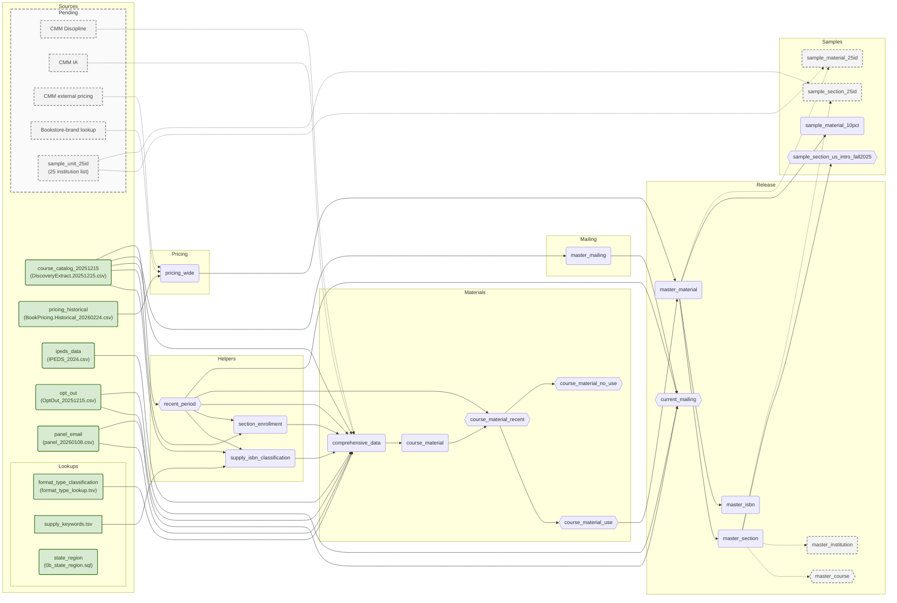

# Data flow

## Exports

`YYYY_N` is the term; `YYYYMMDD` is the export date. Brackets mark an optional term suffix.

## Table logic

Arrows above identify inputs. “Section” includes term; grain means one row per key.

| Table / view | Grain | Logic / filter |
|---|---|---|
| `course_catalog_20251215` | Source row | Normalize fields; derive course, section, term IDs. |
| `ipeds_data` | Institution | Import institution attributes. |
| `opt_out` | Source row | Normalize email; retain duplicates. |
| `panel_email` | Email | Import history; latest response year; duplicate/year-variant counts. |
| `format_type_classification` | FormatType | Map OER/IA. |
| `state_region` | State/province | Map reporting region; query-time only. |
| `supply_isbn_classification` | ISBN | Apply CMM-owned title rules to recent-term ISBNs. |
| `section_enrollment` | Section | Catalog-only enrollment, seats, and sibling availability. |
| `comprehensive_data` | Source row | Add lookups, IPEDS-scoped enrollment assignment, requiredness, population flags. |
| `course_material` | Section × ISBN | Deduplicate; retain conflicts, section audit counts, NULL-ISBN groups. |
| `course_material_recent` | Section × ISBN | Shared recent-term export/report boundary. |
| `course_material_use` | Section × ISBN | Use filter below. |
| `course_material_no_use` | Section × ISBN | Remaining recent-term rows. |
| `pricing_historical` | Section × ISBN × option × condition × format × rental term | Remove exact/instructor-only duplicates; latest dated offer. |
| `pricing_wide` | Section × ISBN | Pivot offers; no catalog enrichment. |
| `master_material` | Use section × ISBN | Exact LEFT join; retain unmatched/unpriced items. |
| `master_section` | Material-bearing section | Roll up `master_material`; inherit audits; select modal bookstore URL. |
| `master_course` | Course × term | Draft section/cost rollup; definition pending. |
| `master_institution` | Institution × term | Draft section rollup and modal section URL; definition pending. |
| `master_isbn` | ISBN × term | Roll up material rows. |
| `sample_material_10pct` | Section × ISBN | Selected section clusters from `master_material`. |
| `sample_section_us_intro_fall2025` | Section | Fall 2025; required-bearing; introductory/intermediate; nonblank, non-Canada state. |
| `master_mailing` | Email | Nonblank; newest term, largest enrollment, stable tie-breakers. |
| `recent_period` | Term | Lookup view of newest 12 terms from `course_catalog_20251215`. |
| `current_mailing` | Email | Recent terms; add history; exclude opt-outs. |

The supply TSV contains 123 title rules, not ISBN assignments. Catalog titles are
needed to build `supply_isbn_classification`. Section requiredness is computed inside
`comprehensive_data`; it is independent of the enrollment helper.

### Use filter

Recent terms, non-Canada, ISBN present; exclude supplies, `*No Book Details*`,
`*No Books Required*`, and other no-material placeholders. Any qualifying source row admits
the key; conflicts remain recorded. Older terms stay upstream. Exclusion reasons may overlap.

Materials and mailing share `recent_period`: the newest 12 distinct catalog terms,
including pre-2024 terms while they remain in that window.

### Reading results

- `section_enrollment` includes sections without materials; `master_section` does not.
- Exact section × ISBN matching only; no normalization or broader-key fallback.
- Match ≠ valid price. NULL price/cost ≠ zero.
- `price_avg = (price_min + price_max) / 2`, not mean offer price.
- Enrollment-weighted results must report `enrollment_source`.
- Section audit values repeat on material rows; never sum those copies.
- URL selection ignores blank values; most frequent wins, lexical tie-break.

## Metabase

| Reports | Tables / views |
|---|---|
| Release | `master_material`, `master_section`, `master_course`, `master_institution`, `master_isbn`, `current_mailing` |
| Samples | `sample_material_10pct`, `sample_section_us_intro_fall2025` |
| Populations | `course_material` and its routing views; `section_enrollment` |

Geographic reports join `state_region` at query time.

## Pending

| Item | Boundary |
|---|---|
| `master_course`, `master_institution` | Dashed: draft SQL exists; final definitions pending (#87). |
| CMM Discipline | Department mapping; keys/normalization await lookup. |
| CMM IA | Campus availability, distinct from FormatType IA; grain/dates/precedence unresolved. |
| CMM external pricing | Feed the pricing-wide stage; fields/grain await source. |
| Bookstore-brand lookup | Enrich `pricing_wide`; key and file scope await lookup. |
| 25 institution list | `sample_unit_25id` feeds `sample_material_25id` and `sample_section_25id`; #60. |
Refreshes reuse existing source boxes. Missing arrows mean destination undecided.
“Keep History” is a pending retention decision, not a source.

The diagram describes staged SQL, not the live database. Deployment is held.
Combining `comprehensive_data` and `course_material` remains implementation work (#86),
not an unresolved requirement.
