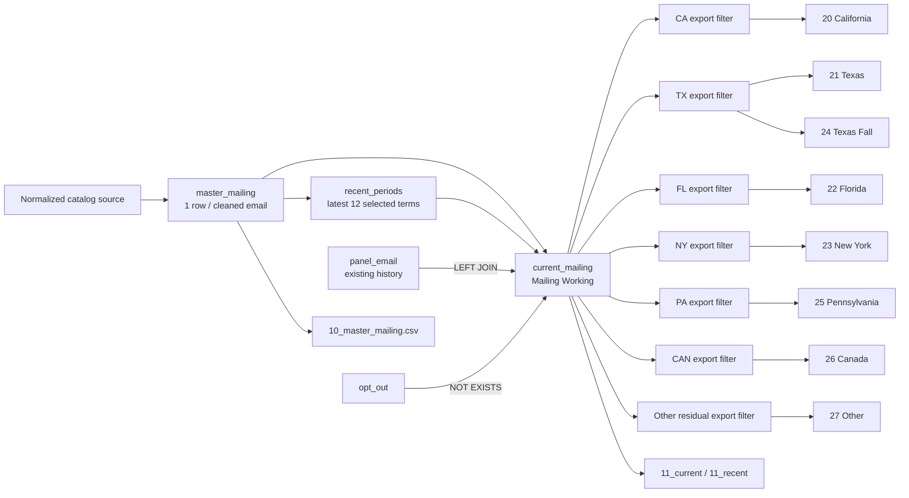

# Mailing flow (#66)

This page defines the implemented Source → Master → Working → export branch. The current branch
uses the existing BVA `panel_email` history snapshot; the updated history input and final field
contract remain pending in issue #56.

## Steps and filters

| Step | Relation / grain | Transform | Population rule |
|---:|---|---|---|
| 1 | `${SURVEY_TABLE}`; one normalized BMG row | Extract recognized `email:` text; take the first space-delimited address in multi-address values; remove interior spaces from other address-like values; lowercase and trim. Derive IDs and period fields. | No mailing eligibility filter. Invalid/missing contacts remain in source/audit. `output/email_issues.tsv` records suspicious values and cleaning actions. |
| 2 | `panel`; source rows | Lowercase/trim email; retain duplicate/history rows. | No selection effect. |
| 3 | `panel_email`; one cleaned email | `MAX(response_year)` as `panel_response_year`, plus source-row and distinct-year counts. | Prevents history joins from multiplying contacts. VARCHAR `MAX` is chronological only for expected four-digit years. |
| 4 | `opt_out`; source rows | Lowercase/trim email; retain duplicates. | No Source or Master filter. Working uses existence, so duplicates do not change results. |
| 5 | `master_mailing`; one nonblank cleaned email | Select one coherent catalog row: newest `period_sortable`, largest enrollment, then stable IDs and contact/course fields. | Only `email IS NOT NULL AND TRIM(email) != ''`. No history, opt-out, recency, geography, or random filter. |
| 6 | `recent_periods`; at most 12 terms | Distinct non-NULL terms represented after Master selection, descending, limit 12. | The window is based on Master-selected rows, not every source term. |
| 7 | `current_mailing`; at most one email | Start from Master, LEFT JOIN `panel_email`, retain response year. | Term is in `recent_periods`; `NOT EXISTS` in `opt_out`. Missing history does not exclude. This is Mailing Working. |
| 8 | seven geographic export filters; no database relations | Classify `current_mailing` with `UPPER(TRIM(state))`; retain original `state`. | Exact CA/TX/FL/NY/PA/CAN. Other is `COALESCE(...,'') NOT IN (...)`, so NULL, blank, and unknown values are included. |
| 9 | mailing CSV wrappers | Query Master or Working directly. | Texas Fall adds `period LIKE 'Fall%'`. All 11/20–27 exports inherit Working filters. |

## Export contract

| Wrapper | Source | Additional rule | Send-ready? |
|---|---|---|---|
| `10_master_mailing` | `master_mailing` | projection only | No; pre-history and pre-opt-out staging/audit |
| `11_current_mailing` | `current_mailing` | selected columns | Eligible list; not necessarily send-ready |
| `11_recent_mailing` | `current_mailing` | all columns; not a separate population | Eligible list; not necessarily send-ready |
| `20_california_mailing` | `current_mailing` | normalized state = CA | Eligible list; not necessarily send-ready |
| `21_texas_mailing` | `current_mailing` | normalized state = TX | Eligible list; not necessarily send-ready |
| `22_florida_mailing` | `current_mailing` | normalized state = FL | Eligible list; not necessarily send-ready |
| `23_newyork_mailing` | `current_mailing` | normalized state = NY | Eligible list; not necessarily send-ready |
| `24_texas_fall_series` | `current_mailing` | normalized state = TX; original period begins `Fall`; newest first | Eligible list; not necessarily send-ready |
| `25_pennsylvania_mailing` | `current_mailing` | normalized state = PA | Eligible list; not necessarily send-ready |
| `26_canada_mailing` | `current_mailing` | normalized state = CAN | Eligible list; not necessarily send-ready |
| `27_other_mailing` | `current_mailing` | normalized state is not CA/TX/FL/NY/PA/CAN | Eligible list; not necessarily send-ready |

The seven predicates are disjoint and exhaustive. DQ requires the Working row count to equal its
distinct-email count and the sum of all seven conditional row counts.

Working and state exports are eligibility lists, not guaranteed send-ready files. The pipeline
records cleaning actions and loose email DQ counters, but does not perform final email-syntax
validation; downstream delivery must validate addresses before sending.

`run_sql.sh` refuses a mailing export after an import in the same invocation unless
`3_mailing_lists.sql` refreshed the branch after that import. `NO_IMPORT=1` may deliberately export
an already refreshed database.

## Pending updated history boundary (#56)

No updated BVA history file is implemented here. Until #56 supplies and approves its schema and
semantics, `panel`/`panel_email` remain the only history source and `panel_response_year` the only
Working history enrichment. Do not infer new suppression, prioritization, sampling, retention, or
cross-snapshot behavior from the pending input. A future change must preserve the one-row-per-email
Working grain and explicitly document its selection/filter effect.

See [`CMM-ETL.md`](CMM-ETL.md) for the pipeline-wide contract and
[`DATA-DICTIONARY.md`](DATA-DICTIONARY.md) for columns.
