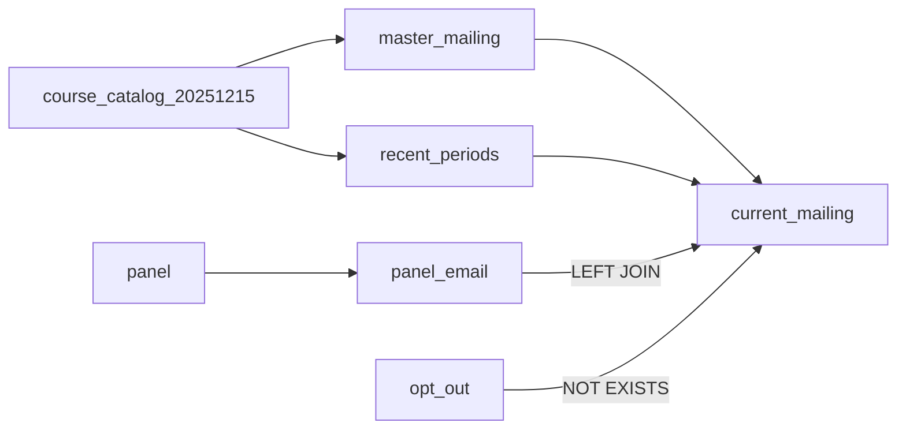

# Mailing

## Rules

| Table / view | Grain | Selection / enrichment |
|---|---|---|
| `course_catalog_20251215` | Source row | Normalize email, IDs, periods; retain missing/invalid contacts. |
| `panel` | Source row | Lowercase/trim email; retain duplicates. |
| `panel_email` | Email | `MAX(response_year)` → `panel_response_year`; count rows/year variants. Assumes four-digit years. |
| `opt_out` | Source row | Lowercase/trim email; duplicates allowed. |
| `master_mailing` | Email | Nonblank only; newest term, largest enrollment, stable IDs/contact/course tie-breakers. No other eligibility filters. |
| `recent_periods` | Term | Lookup view of newest 12 distinct non-NULL terms from `course_catalog_20251215`. |
| `current_mailing` | Email | Recent terms; LEFT history join; exclude opt-out existence. Missing history retains contact; duplicate opt-outs cannot multiply rows. |

Catalog email cleaning extracts `email:` text, takes the first space-delimited address from
multi-address values, removes interior spaces in other address-like values, then lowercases/trims.
Actions are recorded in `output/email_issues.tsv`; final delivery still needs syntax validation.

## Exports

`10_*` reads `master_mailing`; all others read `current_mailing`.
Geography uses `UPPER(TRIM(state))`, preserving the original state column. Filters are not views.

| File | Additional filter / projection |
|---|---|
| `10_master_mailing.csv` | Master columns; before history/opt-outs |
| `11_current_mailing.csv` | Selected columns |
| `11_recent_mailing.csv` | All columns; same population |
| `20_california_mailing.csv` | CA |
| `21_texas_mailing.csv` | TX |
| `22_florida_mailing.csv` | FL |
| `23_newyork_mailing.csv` | NY |
| `24_texas_fall_series.csv` | TX and `period LIKE 'Fall%'`; newest first |
| `25_pennsylvania_mailing.csv` | PA |
| `26_canada_mailing.csv` | CAN |
| `27_other_mailing.csv` | Everything else, including NULL/blank/unknown |

Checks: Working rows = distinct emails = seven geography counts. Texas Fall is a subset.
These are eligibility lists, not send-ready addresses.

After import, `run_sql.sh` requires `3_mailing_lists.sql` before exporting.
`NO_IMPORT=1` may use already-refreshed relations.

## Pending

Updated BVA history/schema: #56. Until approved, only `panel_response_year` enriches Working.
No new suppression, prioritization, sampling, retention, or cross-snapshot behavior is implied.
Future changes must preserve one row/email and specify selection effects.
