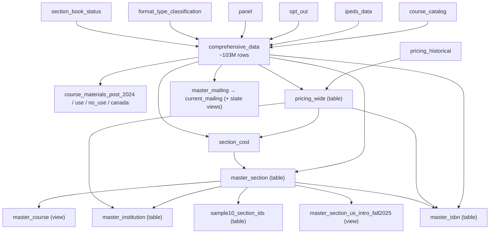

# CommodoreSQL Database Schema

DuckDB pipeline integrating course-catalog data (~103M rows) with institutional
characteristics (IPEDS), bookstore pricing, and opt-out/panel lists. Supports targeted
mailing lists and analysis of course-materials cost and OER/Inclusive-Access adoption.

For full column definitions and types see [`schema.dbml`](schema.dbml) (load in dbdiagram.io).
For naming standards and gotchas see [`CLAUDE.md`](CLAUDE.md). For current work status see
[`HANDOFF.md`](HANDOFF.md).

## Source data

| File | Target table | Rows |
|------|-------------|------|
| `DiscoveryExtract.*.csv` | `course_catalog_<date>` | ~103M |
| `IPEDS_2024.csv` | `ipeds_data` | ~7K |
| `OptOut_*.csv` | `opt_out` | variable |
| `panel_*.csv` | `panel` | variable |
| `format_type_lookup.tsv` | `format_type_classification` | ~69 |
| `supply_keywords.tsv` | (read by `1a_supply_classification.sql` + `scripts/classify_supplies.sh`) | 97 incl + 26 excl |
| `BookPricing.Historical_*.csv` | `pricing_historical` | ~11K distinct |

## Pipeline

Run via `scripts/run_sql.sh`. Three stages, each skippable by flag
(`NO_IMPORT` / `NO_EDA` / `NO_EXPORT`). DROP-before-CREATE; re-runnable. Config in
`scripts/dot.env`; SQL is envsubst-templated (`${CONFIG}`, `${LOOKUP_DIR}`, …).

### IMPORT stage

| SQL file | Creates | Purpose |
|----------|---------|---------|
| `0_setup.sql` | `course_catalog_*`, `ipeds_data`, `opt_out`, `panel`, `email_issues` | Load CSVs, normalize emails, derive composite keys (`period_date` included) |
| `0b_state_region.sql` | `state_region` | State → region lookup |
| `1_bookprices_import.sql` | `pricing_historical` | Load bookstore pricing; derive `section_id`/period keys; set `required` from Book Status |
| `1a_supply_classification.sql` | `supply_isbn_classification` | ISBN-level supply flag from title keywords (#36); built here so `has_required` (1b_) can be supply-aware (#40) |
| `1b_section_filter.sql` | `section_book_status` | One row per section: supply-aware `has_required` flag (#40); sets `is_required_inferred` on pricing |
| `2_oer_classification.sql` | `format_type_classification`, (re)builds `comprehensive_data`, four `course_materials_*` views | OER/IA lookup, master join, row flags, and canonical post-2024 Use/NoUse/Canada population (#58) |
| `2b_pricing_oer_ia.sql` | (updates `pricing_historical`) | Writes `is_oer`/`is_ia` onto pricing per `(section_id, ISBN13)` via BOOL_OR |
| `2c_pricing_wide.sql` | **`pricing_wide`** (TABLE), `pricing_wide_filtered` (view) | Pivot pricing into 18 price cols + `has_buy`/`has_rent` + fact aggs + institution enrichment |
| `2d_data_quality.sql` | `__data_quality_*` tables | Materialized DQ snapshots |

### EDA stage

| SQL file | Creates | Purpose |
|----------|---------|---------|
| `3_mailing_lists.sql` | `master_mailing`, `current_mailing`, 5 state views | Deduplicated instructor mailing lists |
| `4_merged_records.sql` | **`section_cost`** (table), **`master_section`** (TABLE), `master_course` (view), `master_course_material` (view), `master_section_us_intro_fall2025` (view) | Aggregated records by section / course; per-section cost; BMG report view |
| `models/*.sql` | **`master_institution`**, **`master_isbn`**, **`sample10_section_ids`** (TABLEs) | Canonical term rollups and deterministic section-sample membership; auto-discovered and materialized by `run_sql.sh` after the EDA SQL files |

### EXPORT stage

Auto-discovers `scripts/sql/exports/*.sql`; wraps each in a temp table and `COPY`s to CSV in
`output/`. (Analysis extracts like the A/B subsets and supply classification are separate
re-runnable scripts — `scripts/export_fall2025_subsets.sh`, `scripts/classify_supplies.sh` —
that write Parquet to `output/`.) `scripts/export_cmm_masters.sh` writes one release-dated CSV
per priced term from the materialized Master Section, Master Institution, and Master ISBN tables.

## Key tables

- **`comprehensive_data`** — the master join (catalog × IPEDS × opt-out × panel × format-type ×
  section status), ~103M rows. Owns all row-level population booleans, including the authoritative
  `is_course_material_use` / `is_course_material_no_use` partition (#58). The rerunnable
  `course_materials_post_2024`, `course_materials_use`, `course_materials_no_use`, and
  `course_materials_canada` views expose those populations without reimplementing predicates.
- **`pricing_wide`** — one row per `(section_id, isbn13)`: 18 price columns (option × condition ×
  format), `has_buy`/`has_rent`, `price_min/max`, `rental_days_min/max`, `format_count`, plus
  institution enrichment. `pricing_wide_filtered` = the `is_required_inferred` subset (view).
- **`section_cost`** — per-section required/optional cost aggregates over distinct priced Use
  materials; sections without eligible priced material remain on `master_section` with NULL costs.
- **`master_section`** — **materialized TABLE**, one row per `section_id` (2024+). Institution
  enrichment (state/control/level/size/sector/…), Use-based material/required/optional counts,
  OER/IA, publisher, ISBN/FormatType, and cost fields. Its compact population audit includes
  `has_course_material_use`, Use/NoUse and placeholder counts, and `is_canada`; #36 supplies are
  still audited across all source rows by `is_supply`/`supply_count`. Enrollment availability
  flags (`has_enrollment*`) and the persisted `enrollment_assigned`/`enrollment_source` fill (#32)
  retain the full section population. It is the analysis workhorse.
- **`master_course`** — view: one row per `(course_id, period)`, rollups of the above.
- **`master_institution`** — table: one row per `(period_sortable, unit_id)`, including an
  explicit NULL-unit unknown bucket so section totals reconcile; institution attributes,
  deterministic bookstore URL, and section-level coverage/totals (#54).
- **`master_isbn`** — table: one row per `(period_sortable, isbn13)` for canonical Use
  materials; canonical metadata with conflict DQ, section-level coverage, all 18 price-cell
  counts, enrollment, and institution-type counts (#55).
- **`sample10_section_ids`** — table: one row per selected section, using the version-stable
  `md5-prefix64-mod10-v1` bucket-zero rule. All sampled stages join this one membership table (#53).
- **`master_section_us_intro_fall2025`** — view (BMG #38): filtered projection of `master_section`
  (Fall 2025, `required_count>=1`, intro/intermediate course levels, US only). No new columns.

## Data lineage

## Key concepts

### Composite keys
- `course_id` = `unit_id::dept_code::course_number`
- `section_id` = `unit_id::dept_code::course_number::section::period_sortable` — **includes period**
  (each section-offering is its own ID). `(section_id, isbn13)` is the natural catalog grain.
- `period_sortable` = `YYYY-N` (1=Winter, 2=Spring, 3=Summer, **4=Fall**); `period_date` = canonical
  DATE for time-series axes.

### is_required_inferred (the "required code", issue #1)
Inferred is_required. TRUE when `period_date >= 2024-01-01` AND
`(has_required=TRUE AND book_status='required')` OR `(has_required=FALSE AND book_status IS NULL)`.
Applied to `comprehensive_data` and `pricing_historical`. `master_section.required_count` =
`COUNT(*) FILTER (WHERE is_required_inferred AND is_course_material_use)`. (Renamed from
`filter_include`, #34.)

`has_required` is **supply-aware** (#40): `BOOL_OR(book_status='required' AND NOT is_supply)`, built in
`1a_`/`1b_`. A supply-only "required" item (e.g. safety goggles) no longer forces `has_required=TRUE`,
so a co-listed blank-status **real** textbook correctly keeps the required fallback instead of being
bucketed as optional. #41 (resolved): pseudo-SKU non-book items are overwhelmingly **legitimate**
required digital-access materials (Cengage/Pearson/MyLab access codes) — kept. Two narrow, precision-
verified gaps were folded into the supply classifier: `eyewear` supplies and explicit "no material
required" placeholder rows (`supply_category='placeholder_no_material'`). A console DQ line tracks the
remaining (legitimate) pseudo-SKU residual.

### OER/IA classification
Explicit lookup via `format_type_classification` (FormatType → `is_oer`/`is_ia` + categories).
NULL when FormatType is absent — so `has_formattype` is the classifiability flag.

### Supply classification (issue #36)
Bookstore **supplies** (lab kits, goggles, calculators, clickers, …) are identified by an
include-AND-NOT-exclude **title-keyword** classifier (`FormatType` does not encode supplies).
Keyword list: `scripts/sql/lookups/supply_keywords.tsv` (97 include + 26 exclude, single source of
truth). `1a_supply_classification.sql` builds `supply_isbn_classification` (ISBN-level, over **all
2024+** title variants) and `2_oer_classification.sql` joins `is_supply`/`supply_category` onto
`comprehensive_data`. Supplies are NoUse for every material/count/cost aggregate, while
`master_section` surfaces `is_supply` (`BOOL_OR`) + `supply_count` over **all source rows** for audit.
Precision-over-recall (≈0.98); recall
is keyword-bounded. The `placeholder_no_material` category (#41) reuses this mechanism to exclude
explicit "no material required" placeholder rows. Supplies are <1% of Fall-2025 ISBNs — excluding them
barely moves class medians but removes the high-price tail.

### Course-material population contract (issue #58)

`comprehensive_data` owns non-null row booleans. `is_post_2024` means
`period_date >= DATE '2024-01-01'`; `has_isbn` is `ISBN13 IS NOT NULL` (the imported
numeric column maps blank source cells to NULL while retaining nonstandard numeric pseudo-SKUs);
`has_formattype` means nonblank `FormatType`; enrollment flags test non-null enrollment and
non-null `seats_taken < 9999`; `no_details` is the exact title `*No Book Details*`;
`no_materials` is the exact title `*No Books Required*` or
`supply_category='placeholder_no_material'`; and `is_canada` is `state='CAN'`.

Use is post-2024, non-Canadian, ISBN-bearing, non-supply, and neither placeholder flag. NoUse is
its exact post-2024 complement; both are false pre-2024, and Canada is a NoUse subset. No single
exclusion-reason field is stored because the reason booleans can overlap. Non-978/979 pseudo-SKUs
remain eligible unless the existing supply classifier catches them (#41).

The `master_section` row spine is deliberately **not Use-filtered**: it remains one row for every
valid 2024+ `section_id`, preserving the #20 decision to retain no-ISBN/no-adoption sections in
section and enrollment denominators. `master_course` and `master_institution` retain that full
spine. Only material/publisher/OER/IA/ISBN/FormatType/pricing aggregates use the canonical flag;
the #36 supply audit and enrollment assignment continue over the retained population.

### Enrollment fill (issue #32)
`enrollment_assigned` is the persisted per-section enrollment, filling missing values by a
documented hierarchy; `enrollment_source` records the rung used:
`own → own_seats (<9999) → sibling_enroll → sibling_seats → class_median (control×level) →
level_median`. Medians are computed **per period** over the **reference population** (the 4 BMG
course levels × 6 real teaching sectors), so Fall-2025 in-scope rows reproduce the reviewed
analysis (cards 133/134) exactly. Raw `enrollments` is never overwritten; `enrollment_source='none'`
(NULL value) only for rows with no reachable signal.

### Pricing — rental term collapsing
`pricing_historical` grain: `(section_id, isbn13, book_option, book_condition, book_format,
rental_days)`. Buy = one price per (condition × format); rental = one price per `rental_days`
(~95 values). `pricing_wide` collapses rentals via `MAX(price)` and exposes `rental_days_min/max`.
Sentinel prices ≥ 9999 are nulled (#27).

### price_avg convention
`price_avg` / `*_cost_avg` = `(min + max) / 2`, **NOT** an arithmetic mean (legacy). Label clearly.

## Metabase

Reporting is config-as-code: ~52 SQL questions (frontmatter: `-- name:`/`-- display:`/
`-- description:`) in `metabase/questions/`, dashboard JSON in `metabase/dashboards/`, IDs in
`metabase/ids.json` (keyed by filename stem), synced via `metabase/sync.py` (DB id 2). The local
image is built/launched by `metabase.sh`; it connects to `duckdb/commodore.duckdb` and holds a
read lock (DB writes require `docker stop metabase` — see `HANDOFF.md`).
