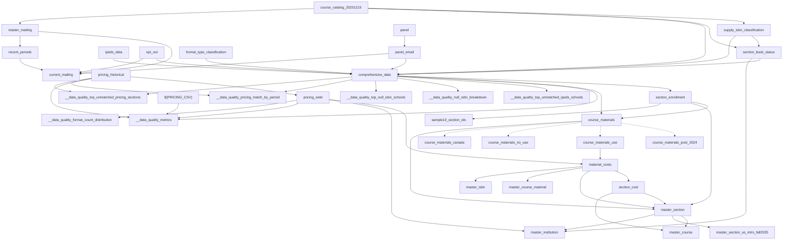

# Schema

## Inputs

Paths are configured in `scripts/dot.env`.

| Owner | Configured input | Loaded target/consumer |
|---|---|---|
| BMG | `DiscoveryExtract.*.csv` | `course_catalog_<date>` |
| BMG | `BookPricing.Historical_*.csv` | `pricing_historical` |
| IPEDS | `IPEDS_2024.csv` | `ipeds_data` |
| BVA | `OptOut_*.csv` | `opt_out` |
| BVA | `panel_*.csv` | `panel`, `panel_email` |
| Internal | `format_type_lookup.tsv` | `format_type_classification` |
| CMM | `scripts/sql/lookups/supply_keywords.tsv` | supply classification/audit |

## Operational stages

Run `scripts/run_sql.sh`; SQL is rendered with `envsubst`. DROP-before-CREATE makes normal runs re-runnable. `NO_IMPORT`, `NO_EDA`, and `NO_EXPORT` skip stages; `CUSTOM_SQL_FILES` replaces the list.

| Stage | Files | Result |
|---|---|---|
| IMPORT | 10 fixed SQL files | Cleanup, source loading, catalog normalization/enrichment, canonical materials, pricing pivot, DQ snapshots; `0_setup.sql` also writes `output/email_issues.tsv`. |
| EDA | 3 fixed SQL files | Mailing, Material Costs, section costs, and section/course/material masters. |
| Models | `scripts/sql/models/*.sql` lexical | `master_institution`, `master_isbn`, `sample10_section_ids`. |
| EXPORT | `scripts/sql/exports/*.sql` lexical, top-level | Temporary-table wrappers to `output/<basename>.csv`. |

After IMPORT, mailing export requires `3_mailing_lists.sql`; wrapper-only runs with `NO_IMPORT=1` may use last-refreshed mailing relations.

### Exact `run_sql.sh` order

```mermaid
flowchart TD
  run["scripts/run_sql.sh"] --> i0c["01 · 0_cleanup.sql"]
  run -. "NO_IMPORT" .-> x01["01_sample_records.sql"]
  i0c --> i00["02 · 0_setup.sql"] --> i0b["03 · 0b_state_region.sql"] --> i10["04 · 1_bookprices_import.sql"] --> i1a["05 · 1a_supply_classification.sql"] --> i1b["06 · 1b_section_filter.sql"] --> i20["07 · 2_oer_classification.sql"] --> i2b["08 · 2b_course_materials.sql"] --> i2c["09 · 2c_pricing_wide.sql"] --> i2d["10 · 2d_data_quality.sql"]
  i2d --> e30["11 · 3_mailing_lists.sql"] --> e3b["12 · 3b_material_costs.sql"] --> e40["13 · 4_merged_records.sql"] --> m01["14 · models/master_institution.sql"] --> m02["15 · models/master_isbn.sql"] --> m03["16 · models/sample10_section_ids.sql"] --> x01
  i2d -. "NO_EDA" .-> x01
  x01 --> x10["10_master_mailing.sql"] --> x11c["11_current_mailing.sql"] --> x11r["11_recent_mailing.sql"] --> x20["20_california_mailing.sql"] --> x21["21_texas_mailing.sql"] --> x22["22_florida_mailing.sql"] --> x23["23_newyork_mailing.sql"] --> x24["24_texas_fall_series.sql"] --> x25["25_pennsylvania_mailing.sql"] --> x26["26_canada_mailing.sql"] --> x27["27_other_mailing.sql"] --> x30["30_faculty_records.sql"] --> x31["31_master_section.sql"] --> x32["32_master_course.sql"] --> x33["33_master_course_material.sql"] --> x34["34_master_section_sample10pct.sql"] --> x35["35_master_institution_by_term.sql"] --> x36["36_master_isbn_by_term.sql"] --> x37["37_sample10_reconciliation.sql"] --> x38["38_cmm_release_reconciliation.sql"] --> x39["39_cmm_release_key_reconciliation.sql"] --> x40["40_material_costs_by_term.sql"] --> x41["41_material_costs_reconciliation.sql"]
```

## Relation inventory

| Relation | Grain / role |
|---|---|
| `course_catalog_<date>` | Normalized BMG source rows. |
| `ipeds_data` | Institution lookup. |
| `opt_out`, `panel` | Retained normalized-email BVA rows; duplicate emails allowed. `panel_email` is one row/email. |
| `state_region` | State/province-to-region lookup. |
| `format_type_classification` | FormatType-to-OER/IA lookup. |
| `supply_isbn_classification` | One classified 2024+ ISBN row. |
| `section_book_status` | One section; supply-aware required evidence. |
| `comprehensive_data` | One enriched normalized catalog row; refresh DQ proves lookup uniqueness/count preservation. |
| `section_enrollment` | One valid 2024+ period×section; complete assigned-enrollment spine. |
| `course_materials` | One period×section×ISBN plus at most one NULL-ISBN audit row. |
| `course_materials_post_2024` | Post-2024 projection. |
| `course_materials_use` | Use projection. |
| `course_materials_no_use` | Exact post-2024 complement. |
| `course_materials_canada` | Canadian post-2024 NoUse subset. |
| `pricing_historical` | Section×ISBN×option×condition×format×rental-term pricing. |
| `pricing_wide` | One section×ISBN; provenance and 18 price cells. |
| `__data_quality_*` | Non-mutating DQ snapshots. |
| `master_mailing` | One nonblank cleaned email before history/opt-out. |
| `recent_periods` | Newest 12 non-NULL mailing terms. |
| `current_mailing` | Eligible cleaned email after recency/history/opt-out. |
| `material_costs` | One canonical Use period×section×ISBN; LEFT pricing enrichment. |
| `section_cost` | Cost aggregates per material-bearing period×section. |
| `master_section` | One material-bearing period×section. |
| `master_course` | One period×course. |
| `master_course_material` | Exact group from `material_costs`, excluding NULL course/publisher/sortable period. |
| `master_section_us_intro_fall2025` | Compatibility report projection. |
| `master_institution` | Material-bearing period×institution, including NULL unit. |
| `master_isbn` | Canonical Use period×ISBN rollup. |
| `sample10_section_ids` | Deterministic section-sample membership. |

## Data dependencies

Solid arrows are dependencies; dotted arrows are projections/subsets/leaves. All 37 DBML relations are current and consumed. Geographic mailing is seven direct `current_mailing` export filters.

`state_region` is an IMPORT helper joined at query time; it does not enrich `comprehensive_data` or release tables. Pending inputs have no implemented nodes. The intended topology is the 37 DBML relations (28 tables, nine views); cleanup enforces absence of 45 retired relations.

## Export dependencies and inventory

Normal EXPORT runs 24 top-level wrappers, lexically, each to `output/<basename>.csv`: `01_sample_records`; `10_master_mailing`; `11_current_mailing`, `11_recent_mailing`; `20`–`27` mailing filters; `30_faculty_records`; `31`–`36` release/model exports; `37`–`39` reconciliations; `40_material_costs_by_term`; `41_material_costs_reconciliation`. Wrapper 1 is unseeded raw sampling and unrelated to deterministic `sample10_section_ids`.

`30_faculty_records.csv` requires non-NULL instructor, course number, section, and title.
It groups by faculty ID/instructor/school/email/department, listing record/section counts by term.
Faculty ID uses email, falling back to instructor + school.

| Command | Artifacts |
|---|---|
| `scripts/export_cmm_masters.sh [terms…]` | Four per-term CSVs: `master_section`, `master_institution`, `master_isbn`, `material_costs`. |
| `scripts/export_course_materials.sh [YYYYMMDD] [YYYY-N]` | Five course-material CSVs; term optional; refuses overwrite. |
| `scripts/export_fall2025_subsets.sh` | Two Fall 2025 Parquet subsets. |
| `scripts/classify_supplies.sh` | `output/fall2025_supply_isbns.parquet`; separate supply audit. |
| `scripts/export_all.sh` | Alternate CSV runner for 24 wrappers. |
| `scripts/export_all_parquet.sh` | Same 24 top-level wrappers → `<basename-without-number>.parquet`; no recursive discovery. |

## Pending inputs and non-current paths

Spring 2026 catalog/pricing, updated IPEDS, external pricing, discipline, updated mailing history, campus IA, bookstore-brand, and the 25 institution list have no SQL nodes until files, grains, keys, and semantics are validated (issues #23, #51, #52, #56, #57, #60, #72). Keep History is not implemented. Pricing import rebuilds `pricing_historical` and retains the latest logical-key row within the configured snapshot; matching is exact and non-mutating. Current baselines describe loaded data only.

<page url="https://app.notion.com/p/3cbd9fdd1a1a81d893effd579a76812b">CMM ETL Contract</page>
