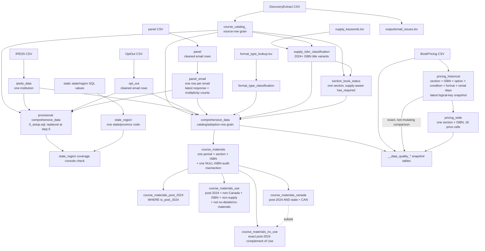
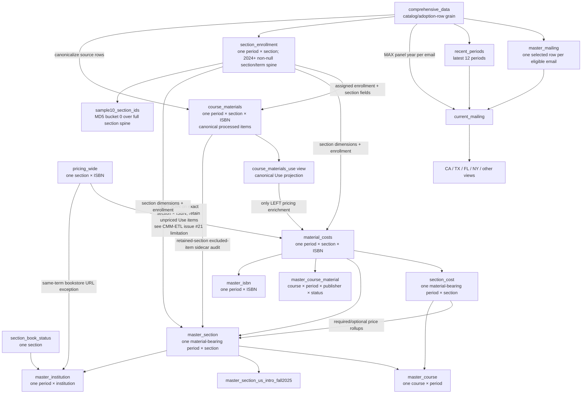
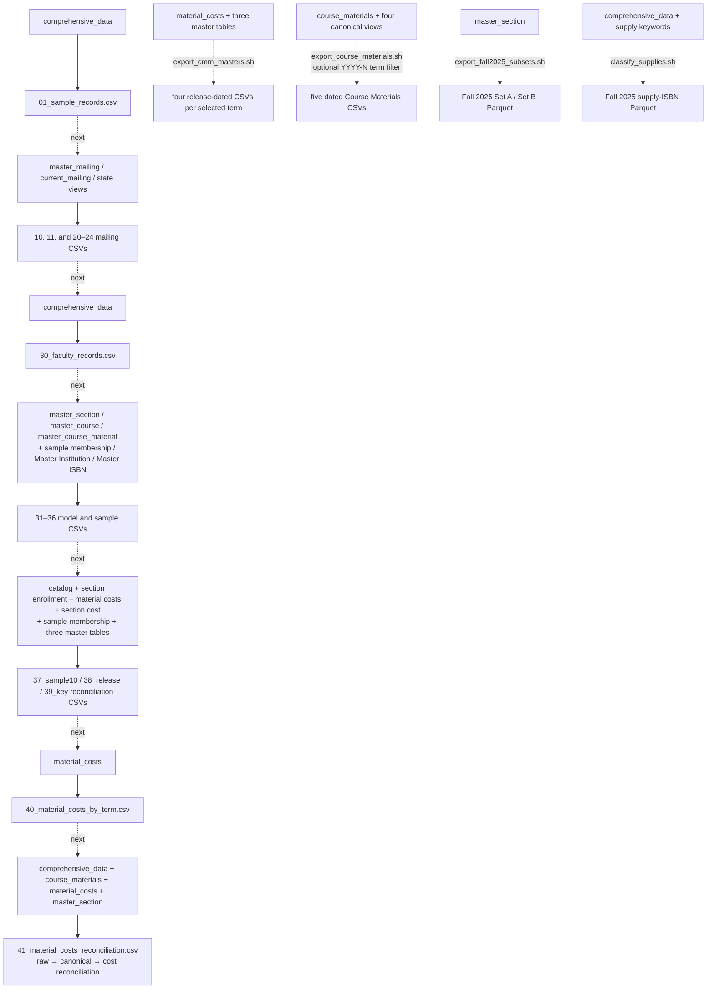

# CommodoreSQL Database Schema

DuckDB pipeline integrating course-catalog data (~103M rows) with institutional
characteristics (IPEDS), bookstore pricing, and opt-out/panel lists. Supports targeted
mailing lists and analysis of course-materials cost and OER/Inclusive-Access adoption.

For full column definitions and types see [`schema.dbml`](schema.dbml) (load in dbdiagram.io).
For naming standards and gotchas see [`CLAUDE.md`](CLAUDE.md). For current work status see
[`HANDOFF.md`](HANDOFF.md).

## Source data

| File | Target table | Rows |
|------|-------------|------|
| `DiscoveryExtract.*.csv` | `course_catalog_<date>` | ~103M |
| `IPEDS_2024.csv` | `ipeds_data` | ~7K |
| `OptOut_*.csv` | `opt_out` | variable |
| `panel_*.csv` | `panel` | variable |
| `format_type_lookup.tsv` | `format_type_classification` | ~69 |
| `supply_keywords.tsv` | (read by `1a_supply_classification.sql` + `scripts/classify_supplies.sh`) | 97 incl + 26 excl |
| `BookPricing.Historical_*.csv` | `pricing_historical` | snapshot-dependent (~27.3M current rows) |

## Pipeline

Run via `scripts/run_sql.sh`. Three stages, each skippable by flag
(`NO_IMPORT` / `NO_EDA` / `NO_EXPORT`). DROP-before-CREATE; re-runnable. Config in
`scripts/dot.env`; SQL is envsubst-templated (`${CONFIG}`, `${LOOKUP_DIR}`, …).

### IMPORT stage

| SQL file | Creates | Purpose |
|----------|---------|---------|
| `0_setup.sql` | `course_catalog_*`, `ipeds_data`, `opt_out`, `panel`, provisional `comprehensive_data`; writes `output/email_issues.tsv` | Load CSVs, normalize emails, derive composite keys (`period_date` included) |
| `0b_state_region.sql` | `state_region` | State → region lookup |
| `1_bookprices_import.sql` | `pricing_historical` | Load and dedupe source-owned bookstore pricing; derive provenance keys/source `required`; create pricing indexes |
| `1a_supply_classification.sql` | `supply_isbn_classification` | ISBN-level supply flag from title keywords (#36); built here so `has_required` (1b_) can be supply-aware (#40) |
| `1b_section_filter.sql` | `section_book_status` | One row per section: supply-aware `has_required` flag (#40); pricing remains untouched |
| `2_oer_classification.sql` | `format_type_classification`, (re)builds `comprehensive_data` | OER/IA lookup, enriched normalized BMG source-row table, and row flags |
| `2b_course_materials.sql` | `section_enrollment`, `course_materials`, four `course_materials_*` views | First canonical processed item table; one section×ISBN row plus one NULL-ISBN audit row per section when present; source/variant/conflict fields and canonical population views |
| `2c_pricing_wide.sql` | **`pricing_wide`** (TABLE) | Source-owned pivot with provenance, 18 price cols, `has_buy`/`has_rent`, and fact aggregates; no catalog/IPEDS enrichment |
| `2d_data_quality.sql` | `__data_quality_*` tables | Materialized, non-mutating DQ snapshots including exact pricing-to-catalog comparisons |

### EDA stage

| SQL file | Creates | Purpose |
|----------|---------|---------|
| `3_mailing_lists.sql` | `master_mailing`, `current_mailing`, 5 state views | Deduplicated instructor mailing lists |
| `3b_material_costs.sql` | **`material_costs`** (TABLE) | Only LEFT pricing enrichment of canonical `course_materials_use`; retains unmatched/unpriced Use items |
| `4_merged_records.sql` | **`section_cost`** (table), **`master_section`** (TABLE), `master_course` (view), `master_course_material` (view), `master_section_us_intro_fall2025` (view) | Material-cost section rollups, material-bearing Master Section, and BMG report view |
| `models/*.sql` | **`master_institution`**, **`master_isbn`**, **`sample10_section_ids`** (TABLEs) | Canonical term rollups and deterministic section-sample membership; `master_isbn` consumes `material_costs`; auto-discovered and materialized by `run_sql.sh` after the EDA SQL files |

### EXPORT stage

Auto-discovers the 21 `scripts/sql/exports/*.sql` files in lexical order; wraps each in a temp
table and `COPY`s it to `output/<SQL basename>.csv`. The exact order, source models, filters, and
file names are inventoried under [Data lineage](#data-lineage). Analysis extracts like the A/B
subsets and supply classification are separate re-runnable scripts —
`scripts/export_fall2025_subsets.sh`, `scripts/classify_supplies.sh` — that write Parquet to
`output/`. `scripts/export_cmm_masters.sh` is also separate from `run_sql.sh`; it writes one
release-dated CSV per material-bearing term from the materialized Material Costs, Master Section,
Master Institution, and Master ISBN tables.
`scripts/export_course_materials.sh` is a separate read-only exporter for the five canonical
Course Materials relations, with optional term filtering.
`38_cmm_release_reconciliation.sql` and `39_cmm_release_key_reconciliation.sql` check the canonical
population, material-cost, section, institution, ISBN, and exact section-key paths by term after
those tables are materialized. They are split to keep the two high-cardinality states sequential.
Per-term exports are direct `period_sortable` filters of Material Costs and the three release
masters; full exports retain `period_sortable` and combine all available terms without changing
the item grain. The material-cost baseline expected for the refreshed snapshot is 12,806,060
rows.

## Key tables

- **`comprehensive_data`** — exactly one enriched, normalized BMG source row (catalog × IPEDS ×
  opt-out × panel lookup × format-type × section status), validated at 102,885,609 rows. It
  remains the source for mailing, faculty, and
  raw DQ consumers, and owns row-level population booleans.
- **`panel` / `panel_email`** — raw panel source rows remain retained; `panel_email` is the
  one-row-per-cleaned-email enrichment lookup with latest response and multiplicity counts, so
  panel history cannot multiply `comprehensive_data` rows.
- **`course_materials`** — first canonical processed table, one row per
  `(period_sortable, section_id, isbn13)` plus one NULL-ISBN audit row per section when present.
  It carries representative catalog metadata, source counts, variant/conflict evidence, flags,
  and assigned enrollment, validated at 96,663,781 rows. The four
  `course_materials_*` views are direct canonical projections.
- **`pricing_historical`** — indexed, deduplicated source-owned pricing at the source logical
  grain; no catalog classification is written back after import.
- **`pricing_wide`** — one row per `(section_id, isbn13)`: source/provenance fields, 18 price
  columns (option × condition × format), `has_buy`/`has_rent`, `price_min/max`,
  `rental_days_min/max`, and `format_count`. It has no required-inference, OER/IA, or IPEDS fields
  and no required-only companion view. Exact-join evidence and future proposals live only in the
  [issue #21 limitation](CMM-ETL.md#current-limitation--pricing-to-catalog-section-matching-issue-21).
- **`section_enrollment`** — exact one row per `(period_sortable, section_id)` with authoritative
  raw enrollment/flags, section-scope dimensions, assigned enrollment, and `enrollment_source`.
  Built in stage 2b, it owns the complete valid 2024+ section population; `course_materials`,
  `material_costs`, and `master_section` consume it so raw inputs, flags, and assignment agree.
- **`material_costs`** — materialized one row per `(period_sortable, section_id, isbn13)`
  canonical Use item. It retains items without a pricing row or valid price and uses catalog-owned title/author/publisher,
  format, FormatType, status, and flags from `course_materials`; a LEFT join to `pricing_wide`
  contributes bookstore URL, all 18 price cells, `format_count`, price bounds, rental range,
  and buy bounds. Term/ISBN compatibility metadata needed by `master_isbn` is also persisted here,
  so that rollup does not return to raw catalog rows. Expected current baseline: 12,806,060 rows.
- **`section_cost`** — per-material-bearing-section required/optional cost aggregates consumed
  from `material_costs`. A section can have Use materials but no valid price, producing NULL cost
  bounds. It is not the approved item-level input.
- **`master_section`** — **materialized TABLE**, one row per distinct
  `(period_sortable, section_id)` represented in canonical `material_costs` (6,983,049 current
  rows). Material/required/optional counts, OER/IA, publishers, ISBN/FormatType, and coverage
  derive from deduplicated `material_costs`; price/cost fields join from `section_cost`; section
  dimensions, enrollment flags, and exact assigned enrollment join from `section_enrollment`.
  Compact NoUse/placeholder/Canada/supply fields are sidecar audits over canonical `course_materials`
  rows for retained material-bearing sections only—not full-population denominators. Complete valid section and
  enrollment coverage remains upstream in `section_enrollment`.
- **`master_course`** — view: one row per `(course_id, period)`, rollups of the above.
- **`master_institution`** — table: one row per `(period_sortable, unit_id)` represented by a
  material-bearing Master Section row, including an explicit NULL-unit unknown bucket when one is
  present; institution attributes, deterministic bookstore URL from all same-term `pricing_wide`
  rows, and material-section coverage/totals (#54).
- **`master_isbn`** — table: one row per `(period_sortable, isbn13)` for canonical Use
  materials consumed from `material_costs`; canonical metadata with conflict DQ, section-level
  coverage, all 18 price-cell counts, enrollment, and institution-type counts (#55).
- **`sample10_section_ids`** — table: one row per selected section, using the version-stable
  `md5-prefix64-mod10-v1` bucket-zero rule. All sampled stages join this one membership table (#53).
- **`master_section_us_intro_fall2025`** — view (BMG #38): filtered projection of `master_section`
  (Fall 2025, `required_count>=1`, intro/intermediate course levels, US only). No new columns.

## Data lineage

This section is the canonical **implemented execution and file-output map**. The source-faithful
whiteboard transcription remains in
[`comms/media/2026-08-17-data-flow.md`](comms/media/2026-08-17-data-flow.md); proposed sources from
that board are not drawn as though they execute today. SQL remains authoritative for field
semantics. Detailed selection rules, derived fields, denominators, and NULL meanings are in
[`CMM-ETL.md`](CMM-ETL.md#4-selection-inclusion-and-exclusion-rules),
[`schema.dbml`](schema.dbml), and the
[`Master Section dictionary`](MASTER-SECTION-DICTIONARY.md).

The detailed ETL contract is also synced as this Notion child page:

<page url="https://app.notion.com/p/CMM-ETL-Contract-3cbd9fdd1a1a81d893effd579a76812b">CMM ETL Contract</page>

### Exact `run_sql.sh` execution order

Arrows in this first diagram mean **execution order**, not table dependency. A skipped stage
removes its whole subgraph (`NO_IMPORT`, `NO_EDA`, or `NO_EXPORT`). Model and export files are
discovered with a lexical sort; the ordering shown below is therefore executable behavior.

```mermaid
flowchart TD
    run["scripts/run_sql.sh"] --> i00
    run -. "NO_IMPORT" .-> e30
    run -. "NO_IMPORT + NO_EDA" .-> x01

    subgraph import["IMPORT — unless NO_IMPORT"]
        i00["01 · 0_setup.sql"] --> i0b["02 · 0b_state_region.sql"]
        i0b --> i10["03 · 1_bookprices_import.sql"]
        i10 --> i1a["04 · 1a_supply_classification.sql"]
        i1a --> i1b["05 · 1b_section_filter.sql"]
        i1b --> i20["06 · 2_oer_classification.sql"]
        i20 --> i2b["07 · 2b_course_materials.sql"]
        i2b --> i2c["08 · 2c_pricing_wide.sql"]
        i2c --> i2d["09 · 2d_data_quality.sql"]
    end

    i2d --> e30
    i2d -. "NO_EDA" .-> x01
    subgraph eda["EDA + models — unless NO_EDA"]
        e30["10 · 3_mailing_lists.sql"] --> e3b["11 · 3b_material_costs.sql"]
        e3b --> e40["12 · 4_merged_records.sql"]
        e40 --> m01["13 · models/master_institution.sql"]
        m01 --> m02["14 · models/master_isbn.sql"]
        m02 --> m03["15 · models/sample10_section_ids.sql"]
    end

    m03 --> x01
    subgraph exports["EXPORT — unless NO_EXPORT; each node becomes output/{basename}.csv"]
        x01["01_sample_records.sql"] --> x10["10_master_mailing.sql"]
        x10 --> x11c["11_current_mailing.sql"]
        x11c --> x11r["11_recent_mailing.sql"]
        x11r --> x20["20_california_mailing.sql"]
        x20 --> x21["21_texas_mailing.sql"]
        x21 --> x22["22_florida_mailing.sql"]
        x22 --> x23["23_newyork_mailing.sql"]
        x23 --> x24["24_texas_fall_series.sql"]
        x24 --> x30["30_faculty_records.sql"]
        x30 --> x31["31_master_section.sql"]
        x31 --> x32["32_master_course.sql"]
        x32 --> x33["33_master_course_material.sql"]
        x33 --> x34["34_master_section_sample10pct.sql"]
        x34 --> x35["35_master_institution_by_term.sql"]
        x35 --> x36["36_master_isbn_by_term.sql"]
        x36 --> x37["37_sample10_reconciliation.sql"]
        x37 --> x38["38_cmm_release_reconciliation.sql"]
        x38 --> x39["39_cmm_release_key_reconciliation.sql"]
        x39 --> x40["40_material_costs_by_term.sql"]
        x40 --> x41["41_material_costs_reconciliation.sql"]
    end
```

If `NO_IMPORT` is set, execution begins at `3_mailing_lists.sql`; if `NO_EDA` is also set, it
begins at the export list. `CUSTOM_SQL_FILES` replaces the assembled list entirely, so a custom
run is intentionally outside the fixed order above.

### Implemented table and file lineage

Solid arrows in the following build diagrams mean **data dependency**. Labels call out the
population or grain transition where it matters. Dotted arrows identify logical subset/reference
relationships when the downstream SQL reads the owning table/flag rather than the displayed view.
Standalone exporters appear in the separate export diagram.

#### Import and enrichment dependencies

The final `comprehensive_data`, `panel_email`, `course_materials`, `section_enrollment`,
`pricing_wide`, and `section_book_status` nodes repeat below as connectors into EDA; they are not
rebuilt between diagrams.

#### EDA and model dependencies

`state_region` is built in execution step 2 and is joined at query time by the Metabase report
questions; it does not enrich `comprehensive_data` or a materialized release table. The import step
also writes `output/email_issues.tsv` directly from the raw catalog CSV.

### Export lineage

Solid arrows below mean source-to-file dependency. Dotted `next` arrows preserve the normal
21-wrapper lexical execution order; labeled dashed arrows are implemented standalone commands.
Exact wrapper order, row filters, and artifact names follow in the inventory.

### Automatic export inventory

These are the 21 SQL wrappers run by the normal EXPORT stage, in exact lexical execution order.
Each produces `output/<SQL basename>.csv` without changing the listed source grain unless a filter
or aggregation is stated.

| Order | SQL wrapper | Source and transformation |
|---:|---|---|
| 1 | `01_sample_records.sql` | 10,000 randomly ordered `comprehensive_data` rows |
| 2 | `10_master_mailing.sql` | selected columns from `master_mailing` |
| 3 | `11_current_mailing.sql` | selected columns from `current_mailing` |
| 4 | `11_recent_mailing.sql` | all columns from `current_mailing` |
| 5 | `20_california_mailing.sql` | `current_mailing_ca` |
| 6 | `21_texas_mailing.sql` | `current_mailing_tx` |
| 7 | `22_florida_mailing.sql` | `current_mailing_fl` |
| 8 | `23_newyork_mailing.sql` | `current_mailing_ny` |
| 9 | `24_texas_fall_series.sql` | Texas current-mailing rows whose source period starts with `Fall` |
| 10 | `30_faculty_records.sql` | `comprehensive_data` aggregated by faculty identity after requiring instructor, course number, section, and course title |
| 11 | `31_master_section.sql` | full all-term `master_section` |
| 12 | `32_master_course.sql` | full all-term `master_course` |
| 13 | `33_master_course_material.sql` | full all-term `master_course_material` |
| 14 | `34_master_section_sample10pct.sql` | `master_section` intersected with `sample10_section_ids` |
| 15 | `35_master_institution_by_term.sql` | all-term `master_institution`, ordered by term and institution |
| 16 | `36_master_isbn_by_term.sql` | all-term `master_isbn`, ordered by term and ISBN |
| 17 | `37_sample10_reconciliation.sql` | full-versus-deterministic-sample checks across catalog, section, material, cost, and master stages |
| 18 | `38_cmm_release_reconciliation.sql` | exact cross-model measures by term |
| 19 | `39_cmm_release_key_reconciliation.sql` | exact Material Costs/Master Section section-key comparison by term |
| 20 | `40_material_costs_by_term.sql` | full all-term `material_costs`, ordered by term, section, and ISBN |
| 21 | `41_material_costs_reconciliation.sql` | exact Use-key, pricing-match, uniqueness, NULL-key, and Master Section coverage checks |

`01_sample_records.sql` is an unseeded 10,000-row raw diagnostic and is unrelated to the canonical
deterministic section sample used by `sample10_section_ids`, export 34, and export 37.

### Current standalone exporters

These commands are implemented and re-runnable, but **do not run as part of `scripts/run_sql.sh`**.

| Command | Current files |
|---|---|
| `scripts/export_cmm_masters.sh [terms…]` | Four release-dated CSVs per selected material-bearing term under `output/cmm/`: `master_section`, `master_institution`, `master_isbn`, and `material_costs` |
| `scripts/export_course_materials.sh [YYYYMMDD] [YYYY-N]` | Five dated CSVs under `output/course_materials` (or `COURSE_MATERIALS_OUTPUT_DIR`): `course_materials`, `course_materials_post_2024`, `course_materials_use_post_2024`, `course_materials_nouse_post_2024`, and `course_materials_can_post_2024`; the term argument is optional; stages all five and refuses overwrite |
| `scripts/export_fall2025_subsets.sh` | `output/fall2025_setA_required.parquet` and `output/fall2025_setB_no_required.parquet` |
| `scripts/classify_supplies.sh` | `output/fall2025_supply_isbns.parquet`; subsequent statements print classification/cost diagnostics |
| `scripts/export_all.sh` | Alternate CSV runner for the same 21 SQL wrappers under `output/exports/` |
| `scripts/export_all_parquet.sh` | Noncanonical recursive Parquet runner under `output/`: the 21 top-level wrappers plus eight `exports/optional/*.sql` legacy summary queries, with numeric prefixes removed. The optional queries depend on `5_`/`6_` summary views that `run_sql.sh` does not rebuild. |

The five Course Materials exports are standalone only and are not automatic SQL wrappers; they
accept a release date and optional `YYYY-N` term filter. `current_mailing_other` is queryable but
has no automatic export wrapper today. Pennsylvania and Canada mailing partitions are also not
implemented; their source refresh and final partition contract remain tracked in issue #56.
`scripts/classify_supplies.sh` independently reclassifies Fall 2025 for an audit extract; it is not
the all-2024+ `supply_isbn_classification` table consumed by the canonical pipeline.

### Pending paths, not current execution

The whiteboard's Spring 2026 catalog/pricing, updated IPEDS, external pricing, discipline,
mailing-history, campus IA, and shared 25-institution inputs have no active SQL nodes yet. They are
owned by issues #51, #52, #56, #57, and #60 and stay outside the implemented diagrams until their
files, grains, keys, and semantics are validated. The whiteboard note “Keep History” is likewise not
an implemented cross-snapshot retention layer: `1_bookprices_import.sql` drops/recreates the
source-owned `pricing_historical`, keeps only the latest row at each logical pricing key within the
configured input snapshot, and builds its indexes. Pricing-to-catalog matching remains an exact,
non-mutating DQ comparison; see the issue #21 limitation in `CMM-ETL.md`.

## Key concepts

### Composite keys
- `course_id` = `unit_id::dept_code::course_number`
- `section_id` = `unit_id::dept_code::course_number::section::period_sortable` — **includes period**
  (each section-offering is its own ID). `(section_id, isbn13)` is the natural catalog grain.
- `period_sortable` = `YYYY-N` (1=Winter, 2=Spring, 3=Summer, **4=Fall**); `period_date` = canonical
  DATE for time-series axes.

### is_required_inferred (the "required code", issue #1)
Inferred is_required. TRUE when `period_date >= 2024-01-01` AND
`(has_required=TRUE AND book_status='required')` OR `(has_required=FALSE AND book_status IS NULL)`.
Applied to catalog-owned `comprehensive_data`, not to either pricing table.
`master_section.required_count` =
the count of canonical `material_costs` items where `is_required_inferred` is true; membership in
that table already guarantees the Use predicate. (Renamed from `filter_include`, #34.)

`has_required` is **supply-aware** (#40): `BOOL_OR(book_status='required' AND NOT is_supply)`, built in
`1a_`/`1b_`. A supply-only "required" item (e.g. safety goggles) no longer forces `has_required=TRUE`,
so a co-listed blank-status **real** textbook correctly keeps the required fallback instead of being
bucketed as optional. #41 (resolved): pseudo-SKU non-book items are overwhelmingly **legitimate**
required digital-access materials (Cengage/Pearson/MyLab access codes) — kept. Two narrow, precision-
verified gaps were folded into the supply classifier: `eyewear` supplies and explicit "no material
required" placeholder rows (`supply_category='placeholder_no_material'`). A console DQ line tracks the
remaining (legitimate) pseudo-SKU residual.

### OER/IA classification
Explicit lookup via `format_type_classification` (FormatType → `is_oer`/`is_ia` + categories).
NULL when FormatType is absent — so `has_formattype` is the classifiability flag.

### Supply classification (issue #36)
Bookstore **supplies** (lab kits, goggles, calculators, clickers, …) are identified by an
include-AND-NOT-exclude **title-keyword** classifier (`FormatType` does not encode supplies).
Keyword list: `scripts/sql/lookups/supply_keywords.tsv` (97 include + 26 exclude, single source of
truth). `1a_supply_classification.sql` builds `supply_isbn_classification` (ISBN-level, over **all
2024+** title variants) and `2_oer_classification.sql` joins `is_supply`/`supply_category` onto
`comprehensive_data`. Supplies are NoUse for every material/count/cost aggregate, while
`master_section` surfaces `is_supply` (`BOOL_OR`) + `supply_count` only for excluded source rows
that co-occur with a retained material-bearing section. Complete supply audits use
`comprehensive_data`.
Precision-over-recall (≈0.98); recall
is keyword-bounded. The `placeholder_no_material` category (#41) reuses this mechanism to exclude
explicit "no material required" placeholder rows. Supplies are <1% of Fall-2025 ISBNs — excluding them
barely moves class medians but removes the high-price tail.

### Course-material population contract (issue #58)

`comprehensive_data` owns non-null row booleans at enriched source-row grain. `is_post_2024` means
`period_date >= DATE '2024-01-01'`; `has_isbn` is `ISBN13 IS NOT NULL` (the imported
numeric column maps blank source cells to NULL while retaining nonstandard numeric pseudo-SKUs);
`has_formattype` means nonblank `FormatType`; enrollment flags test non-null enrollment and
non-null `seats_taken < 9999`; `no_details` is the exact title `*No Book Details*`;
`no_materials` is the exact title `*No Books Required*` or
`supply_category='placeholder_no_material'`; and `is_canada` is `state='CAN'`.

Use is post-2024, non-Canadian, ISBN-bearing, non-supply, and neither placeholder flag. NoUse is
its exact post-2024 complement; both are false pre-2024, and Canada is a NoUse subset. No single
exclusion-reason field is stored because the reason booleans can overlap. Non-978/979 pseudo-SKUs
remain eligible unless the existing supply classifier catches them (#41).

The `course_materials` row population is the first canonical item set: one row per valid
period/section/ISBN and one NULL-ISBN audit row per section when present. `material_costs` is the
distinct canonical Use/material key set, one row per period-specific section/ISBN. `master_course` and `master_institution`
roll up that same material-bearing population. No-ISBN, no-adoption, NoUse-only, Canada-only, and
supply-only sections remain available in `comprehensive_data` and the complete
`section_enrollment` spine; they do not create release-facing Master Section rows. Sidecar audit
columns on retained rows describe excluded source records that co-occur with an included material
section and must not be interpreted as complete-population counts.

For every exported Master Section column, including its business label, owning source/aggregation,
denominator, and NULL meaning, see [`MASTER-SECTION-DICTIONARY.md`](MASTER-SECTION-DICTIONARY.md).

### Canonical material-cost spine

`material_costs` is the approved item-level input: one material row per
`(period_sortable, section_id, isbn13)` after the `course_materials_use` projection. Catalog
duplicates at that key collapse in `course_materials` before enrichment; source disagreement is
retained as explicit variant/conflict signals (for example title, author, publisher, format, or
FormatType variant counts) rather than silently choosing a pricing value. A LEFT join to the
one-row-per-key `pricing_wide` table preserves every Use item.
`section_cost` aggregates this table; `master_section` is its one-row-per-section rollup; and
`master_isbn` rolls it up by term and ISBN. Source-owned `pricing_historical` and `pricing_wide`
remain available for pricing-only analysis and DQ, but never own catalog attributes.

The current expected baseline is 12,806,060 material-cost rows. This baseline is not a claim that
Spring 2026 or any external source has landed locally.

### Enrollment fill (issue #32)
`section_enrollment` owns the persisted per-section enrollment, filling missing values by a
documented hierarchy; `enrollment_source` records the rung used:
`own → own_seats (<9999) → sibling_enroll → sibling_seats → class_median (control×level) →
level_median`. Medians are computed **per period** over the **reference population** (the 4 BMG
course levels × 6 real teaching sectors), so Fall-2025 in-scope rows reproduce the reviewed
analysis (cards 133/134) exactly. Raw `enrollments` is never overwritten; `enrollment_source='none'`
(NULL value) only for rows with no reachable signal.

### Pricing — rental term collapsing
`pricing_historical` grain: `(section_id, isbn13, book_option, book_condition, book_format,
rental_days)`. Buy = one price per (condition × format); rental = one price per `rental_days`
(~95 values). `pricing_wide` collapses rentals via `MAX(price)` and exposes `rental_days_min/max`.
Sentinel prices ≥ 9999 are nulled (#27).

### price_avg convention
`price_avg` / `*_cost_avg` = `(min + max) / 2`, **NOT** an arithmetic mean (legacy). Label clearly.

## Metabase

Reporting is config-as-code: 62 SQL questions (frontmatter: `-- name:`/`-- display:`/
`-- description:`) in `metabase/questions/`, dashboard JSON in `metabase/dashboards/`, IDs in
`metabase/ids.json` (keyed by filename stem), synced via `metabase/sync.py` (DB id 2). The generated
[`DASHBOARDS-REPORTS.md`](DASHBOARDS-REPORTS.md) inventory groups the dashboards conceptually and
lists each dashboard card as a subsection, plus standalone cards and models. The local image is
built/launched by `metabase.sh`; it connects to `duckdb/commodore.duckdb` and holds a read lock (DB
writes require `docker stop metabase` — see `HANDOFF.md`).
