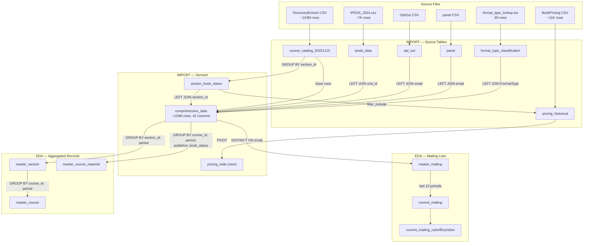

# CommodoreSQL Database Schema

DuckDB pipeline integrating course catalog data (~103M rows) with institutional characteristics, pricing, and opt-out/panel lists. Supports targeted mailing lists and OER/IA adoption analysis.

For full column definitions, types, and indexes see [`schema.dbml`](schema.dbml).

## Source Data

| File | Target Table | Rows |
|------|-------------|------|
| `DiscoveryExtract.20251215.csv` | `course_catalog_20251215` | ~103M |
| `IPEDS_2024.csv` | `ipeds_data` | ~7K |
| `OptOut_20251215.csv` | `opt_out` | variable |
| `panel_20260108.csv` | `panel` | variable |
| `format_type_lookup.tsv` | `format_type_classification` | 69 |
| `BookPricing.Historical_20260224.csv` | `pricing_historical` | ~11K |

## Pipeline

Run via `scripts/run_sql.sh`. Three stages controlled by `NO_IMPORT`, `NO_EDA`, `NO_EXPORT` flags.

### IMPORT stage

| SQL File | Creates | Purpose |
|----------|---------|---------|
| `0_setup.sql` | `course_catalog_20251215`, `ipeds_data`, `opt_out`, `panel`, `email_issues`, `comprehensive_data` | Load CSVs, normalize emails, derive composite keys, build master join |
| `1_bookprices_import.sql` | `pricing_historical` | Load bookstore pricing, derive section_id/period keys |
| `1b_section_filter.sql` | `section_book_status` | One row per section: `has_required` flag. Adds `filter_include` to pricing |
| `1c_pricing_wide.sql` | `pricing_wide` (view) | Pivot pricing into 18 price columns (option x condition x format) |
| `2_oer_classification.sql` | `format_type_classification`, recreates `comprehensive_data` | OER/IA lookup, add classification + filter_include to comprehensive_data |

### EDA stage

| SQL File | Creates | Purpose |
|----------|---------|---------|
| `3_mailing_lists.sql` | `master_mailing`, `current_mailing`, 5 state-specific views | Deduplicated instructor mailing lists |
| `4_merged_records.sql` | `master_section`, `master_course`, `master_course_material` | Aggregated records by section, course, material |

### EXPORT stage

Auto-discovers `scripts/sql/exports/*.sql`. Each query is wrapped in a temp table and exported to CSV via `COPY`.

Optional summary/crosstab exports in `exports/optional/` (require `5_univariate_summaries.sql` and `6_crosstab_summaries.sql` to be run first).

## Data Lineage

## Key Concepts

### Composite Keys

Derived via `::` delimiter (pipe `|` appears in source data):

- `course_id` = `unit_id::dept_code::course_number`
- `section_id` = `unit_id::dept_code::course_number::section`
- `period_sortable` = `YYYY-N` (1=Winter, 2=Spring, 3=Summer, 4=Fall)
- `period_date` = canonical DATE (01-01, 04-01, 07-01, 10-01) for time-series axes

### filter_include

Controls which materials appear in filtered analyses. A row is included when:
- `period_date >= 2024-01-01`, AND
- Section `has_required = TRUE` and `book_status = 'required'`, OR
- Section `has_required = FALSE` and `book_status IS NULL`

Applied to both `comprehensive_data` and `pricing_historical`.

### OER/IA Classification

Explicit lookup via `format_type_classification` (69 FormatType values mapped to `is_oer`/`is_ia` flags and categories). Publisher-based guessing was removed as unreliable.

### Email Cleaning

Emails normalized to lowercase/trimmed. Handles embedded text patterns, multiple addresses, interior spaces. Audit trail written to `output/email_issues.tsv` during import.

## Metabase

5 questions and 2 dashboards managed via `metabase/sync.py`. Questions are SQL files with frontmatter in `metabase/questions/`, dashboards are JSON layouts in `metabase/dashboards/`. IDs tracked in `metabase/ids.json`.

| Dashboard | Questions | Focus |
|-----------|-----------|-------|
| filter_include_quality | 01, 02, 03 | Data quality after has_required filter |
| oer_ia_status_filtered | 04, 05 | OER/IA status and trends (2024+) |
