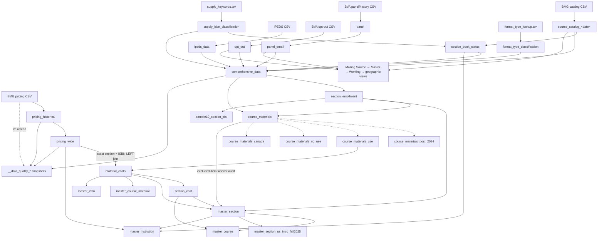
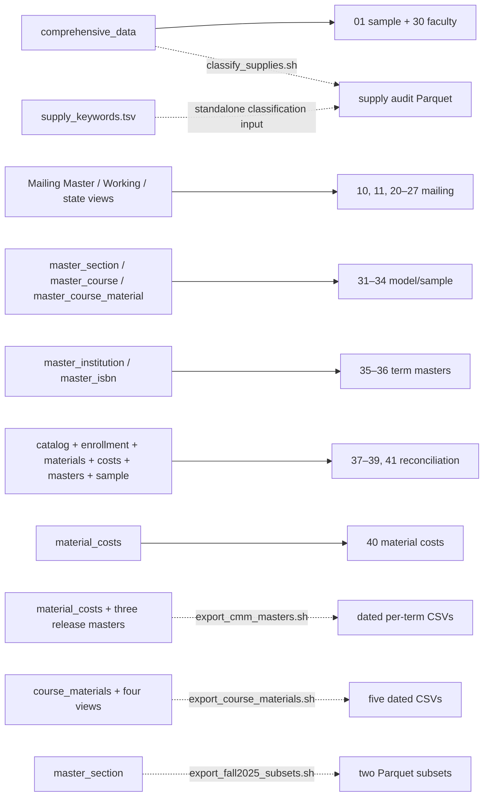

# CommodoreSQL Database Schema

Operational map of the DuckDB build: inputs, execution order, relation dependencies, and export
artifacts. Field semantics belong in the linked contracts, not here.

## Contract index

| Question | Authoritative document |
|---|---|
| Release-facing ETL rules and processing semantics | [`CMM-ETL.md`](CMM-ETL.md) |
| Use/NoUse/Canada and canonical material populations | [`COURSE-MATERIAL-POPULATIONS.md`](COURSE-MATERIAL-POPULATIONS.md) |
| Mailing Source → Master → Working selection and routing | [`MAILING-FLOW.md`](MAILING-FLOW.md) |
| Pricing grain, pivoting, and catalog-match limitations | [`PRICING-CATALOG-MATCHING.md`](PRICING-CATALOG-MATCHING.md) |
| Every relation and column | [`DATA-DICTIONARY.md`](DATA-DICTIONARY.md), generated from [`schema.dbml`](schema.dbml) |
| Naming, ownership, keys, and pipeline conventions | [`CLAUDE.md`](CLAUDE.md) |
| Dashboard and Metabase inventory | [`DASHBOARDS-REPORTS.md`](DASHBOARDS-REPORTS.md) |
| Current operating status and run notes | [`HANDOFF.md`](HANDOFF.md) |

## Inputs

Compatibility target names are established executable names; they are not source prefixes.
BMG owns course materials and raw pricing, BVA owns opt-out and mailing history, and IPEDS owns
institution metadata.

| Owner | Configured input | Loaded target or consumer |
|---|---|---|
| BMG | `DiscoveryExtract.*.csv` | `course_catalog_<date>` |
| BMG | `BookPricing.Historical_*.csv` | `pricing_historical` |
| IPEDS | `IPEDS_2024.csv` | `ipeds_data` |
| BVA | `OptOut_*.csv` | `opt_out` |
| BVA | `panel_*.csv` | `panel`, then `panel_email` |
| Internal | `format_type_lookup.tsv` | `format_type_classification` |
| Internal | `scripts/sql/lookups/supply_keywords.tsv` | supply classification SQL and audit script |

## Operational stages

Run `scripts/run_sql.sh`. SQL is rendered through `envsubst` using `scripts/dot.env`. The normal
run is DROP-before-CREATE and re-runnable. `NO_IMPORT`, `NO_EDA`, and `NO_EXPORT` skip whole stages;
`CUSTOM_SQL_FILES` replaces the assembled list entirely.

| Stage | Files | Operational result |
|---|---|---|
| IMPORT | 9 fixed SQL files | Loads sources; normalizes/enriches catalog rows; builds canonical Course Materials, pricing pivot, and DQ snapshots. `0_setup.sql` also writes `output/email_issues.tsv`. |
| EDA | 3 fixed SQL files | Builds mailing relations, canonical Material Costs, section costs, and section/course/material masters. |
| Models | `scripts/sql/models/*.sql`, lexical order | Materializes `master_institution`, `master_isbn`, and `sample10_section_ids`. |
| EXPORT | `scripts/sql/exports/*.sql`, lexical order, top level only | Wraps each query in a temporary table and writes `output/<basename>.csv`. |

If IMPORT ran in an invocation, a mailing export is rejected unless `3_mailing_lists.sql` ran
after the last import file. With `NO_IMPORT=1`, wrapper-only runs may use the last refreshed mailing
relations.

### Exact `run_sql.sh` order

Arrows here mean execution order. File discovery is lexical.

```mermaid
flowchart TD
    run["scripts/run_sql.sh"] --> i00
    run -. "NO_IMPORT" .-> e30
    run -. "NO_IMPORT + NO_EDA" .-> x01

    subgraph import["IMPORT — unless NO_IMPORT"]
        i00["01 · 0_setup.sql"] --> i0b["02 · 0b_state_region.sql"]
        i0b --> i10["03 · 1_bookprices_import.sql"]
        i10 --> i1a["04 · 1a_supply_classification.sql"]
        i1a --> i1b["05 · 1b_section_filter.sql"]
        i1b --> i20["06 · 2_oer_classification.sql"]
        i20 --> i2b["07 · 2b_course_materials.sql"]
        i2b --> i2c["08 · 2c_pricing_wide.sql"]
        i2c --> i2d["09 · 2d_data_quality.sql"]
    end

    i2d --> e30
    i2d -. "NO_EDA" .-> x01
    subgraph eda["EDA + models — unless NO_EDA"]
        e30["10 · 3_mailing_lists.sql"] --> e3b["11 · 3b_material_costs.sql"]
        e3b --> e40["12 · 4_merged_records.sql"]
        e40 --> m01["13 · models/master_institution.sql"]
        m01 --> m02["14 · models/master_isbn.sql"]
        m02 --> m03["15 · models/sample10_section_ids.sql"]
    end

    m03 --> x01
    subgraph exports["EXPORT — unless NO_EXPORT"]
        x01["01_sample_records.sql"] --> x10["10_master_mailing.sql"]
        x10 --> x11c["11_current_mailing.sql"]
        x11c --> x11r["11_recent_mailing.sql"]
        x11r --> x20["20_california_mailing.sql"]
        x20 --> x21["21_texas_mailing.sql"]
        x21 --> x22["22_florida_mailing.sql"]
        x22 --> x23["23_newyork_mailing.sql"]
        x23 --> x24["24_texas_fall_series.sql"]
        x24 --> x25["25_pennsylvania_mailing.sql"]
        x25 --> x26["26_canada_mailing.sql"]
        x26 --> x27["27_other_mailing.sql"]
        x27 --> x30["30_faculty_records.sql"]
        x30 --> x31["31_master_section.sql"]
        x31 --> x32["32_master_course.sql"]
        x32 --> x33["33_master_course_material.sql"]
        x33 --> x34["34_master_section_sample10pct.sql"]
        x34 --> x35["35_master_institution_by_term.sql"]
        x35 --> x36["36_master_isbn_by_term.sql"]
        x36 --> x37["37_sample10_reconciliation.sql"]
        x37 --> x38["38_cmm_release_reconciliation.sql"]
        x38 --> x39["39_cmm_release_key_reconciliation.sql"]
        x39 --> x40["40_material_costs_by_term.sql"]
        x40 --> x41["41_material_costs_reconciliation.sql"]
    end
```

## Relation inventory

This is a navigation index, not a column dictionary. “Section” means a period-specific
`section_id`; see [`CLAUDE.md`](CLAUDE.md#section_id-is-period-specific).

| Relation | Grain / operational role |
|---|---|
| `course_catalog_<date>` | Normalized BMG source rows; compatibility table name. |
| `ipeds_data` | Institution metadata lookup. |
| `opt_out`, `panel` | Retained BVA source rows with normalized email; duplicate emails are allowed. `panel_email` collapses panel history to one row per email. |
| `state_region` | Static state/province-to-region lookup used by reports. |
| `format_type_classification` | FormatType-to-OER/IA lookup. |
| `supply_isbn_classification` | One row per classified 2024+ ISBN. |
| `section_book_status` | One row per section; supply-aware required-status evidence. |
| `comprehensive_data` | One enriched normalized catalog source row in the recorded snapshot; raw lookup joins do not structurally reject duplicate keys, so refresh DQ must prove count preservation. |
| `section_enrollment` | One row per valid 2024+ period × section; authoritative assigned enrollment spine. |
| `course_materials` | One row per period × section × ISBN, plus at most one NULL-ISBN audit row per section. |
| `course_materials_post_2024` | Direct post-2024 projection of `course_materials`. |
| `course_materials_use` | Canonical Use projection. |
| `course_materials_no_use` | Exact post-2024 complement of Use. |
| `course_materials_canada` | Canadian post-2024 subset; also part of NoUse. |
| `pricing_historical` | Source pricing at section × ISBN × option × condition × format × rental-term grain. |
| `pricing_wide` | One row per section × ISBN; provenance, 18 price cells, and fact aggregates. |
| `__data_quality_*` | Materialized, non-mutating DQ snapshots. |
| `master_mailing` | One row per nonblank cleaned email before history enrichment and opt-out filtering. |
| `recent_periods` | Newest 12 non-NULL terms represented by Mailing Master. |
| `current_mailing` | One eligible cleaned email after recency, history enrichment, and opt-out exclusion. |
| `current_mailing_{ca,tx,fl,ny,pa,can,other}` | Exhaustive disjoint normalized-state partitions of Working. |
| `material_costs` | One canonical Use item per period × section × ISBN; LEFT-enriched from pricing. |
| `section_cost` | Cost aggregates per material-bearing period × section. |
| `master_section` | One row per material-bearing period × section. |
| `master_course` | One row per period × course. |
| `master_course_material` | One row per exact group `(course_id, period, period_sortable, period_date, school, department, course_number, course_title, publisher, book_status)` from `material_costs`; filters NULL `course_id`, `publisher`, and `period_sortable`. |
| `master_section_us_intro_fall2025` | Compatibility report projection of `master_section`. |
| `master_institution` | One row per material-bearing period × institution, including any NULL-unit bucket. |
| `master_isbn` | One row per period × ISBN in canonical Use materials. |
| `sample10_section_ids` | Deterministic section-sample membership. |

## Data dependencies

Solid arrows mean data dependency. Dotted arrows mark a projection/subset or a standalone output.
The mailing branch stays deliberately high-level here; see [`MAILING-FLOW.md`](MAILING-FLOW.md)
for its selection, recency, history, opt-out, and routing rules.

<page url="https://app.notion.com/p/3cbd9fdd1a1a81d893effd579a76812b">CMM ETL Contract</page>

`state_region` is built during IMPORT and joined at query time by Metabase questions. It does not
enrich `comprehensive_data` or a release table.

### Export dependencies

## Automatic export inventory

These are all 24 top-level wrappers run by the normal EXPORT stage, in exact lexical order. Each
writes `output/<SQL basename>.csv`.

| # | Wrapper | Source / transformation |
|---:|---|---|
| 1 | `01_sample_records.sql` | 10,000 randomly ordered `comprehensive_data` rows. |
| 2 | `10_master_mailing.sql` | Selected `master_mailing` columns; pre-history/pre-opt-out audit, not send-ready. |
| 3 | `11_current_mailing.sql` | Selected `current_mailing` Working columns. |
| 4 | `11_recent_mailing.sql` | All Working columns; same population as wrapper 3. |
| 5 | `20_california_mailing.sql` | `current_mailing_ca`. |
| 6 | `21_texas_mailing.sql` | `current_mailing_tx`. |
| 7 | `22_florida_mailing.sql` | `current_mailing_fl`. |
| 8 | `23_newyork_mailing.sql` | `current_mailing_ny`. |
| 9 | `24_texas_fall_series.sql` | Texas Working rows whose source period starts with `Fall`. |
| 10 | `25_pennsylvania_mailing.sql` | `current_mailing_pa`. |
| 11 | `26_canada_mailing.sql` | `current_mailing_can`. |
| 12 | `27_other_mailing.sql` | Residual `current_mailing_other`, including NULL/blank/unknown states. |
| 13 | `30_faculty_records.sql` | Filters `comprehensive_data` to non-NULL `instructor`, `course_number`, `section`, and `course_title`; groups by faculty identity, instructor, school, email, and department, with per-period record and section lists. |
| 14 | `31_master_section.sql` | Full all-term `master_section`. |
| 15 | `32_master_course.sql` | Full all-term `master_course`. |
| 16 | `33_master_course_material.sql` | Full all-term `master_course_material`. |
| 17 | `34_master_section_sample10pct.sql` | `master_section` intersected with `sample10_section_ids`. |
| 18 | `35_master_institution_by_term.sql` | All-term `master_institution`, ordered by term/institution. |
| 19 | `36_master_isbn_by_term.sql` | All-term `master_isbn`, ordered by term/ISBN. |
| 20 | `37_sample10_reconciliation.sql` | Full-versus-deterministic-sample stage checks. |
| 21 | `38_cmm_release_reconciliation.sql` | Cross-model measures by term. |
| 22 | `39_cmm_release_key_reconciliation.sql` | Material Costs/Master Section section-key comparison by term. |
| 23 | `40_material_costs_by_term.sql` | All-term `material_costs`, ordered by term/section/ISBN. |
| 24 | `41_material_costs_reconciliation.sql` | Use-key, pricing-match, uniqueness, NULL-key, and section-coverage checks. |

Wrapper 1 is an unseeded raw diagnostic. It is unrelated to the deterministic section sample used
by `sample10_section_ids`, wrappers 17 and 20.

## Standalone export inventory

These commands are implemented and re-runnable but do **not** run in `scripts/run_sql.sh`.

| Command | Exact artifact inventory |
|---|---|
| `scripts/export_cmm_masters.sh [terms…]` | Four CSVs per selected material-bearing term under `output/cmm/`: `{master_section,master_institution,master_isbn,material_costs}_<YYYY_N>_<YYYYMMDD>.csv`. |
| `scripts/export_course_materials.sh [YYYYMMDD] [YYYY-N]` | Five CSVs under `output/course_materials/` (or `COURSE_MATERIALS_OUTPUT_DIR`): `{course_materials,course_materials_post_2024,course_materials_use_post_2024,course_materials_nouse_post_2024,course_materials_can_post_2024}[_<YYYY_N>]_<YYYYMMDD>.csv`. The term is optional; the script stages all five and refuses overwrite. |
| `scripts/export_fall2025_subsets.sh` | `output/fall2025_setA_required.parquet`, `output/fall2025_setB_no_required.parquet`. |
| `scripts/classify_supplies.sh` | Reads `scripts/sql/lookups/supply_keywords.tsv`; writes `output/fall2025_supply_isbns.parquet`, then prints classification/cost diagnostics. This audit is separate from the canonical all-2024+ classifier. |
| `scripts/export_all.sh` | Alternate CSV runner for the same 24 wrappers under `output/exports/`. |
| `scripts/export_all_parquet.sh` | Noncanonical recursive Parquet runner under `output/`: the 24 top-level wrappers plus eight `exports/optional/*.sql` legacy summaries, with numeric prefixes removed. The optional queries depend on `5_`/`6_` summary views that `run_sql.sh` does not rebuild. |

## Pending inputs and non-current paths

Spring 2026 catalog/pricing, updated IPEDS, external pricing, discipline, updated mailing history,
campus IA, and shared 25-institution inputs have no active SQL nodes. They remain outside the
implemented diagrams until their files, grains, keys, and semantics are validated (issues #51,
#52, #56, #57, and #60).

“Keep History” is not an implemented cross-snapshot retention layer. The pricing import
drops/recreates `pricing_historical` and retains the latest row at each logical key within the
configured snapshot. Pricing-to-catalog matching is exact and non-mutating; proposed matching
work is documented in [`PRICING-CATALOG-MATCHING.md`](PRICING-CATALOG-MATCHING.md).

Current baselines in other documents describe the loaded snapshot, not evidence that pending
sources have landed.
