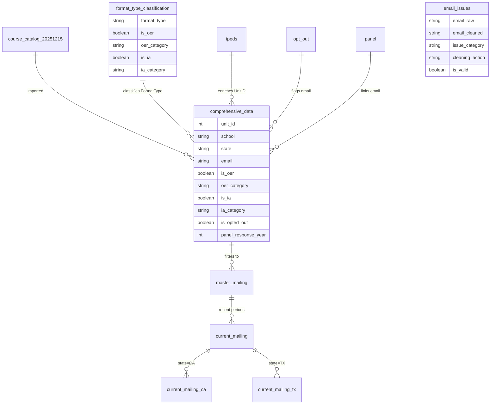

# TODO: Email Data Quality Improvements

## Overview

Enhance email data quality through comprehensive issue tracking with minimal-effort recovery. Current email_issues table captures only 1,103 records but ~40,000+ problematic emails exist in the database.

## Goals

1. **Auditable changes** - Track all email issues and applied transformations
2. **Simple recovery** - Apply only easy, reliable cleaning rules (remove spaces, trim, etc.)
3. **Flag unfixable** - Mark problematic emails for audit without dropping course catalog rows
4. **Exclusion from mailing** - Exclude known-bad emails from mailing lists only

## Key Principles

- **Never drop course catalog rows** - Invalid email doesn't invalidate other course data
- **Minimal effort recovery** - Only simple, reliable transformations worth the effort
- **Many are duplicates** - Aggressive recovery not needed; likely duplicates of valid emails
- **No opt-out impact** - Users don't opt out until first mailing, so missing some recoverable emails acceptable

## Current State

### Email Issues Table (1,103 records)
- `removed_spaces`: 529 records
- `multiple_emails_took_first`: 274 records
- `extracted_from_text`: 190 records
- `missing_at_sign`: 110 records

### Uncaptured Issues (~40,000 records)
- **37,429 records**: email = `'null'` (string literal, not NULL)
- **3,473 records**: missing @ sign after cleaning
- **22 records**: still contain spaces after cleaning
- **Unknown count**: other malformed emails not yet categorized

## Implementation Plan

### Phase 1: Comprehensive Email Issue Detection

**Objective**: Capture ALL problematic emails in email_issues table for auditing

**Approach**: Two-phase detection
1. **Raw email issues** - Problems in source data (`"E-Mail"` column)
2. **Post-cleaning issues** - Problems remaining after cleaning rules applied

**New email_issues table schema**:
```sql
CREATE TABLE email_issues (
    email_raw TEXT,           -- Original value from source CSV
    email_cleaned TEXT,       -- Value after cleaning rules applied (may still be invalid)
    source_table TEXT,        -- Always 'course_catalog' for now
    issue_phase TEXT,         -- 'raw' or 'post_cleaning'
    issue_category TEXT,      -- Categorization of the problem
    cleaning_action TEXT,     -- Rule(s) applied during cleaning (or 'none' if unfixable)
    is_valid BOOLEAN,         -- Whether email_cleaned is valid for mailing
    record_count INTEGER,     -- Number of records with this email
    notes TEXT                -- Additional context for audit
);
```

**Issue categories to track**:
- `string_null` - Literal 'null' value → `is_valid=false`
- `missing_at_sign` - No @ symbol present → `is_valid=false`
- `has_spaces` - Contains whitespace → Apply trim/remove spaces if otherwise valid
- `multiple_emails` - Multiple addresses in one field → Take first valid-looking email
- `text_prefix` - "email:", "email " prefix present → Strip prefix if otherwise valid
- `too_short` - Length < 5 characters → `is_valid=false`
- `html_entity` - Contains HTML entities (e.g., `&#160;`) → `is_valid=false` (not worth decoding)
- `name_only` - Appears to be just a name, not email → `is_valid=false`
- `partial_address` - Missing domain or username → `is_valid=false`

**Simple recovery rules only**:
- Trim whitespace (universal)
- Lowercase (universal)
- Remove interior spaces from otherwise valid emails (already implemented)
- Strip "email:" or "e-mail:" prefix (already implemented)
- Take first email from multiple (already implemented)

**Implementation file**: `scripts/sql/0_setup.sql` (lines 145-176)

### Phase 2: Simple Rule Application (Minimal Effort)

**Objective**: Apply only simple, reliable cleaning rules - skip complex recovery

**Rules to keep** (already implemented):
- `universal_cleanup` - Trim whitespace, lowercase (always safe)
- `prefix_removal` - Remove "email:", "e-mail:" prefix (already working)
- `space_handling` - Remove interior spaces from valid emails (already working)
- `multiple_email_extraction` - Take first email from list (already working)

**Rules to skip** (not worth effort):
- ❌ HTML entity decoding - Complex, low volume, likely duplicates
- ❌ Domain inference - Unreliable, requires institutional data
- ❌ Manual corrections - Time intensive for marginal gain
- ❌ Aggressive pattern matching - Risk of false positives

**Additional simple rule to add**:
- `null_literal_handling` - Convert string 'null' to SQL NULL (37,429 records)
  ```sql
  CASE WHEN LOWER(TRIM("E-Mail")) = 'null' THEN NULL
       ELSE <existing cleaning logic>
  END
  ```

**Validation only** (no recovery attempted):
- Check final email has @ sign
- Check length >= 5 characters
- Flag issues but don't drop course_catalog rows

### Phase 3: Exclusion Strategy (Mailing Lists Only)

**Objective**: Exclude invalid emails from mailing lists without dropping course_catalog rows

**Critical**: Email issues affect mailing lists only, NOT course catalog data integrity

**Recommended approach**: Simple validation in master_mailing view

```sql
-- master_mailing view with email validation
CREATE VIEW master_mailing AS
SELECT DISTINCT ON (email)
    unit_id,
    school,
    state,
    department,
    course_level,
    course_subject,
    period,
    period_sortable,
    instructor,
    first_name,
    last_name,
    email
FROM comprehensive_data
WHERE
    email IS NOT NULL
    AND email != ''
    AND email LIKE '%@%'               -- Simple @ check
    AND LENGTH(email) >= 5             -- Minimum valid length
    AND is_opted_out = false
ORDER BY
    email,
    period_sortable DESC,
    enrollments DESC,
    RANDOM();
```

**Why this approach**:
- No schema changes to comprehensive_data table
- No additional tables to maintain
- Simple, transparent validation logic
- Invalid emails still visible in comprehensive_data for audit
- Easy to adjust validation criteria

### Phase 4: Reporting and Monitoring

**Objective**: Track data quality metrics over time

**Reports to generate**:
1. **Email quality summary** - counts by issue_category
2. **Cleaning effectiveness** - before/after metrics for each rule
3. **Exclusion impact** - how many records excluded from mailing lists
4. **Fixable candidates** - prioritized list for manual review

**Implementation**: Add to exports
- `exports/email_quality_summary.sql`
- `exports/email_issues_detailed.sql`
- `exports/cleaning_effectiveness.sql`

## Simplified Implementation Protocol

### One-Time Setup

**Goal**: Add simple string 'null' handling and comprehensive email_issues tracking

1. **Add null literal handling** to email cleaning (scripts/sql/0_setup.sql:51-64)
   ```sql
   LOWER(TRIM(
       CASE
           -- Handle string 'null' literal
           WHEN LOWER(TRIM("E-Mail")) = 'null' THEN NULL
           -- Extract email from "email: addr@domain.com" patterns
           WHEN "E-Mail" LIKE '%email:%@%' THEN ...
           -- ... rest of existing logic
       END
   )) AS email,
   ```

2. **Expand email_issues table** to capture all problems (scripts/sql/0_setup.sql:145-176)
   - Add both raw and post-cleaning issue detection
   - Include is_valid flag for easy filtering
   - Track record_count for prioritization

3. **Add validation to master_mailing** (scripts/sql/3_mailing_lists.sql:6-30)
   ```sql
   WHERE
       email IS NOT NULL
       AND email != ''
       AND email LIKE '%@%'
       AND LENGTH(email) >= 5
       AND is_opted_out = false
   ```

4. **Run full import** and review email_issues table
   ```bash
   scripts/run_sql.sh
   ```

5. **Generate email quality report** (one-time audit)
   ```bash
   duckdb commodore.duckdb -csv \
     -c "SELECT issue_category, is_valid,
         COUNT(*) as records,
         COUNT(DISTINCT email_raw) as unique_emails
         FROM email_issues
         GROUP BY issue_category, is_valid
         ORDER BY records DESC" \
     > output/email_quality_audit.csv
   ```

### No Iteration Required

**Rationale**: Simple rules only, skip diminishing returns
- String 'null' → NULL conversion handles 37K records
- Existing space/prefix/multiple rules already working
- Remaining issues likely duplicates or not worth effort
- email_issues table provides audit trail if needed later

## Priority Order (Minimal Effort Approach)

### Implement Now
1. **String 'null' → NULL** - 37,429 records → Simple CASE WHEN, high impact
2. **Validation in master_mailing** - Add @ and length checks to WHERE clause
3. **Expand email_issues table** - Track all issues for audit (not necessarily for fixing)

### Skip (Not Worth Effort)
- ❌ HTML entity decoding - Low volume (181 records), complex logic
- ❌ Name-only recovery - Unfixable without external data
- ❌ Partial address repair - Unreliable, likely duplicates
- ❌ Manual corrections - Time intensive for marginal benefit

### Already Working (Keep As-Is)
- ✅ Trim whitespace and lowercase
- ✅ Remove interior spaces from valid emails
- ✅ Strip "email:" prefix
- ✅ Extract first email from multiple

## Success Metrics (Simplified)

- **Coverage**: email_issues table captures all problematic emails for audit
- **Accuracy**: Valid emails not incorrectly excluded from master_mailing
- **Mailing quality**: master_mailing contains only emails with @ and length >= 5
- **Data integrity**: No course_catalog rows dropped due to email issues
- **Audit trail**: All email transformations documented in email_issues table

## Files to Modify

1. `scripts/sql/0_setup.sql` - Email cleaning rules and email_issues table creation
2. `scripts/sql/3_mailing_lists.sql` - Add exclusion logic to master_mailing
3. `scripts/sql/exports/` - Add email quality reports (new files)
4. `IMPLEMENTATION_STATUS.md` - Document changes and metrics

## Decisions Made

1. ✅ **Minimal effort recovery only** - Simple rules, skip complex patterns
2. ✅ **No schema changes to comprehensive_data** - Validation in views only
3. ✅ **No row deletion** - Invalid emails don't invalidate course data
4. ✅ **Audit over recovery** - Track issues but don't over-invest in fixes

## Future Considerations (Low Priority)

- Track email quality metrics over time (across data imports)
- Export email_issues for external review if needed
- Add email quality summary to regular exports

---

# TODO: Database Schema Documentation

## Overview

Create visual schema diagrams to document database structure, relationships, and data flow.

## Goals

1. **Visual documentation** - Clear representation of table structure and relationships
2. **Onboarding aid** - Help new contributors understand data model
3. **Reference material** - Quick lookup for table columns and relationships
4. **Version controlled** - Diagrams stored in docs/ alongside markdown documentation

## Diagram Types to Create

### 1. Entity Relationship Diagram (ERD)

**Purpose**: Show tables, columns, and relationships

**Tools to consider**:
- **Mermaid** (recommended) - Text-based, renders in GitHub/docs
- **PlantUML** - More detailed UML diagrams
- **dbdiagram.io** - Online tool, exports to various formats
- **DuckDB DESCRIBE** - Auto-generate table schemas

**Tables to include**:
- `course_catalog_20251215` (raw import)
- `ipeds` (institution data)
- `opt_out` (opt-out list)
- `panel` (panel response data)
- `format_type_classification` (lookup table)
- `comprehensive_data` (main denormalized table)
- `email_issues` (data quality tracking)
- `master_mailing` (view)
- `current_mailing` (view)
- State-specific mailing views (views)
- `faculty_records`, `course_section_records`, `course_records` (aggregated tables)

**Relationships to show**:
- `comprehensive_data` ← JOIN ← `format_type_classification` (via FormatType)
- `comprehensive_data` ← LEFT JOIN ← `ipeds` (via UnitID)
- `comprehensive_data` ← LEFT JOIN ← `opt_out` (via email)
- `comprehensive_data` ← LEFT JOIN ← `panel` (via email)
- `master_mailing` ← VIEW ← `comprehensive_data`
- `current_mailing` ← VIEW ← `master_mailing` + `recent_periods`
- State views ← VIEW ← `current_mailing` (filtered by state)

### 2. Data Flow Diagram

**Purpose**: Show data pipeline from source files through transformations

**Flow sequence**:
```
Source CSV files
    ↓
0_setup.sql (import + email cleaning)
    ↓
format_type_classification (lookup table)
    ↓
2_oer_classification.sql (JOIN OER/IA data)
    ↓
comprehensive_data (denormalized main table)
    ↓
3_mailing_lists.sql (filtering + deduplication)
    ↓
master_mailing → current_mailing → state-specific views
    ↓
4_merged_records.sql (aggregations)
    ↓
faculty_records, course_section_records, course_records
    ↓
5_univariate_summaries.sql + 6_crosstab_summaries.sql
    ↓
Exports (CSV files)
```

### 3. Column Reference Tables

**Purpose**: Quick lookup of available columns in key tables

**Tables to document**:
- `comprehensive_data` - Full column list with data types
- `master_mailing` - Mailing list columns
- `format_type_classification` - OER/IA classification fields
- `email_issues` - Data quality tracking fields

### 4. Source File and Column Lineage Tracking

**Purpose**: Document data provenance and transformations

**For each imported table, track**:
- **Source file path** - CSV file location
- **Import script** - SQL file that creates the table
- **Column mapping**:
  - Original column names from CSV (if renamed)
  - Derived columns (computed during import)
  - Dropped columns (present in CSV but not imported)
  - Transformation logic (e.g., email cleaning, period_sortable calculation)

**Tables requiring lineage documentation**:

1. **course_catalog_20251215**
   - Source: `data/2025.12.15/2025_12/DiscoveryExtract.20251215.csv`
   - Script: `scripts/sql/0_setup.sql`
   - Renamed columns: `"E-Mail"` → `email`, `"CourseLvlTitle"` → `course_level`, etc.
   - Derived columns:
     - `email` ← cleaned from `"E-Mail"` (trim, lowercase, pattern extraction)
     - `period_sortable` ← derived from `Period` (Season YYYY → YYYY-N)
     - `course_id` ← `School || '::' || CourseNum`
     - `section_id` ← `course_id || '::' || SectionNum`
   - Dropped columns: (list any CSV columns not imported)

2. **ipeds**
   - Source: `data/2025.12.15/IPEDS_2024.csv`
   - Script: `scripts/sql/0_setup.sql`
   - Column transformations: (document any)

3. **opt_out**
   - Source: `data/2025.12.15/OptOut_20251215.csv`
   - Script: `scripts/sql/0_setup.sql`
   - Column transformations: (document any)

4. **panel**
   - Source: `data/2025.12.15/panel_20260108.csv`
   - Script: `scripts/sql/0_setup.sql`
   - Column transformations: (document any)

5. **format_type_classification**
   - Source: `data/2025.12.15/format_type_lookup.tsv`
   - Script: `scripts/sql/2_oer_classification.sql`
   - Column transformations: TSV columns imported directly

6. **comprehensive_data**
   - Source: Multiple JOINs (course_catalog + ipeds + opt_out + panel + format_type_classification)
   - Script: `scripts/sql/2_oer_classification.sql`
   - Derived columns:
     - `is_oer`, `oer_category` ← from format_type_classification
     - `is_ia`, `ia_category` ← from format_type_classification
     - `is_opted_out` ← from opt_out join
     - `panel_response_year` ← from panel join

**Documentation format**:

```markdown
## Table: course_catalog_20251215

**Source**: `data/2025.12.15/2025_12/DiscoveryExtract.20251215.csv`
**Import Script**: `scripts/sql/0_setup.sql` (lines 23-96)
**Type**: Raw import with transformations

### Column Lineage

| Database Column | Source Column | Transformation | Notes |
|----------------|---------------|----------------|-------|
| UnitID | UnitID | Direct import | Institution identifier |
| School | School | Direct import | |
| State | State | Direct import | Added in 2025.12.15 data |
| email | "E-Mail" | Cleaned | See email cleaning logic below |
| first_name | FirstName | Direct import | |
| last_name | LastName | Direct import | |
| period_sortable | Period | Derived | Season YYYY → YYYY-N (1=Spring, 2=Summer, 3=Fall) |
| course_id | CourseNum, School | Derived | `School || '::' || CourseNum` |
| section_id | course_id, SectionNum | Derived | `course_id || '::' || SectionNum` |
| FormatType | FormatType | Direct import | Used for OER/IA classification |

### Email Cleaning Logic

```sql
LOWER(TRIM(
    CASE
        WHEN "E-Mail" LIKE '%email:%@%' THEN REGEXP_EXTRACT(...)
        WHEN "E-Mail" LIKE '%email %@%' THEN REGEXP_EXTRACT(...)
        WHEN "E-Mail" LIKE '%@% %@%' THEN SPLIT_PART(...)
        WHEN "E-Mail" LIKE '% %' AND "E-Mail" LIKE '%@%' THEN REPLACE(...)
        ELSE "E-Mail"
    END
)) AS email
```

### Dropped Columns

- (List any CSV columns not imported, if applicable)
```

## Implementation Options

### Option A: Mermaid ERD (Recommended)

**Benefits**:
- Text-based, version controlled
- Renders directly in GitHub markdown
- Easy to update alongside code changes
- No external dependencies

**Example**:


**File location**: `docs/SCHEMA.md`

### Option B: PlantUML Diagram

**Benefits**:
- More detailed UML notation
- Professional appearance
- Can generate SVG/PNG

**Drawbacks**:
- Requires external rendering tool
- Not rendered directly in GitHub

**File location**: `docs/schema.puml`

### Option C: Combined Approach

**Best of both worlds**:
- Mermaid ERD in `docs/SCHEMA.md` for GitHub viewing
- PlantUML in `docs/schema.puml` for detailed documentation
- Auto-generated column reference tables from DuckDB

## Implementation Steps

1. **Extract schema from DuckDB**
   ```bash
   # Get table schemas
   duckdb commodore.duckdb -c "
   SELECT
       table_name,
       column_name,
       data_type,
       is_nullable
   FROM information_schema.columns
   WHERE table_schema = 'main'
   ORDER BY table_name, ordinal_position" \
   > docs/schema_dump.csv
   ```

2. **Document source files and column lineage** in `docs/COLUMN_LINEAGE.md`
   - For each imported table, list source CSV file
   - Create column mapping table (source → database)
   - Document all transformations (derived columns, cleaning logic)
   - List dropped columns (if any)
   - Include script references (file + line numbers)

3. **Create Mermaid ERD** in `docs/SCHEMA.md`
   - Start with core tables: comprehensive_data, format_type_classification
   - Add relationships and key columns
   - Include views (master_mailing, current_mailing, etc.)
   - Reference source files for each table

4. **Create data flow diagram** in `docs/DATA_FLOW.md`
   - Show source CSV files → import scripts → tables
   - Document transformations at each step
   - Link to relevant SQL files and COLUMN_LINEAGE.md

5. **Generate column reference** in `docs/COLUMN_REFERENCE.md`
   - Comprehensive_data: all columns with data types and descriptions
   - Key lookup tables: format_type_classification, email_issues
   - Important views: master_mailing, current_mailing
   - Link to COLUMN_LINEAGE.md for transformation details

6. **Link from main README**
   - Add "Database Schema" section to README.md
   - Link to SCHEMA.md, DATA_FLOW.md, COLUMN_REFERENCE.md, COLUMN_LINEAGE.md

## Success Criteria

- ERD clearly shows table relationships and source files
- Data flow diagram includes CSV sources → scripts → tables
- Column lineage documents all transformations (email cleaning, period_sortable, etc.)
- Column reference includes all key tables with data types
- Diagrams render correctly in GitHub
- Documentation is up-to-date with current schema
- Easy to trace any column back to its source CSV and transformation logic

## Files to Create

1. `docs/COLUMN_LINEAGE.md` - Source files and column transformations for all imported tables
2. `docs/SCHEMA.md` - Mermaid ERD + relationship documentation
3. `docs/DATA_FLOW.md` - Pipeline visualization (CSV → tables → views → exports)
4. `docs/COLUMN_REFERENCE.md` - Detailed column listings with data types
5. `docs/schema.puml` (optional) - PlantUML diagram
6. Update `README.md` - Add links to all schema documentation

## References

- Current implementation: `scripts/sql/0_setup.sql` (lines 51-64, 145-176)
- Discovery documentation: Analysis showed 40K+ uncaptured email issues
- Related: OER/IA lookup table approach (`data/2025.12.15/format_type_lookup.tsv`)

---

# TODO: Data Dictionary with Example Values

## Overview

Create a user-friendly data dictionary that documents database columns with real example values from the data, making it accessible to non-technical stakeholders.

## Goals

1. **Non-technical accessibility** - Clear descriptions without SQL jargon
2. **Real examples** - Show actual data values, not just data types
3. **Business context** - Explain what each field means and how it's used
4. **Integration with schema** - Link to/from technical schema documentation

## Content to Include

### For Each Table/View

**Table-level documentation**:
- **Purpose** - What is this table used for?
- **Record count** - How many rows?
- **Primary use cases** - Who uses this and why?
- **Related tables** - What other tables does this connect to?

**Column-level documentation**:
- **Column name** - Database field name
- **Description** - Plain English explanation
- **Example values** - 3-5 real examples from the data
- **Value range** - For numeric fields, min/max/typical values
- **Allowed values** - For categorical fields, list all possible values
- **Null allowed** - Can this field be empty?
- **Notes** - Special considerations, caveats, data quality issues

### Priority Tables to Document

1. **comprehensive_data** - Main fact table
   - All columns with examples
   - OER/IA classification fields
   - Email field (note data quality)
   - Period fields (Period vs period_sortable)

2. **master_mailing** - Marketing mailing list
   - Who gets included/excluded
   - Recent period filter (last 12 periods)
   - State-based filtering

3. **format_type_classification** - OER/IA lookup
   - All FormatType values
   - OER categories with counts
   - IA categories with counts

4. **Aggregated tables** - Summary views
   - faculty_records, course_section_records, course_records
   - What metrics are calculated
   - How to interpret the data

## Example Format

### Non-Technical Format (Recommended)

**Table: Master Mailing List** (`master_mailing`)

**What is it?**: A deduplicated list of instructors who have taught courses in the last 3 years (12 academic periods), used for sending marketing emails about course materials.

**How many records?**: ~[X] unique email addresses

**When to use it**:
- Generate mailing lists for marketing campaigns
- Identify instructors teaching specific course subjects
- Target instructors in specific states

---

**Columns**:

| Column | Description | Example Values | Notes |
|--------|-------------|----------------|-------|
| **email** | Instructor's email address | `john.smith@university.edu`<br>`prof.jones@college.edu`<br>`teachera@school.edu` | Validated to have @ sign and minimum length. Some emails excluded due to data quality issues. |
| **first_name** | Instructor's first name | `John`<br>`Mary`<br>`Robert` | May be missing for some records |
| **last_name** | Instructor's last name | `Smith`<br>`Jones`<br>`Williams` | May be missing for some records |
| **school** | Institution name | `University of California, Berkeley`<br>`Texas A&M University`<br>`Miami Dade College` | Full institution name |
| **state** | U.S. state (2-letter code) | `CA`<br>`TX`<br>`FL` | 56 unique states/territories. Used for geographic targeting. |
| **department** | Academic department | `Mathematics`<br>`English`<br>`Biology` | Department offering the course |
| **course_level** | Course level category | `Lower Division`<br>`Upper Division`<br>`Graduate` | Indicates undergraduate vs graduate courses |
| **course_subject** | Course subject area | `Algebra`<br>`Composition`<br>`General Biology` | Specific subject taught |
| **period** | Academic period taught | `Fall 2024`<br>`Spring 2025`<br>`Summer 2024` | Season and year |
| **period_sortable** | Sortable period code | `2024-3` (Fall 2024)<br>`2025-1` (Spring 2025)<br>`2024-2` (Summer 2024) | Format: YYYY-N where 1=Spring, 2=Summer, 3=Fall |
| **panel_response_year** | Year responded to faculty panel survey | `2024`<br>`2023`<br>`null` | Null if never responded. Used to identify engaged faculty. |

---

**How records are selected**:
- ✅ Taught course in last 12 academic periods
- ✅ Valid email address (has @ and minimum length)
- ✅ Not opted out of communications
- ❌ Duplicate emails removed (keeps most recent teaching record)

---

**Related tables**:
- **current_mailing** - Same as master_mailing but with additional filtering
- **current_mailing_ca**, **current_mailing_tx**, etc. - State-specific subsets
- **comprehensive_data** - Full course catalog (before filtering)

### Alternative: Traditional Data Dictionary Format

```markdown
## comprehensive_data

**Description**: Complete course material adoption data from institutional course catalogs

### Columns

#### UnitID
- **Type**: Integer
- **Description**: Federal IPEDS institution identifier
- **Example Values**: 110635 (Berkeley), 228778 (Texas A&M), 135726 (Miami Dade)
- **Null Allowed**: No
- **Notes**: Links to IPEDS institutional data

#### email
- **Type**: Text
- **Description**: Instructor email address (cleaned during import)
- **Example Values**:
  - `john.smith@berkeley.edu`
  - `professor.jones@tamu.edu`
  - `null` (37,429 records with invalid addresses)
- **Null Allowed**: Yes (26.5M records have no email)
- **Notes**: See email cleaning logic in COLUMN_LINEAGE.md. 40K+ addresses flagged in email_issues table.

#### is_oer
- **Type**: Boolean
- **Description**: Whether course material is Open Educational Resource (OER)
- **Allowed Values**:
  - `true` - Material is labeled as OER (354,809 records, 0.34%)
  - `false` - Material is not OER (99.66%)
- **Null Allowed**: No (defaults to false)
- **Notes**: Derived from FormatType column via lookup table

#### oer_category
- **Type**: Text (Categorical)
- **Description**: Type of OER material format
- **Allowed Values**:
  - `book_oer` - Physical OER books (248,698 records, 70% of OER)
  - `pure_oer` - Generic OER label (38,917 records)
  - `ebook_oer` - Electronic OER books (16,303 records)
  - `digital_oer` - Digital OER materials (15,199 records)
  - `bundle_oer` - Bundled OER materials (14,539 records)
  - `courseware_oer` - OER courseware platforms (11,605 records)
  - `loose_leaf_oer` - Unbound OER materials (8,190 records)
  - `non_oer` - Not OER (vast majority)
- **Notes**: See OER_IDENTIFICATION.md for full classification details
```

## Implementation Approach

### Recommended: TSV + Markdown

**Primary format: TSV (machine-readable)**
- Tab-separated values for easy parsing and analysis
- Can be loaded into spreadsheets, databases, or analysis tools
- Version controlled alongside code
- Each row = one column definition

**Secondary format: Markdown (human-readable)**
- Rendered documentation from TSV source
- Organized by table for easy browsing
- Links to frequency distributions and technical docs

**File structure**:
```
docs/data_dictionary.tsv          # Machine-readable source of truth
docs/DATA_DICTIONARY.md            # Human-readable markdown (generated from TSV)
```

### Why TSV over JSON

**Advantages**:
- ✅ Simpler format, easier to edit manually
- ✅ Directly viewable in spreadsheets (Excel, Google Sheets)
- ✅ Smaller file size
- ✅ Easier diffs in version control
- ✅ Standard data science format

**JSON drawbacks**:
- ❌ More verbose
- ❌ Harder to edit manually
- ❌ Not directly viewable in spreadsheets
- ❌ Unnecessarily complex for tabular data

## Generating Example Values

**Extract examples from database**:

```bash
# Get example values for each column
duckdb commodore.duckdb -c "
WITH examples AS (
    SELECT
        email,
        ROW_NUMBER() OVER (ORDER BY RANDOM()) as rn
    FROM comprehensive_data
    WHERE email IS NOT NULL
      AND email != ''
      AND email LIKE '%@%'
)
SELECT email
FROM examples
WHERE rn <= 5;
" > docs/examples_email.txt
```

**Get value distributions for categorical fields**:

```bash
# State distribution
duckdb commodore.duckdb -csv -c "
SELECT
    state,
    COUNT(*) as record_count,
    ROUND(100.0 * COUNT(*) / SUM(COUNT(*)) OVER (), 2) as percentage
FROM comprehensive_data
WHERE state IS NOT NULL
GROUP BY state
ORDER BY record_count DESC
LIMIT 20;
" > docs/examples_state_distribution.csv
```

## Files to Create

1. `docs/DATA_DICTIONARY.md` - Non-technical data dictionary with examples
2. `docs/examples/` - Directory with example value extracts (optional)
3. Update `README.md` - Link to data dictionary

## Success Criteria

- Non-technical stakeholders can understand what each field means
- Real example values show what actual data looks like
- Categorical fields list all possible values with counts
- Links to technical schema documentation for deeper details
- Easy to find specific fields (searchable, organized by table)

## References

- Technical schema: `docs/SCHEMA.md`, `docs/COLUMN_LINEAGE.md`
- OER/IA classification: `docs/OER_IDENTIFICATION.md`
- Current data: `commodore.duckdb` (102.9M records)

---

# TODO: Univariate Summaries (Frequency Counts)

## Overview

Generate frequency count reports for all categorical variables in the database, providing distribution insights and data quality checks.

## Goals

1. **Distribution visibility** - See how data is distributed across categorical values
2. **Data quality** - Identify unexpected values, outliers, or data issues
3. **Analysis ready** - Provide summary statistics for reporting and analysis
4. **Automated generation** - Scripts to regenerate summaries as data updates

## Scope

### Categorical Fields to Summarize

**From comprehensive_data**:
- **State** - Geographic distribution (56 unique values)
- **Department** - Academic department distribution
- **course_level** - Course level categories (Lower/Upper Division, Graduate, etc.)
- **course_subject** - Subject area distribution
- **Period** - Academic period distribution
- **Publisher** - Textbook publisher distribution
- **FormatType** - Material format types (69 unique values)
- **oer_category** - OER type distribution (9 categories)
- **ia_category** - Inclusive Access type distribution (10 categories)
- **is_oer** - Boolean: OER vs non-OER count
- **is_ia** - Boolean: IA vs non-IA count
- **is_opted_out** - Boolean: Opt-out status

**From master_mailing**:
- **State** - Geographic distribution of mailing list
- **course_level** - What levels are most represented
- **course_subject** - What subjects are most common

**From email_issues** (when implemented):
- **issue_category** - Types of email problems
- **cleaning_action** - What cleaning rules were applied
- **is_valid** - Valid vs invalid email distribution

## Output Format

### Frequency Count Table Format

**Basic frequency count**:

| Value | Count | Percentage | Cumulative % |
|-------|-------|------------|--------------|
| CA | 15,432,112 | 15.0% | 15.0% |
| TX | 12,876,543 | 12.5% | 27.5% |
| FL | 8,234,567 | 8.0% | 35.5% |
| NY | 7,123,456 | 6.9% | 42.4% |
| ... | ... | ... | ... |

**With additional metrics** (for large cardinality fields):

| Value | Count | Percentage | Cumulative % | Unique Emails | Unique Schools |
|-------|-------|------------|--------------|---------------|----------------|
| Mathematics | 8,234,567 | 8.0% | 8.0% | 45,678 | 1,234 |
| English | 7,123,456 | 6.9% | 14.9% | 42,345 | 1,189 |
| ... | ... | ... | ... | ... | ... |

## SQL Implementation

### Generic Frequency Count Query

```sql
-- Template for categorical field frequency counts
SELECT
    ${FIELD_NAME} as value,
    COUNT(*) as count,
    ROUND(100.0 * COUNT(*) / SUM(COUNT(*)) OVER (), 2) as percentage,
    ROUND(100.0 * SUM(COUNT(*)) OVER (ORDER BY COUNT(*) DESC ROWS BETWEEN UNBOUNDED PRECEDING AND CURRENT ROW) / SUM(COUNT(*)) OVER (), 2) as cumulative_percentage
FROM ${TABLE_NAME}
WHERE ${FIELD_NAME} IS NOT NULL
GROUP BY ${FIELD_NAME}
ORDER BY count DESC;
```

### Specific Examples

**State distribution**:
```sql
SELECT
    state,
    COUNT(*) as record_count,
    ROUND(100.0 * COUNT(*) / SUM(COUNT(*)) OVER (), 2) as percentage,
    COUNT(DISTINCT email) as unique_emails,
    COUNT(DISTINCT school) as unique_schools
FROM comprehensive_data
WHERE state IS NOT NULL
GROUP BY state
ORDER BY record_count DESC;
```

**OER category distribution**:
```sql
SELECT
    oer_category,
    COUNT(*) as record_count,
    ROUND(100.0 * COUNT(*) / SUM(COUNT(*)) OVER (), 2) as percentage,
    COUNT(DISTINCT school) as schools_using
FROM comprehensive_data
GROUP BY oer_category
ORDER BY
    CASE
        WHEN oer_category = 'non_oer' THEN 1
        ELSE 0
    END,
    record_count DESC;
```

**Period distribution** (show trend over time):
```sql
SELECT
    period,
    period_sortable,
    COUNT(*) as record_count,
    COUNT(DISTINCT email) as unique_instructors,
    COUNT(DISTINCT school) as unique_schools
FROM comprehensive_data
WHERE period IS NOT NULL
GROUP BY period, period_sortable
ORDER BY period_sortable DESC;
```

## Implementation Files

### Create Export Scripts

**File**: `scripts/sql/exports/univariate_state.sql`
```sql
-- State distribution across all records
SELECT
    state,
    COUNT(*) as record_count,
    ROUND(100.0 * COUNT(*) / SUM(COUNT(*)) OVER (), 2) as percentage,
    COUNT(DISTINCT email) as unique_emails,
    COUNT(DISTINCT school) as unique_schools
FROM comprehensive_data
WHERE state IS NOT NULL
GROUP BY state
ORDER BY record_count DESC;
```

**File**: `scripts/sql/exports/univariate_oer_category.sql`
```sql
-- OER category distribution
SELECT
    oer_category,
    COUNT(*) as record_count,
    ROUND(100.0 * COUNT(*) / SUM(COUNT(*)) OVER (), 2) as percentage,
    COUNT(DISTINCT school) as schools_using,
    COUNT(DISTINCT email) as unique_instructors
FROM comprehensive_data
GROUP BY oer_category
ORDER BY
    CASE WHEN oer_category = 'non_oer' THEN 1 ELSE 0 END,
    record_count DESC;
```

**File**: `scripts/sql/exports/univariate_format_type.sql`
```sql
-- FormatType distribution (all 69 unique values)
SELECT
    FormatType,
    COUNT(*) as record_count,
    ROUND(100.0 * COUNT(*) / SUM(COUNT(*)) OVER (), 2) as percentage
FROM comprehensive_data
WHERE FormatType IS NOT NULL
GROUP BY FormatType
ORDER BY record_count DESC;
```

### Master Univariate Summary Script

**File**: `scripts/sql/5_univariate_summaries.sql`

Already exists! Verify it generates frequency counts for all categorical fields.

## Output Location

Exports generate CSV files in `output/exports/`:
- `univariate_state.csv`
- `univariate_oer_category.csv`
- `univariate_ia_category.csv`
- `univariate_format_type.csv`
- `univariate_course_level.csv`
- `univariate_course_subject.csv`
- `univariate_department.csv`
- `univariate_publisher.csv`
- `univariate_period.csv`

## Integration with Data Dictionary

**Link summaries to data dictionary**:

In `docs/DATA_DICTIONARY.md`, reference univariate summaries:

```markdown
#### state
- **Type**: Text (2-letter state code)
- **Description**: U.S. state or territory
- **Example Values**: CA, TX, FL, NY, PA
- **Distribution**: See [state distribution summary](../output/exports/univariate_state.csv)
- **Top 5 States**: CA (15.0%), TX (12.5%), FL (8.0%), NY (6.9%), PA (5.2%)
- **Notes**: 56 unique states/territories including DC, PR, GU, etc.
```

## Validation Checks

Use univariate summaries to identify data quality issues:

**Check for unexpected values**:
```sql
-- Find FormatTypes not in lookup table
SELECT DISTINCT FormatType
FROM comprehensive_data
WHERE FormatType NOT IN (
    SELECT format_type
    FROM format_type_classification
)
AND FormatType IS NOT NULL;
```

**Check for missing values**:
```sql
-- Count nulls for key categorical fields
SELECT
    'state' as field,
    COUNT(*) FILTER (WHERE state IS NULL) as null_count,
    ROUND(100.0 * COUNT(*) FILTER (WHERE state IS NULL) / COUNT(*), 2) as null_percentage
FROM comprehensive_data
UNION ALL
SELECT
    'course_level',
    COUNT(*) FILTER (WHERE course_level IS NULL),
    ROUND(100.0 * COUNT(*) FILTER (WHERE course_level IS NULL) / COUNT(*), 2)
FROM comprehensive_data;
```

## Files to Create/Modify

1. Verify `scripts/sql/5_univariate_summaries.sql` exists and is complete
2. Add individual export scripts in `scripts/sql/exports/univariate_*.sql`
3. Update `docs/DATA_DICTIONARY.md` to reference frequency summaries
4. Add validation query scripts (optional)

## Success Criteria

- Frequency counts generated for all categorical fields
- CSV exports available for analysis
- Top values and distributions visible at a glance
- Data quality issues identified (unexpected values, high null rates)
- Integrated with data dictionary for easy reference

## References

- Existing script: `scripts/sql/5_univariate_summaries.sql`
- Crosstabs: `scripts/sql/6_crosstab_summaries.sql`
- Data dictionary: `docs/DATA_DICTIONARY.md` (to be created)
