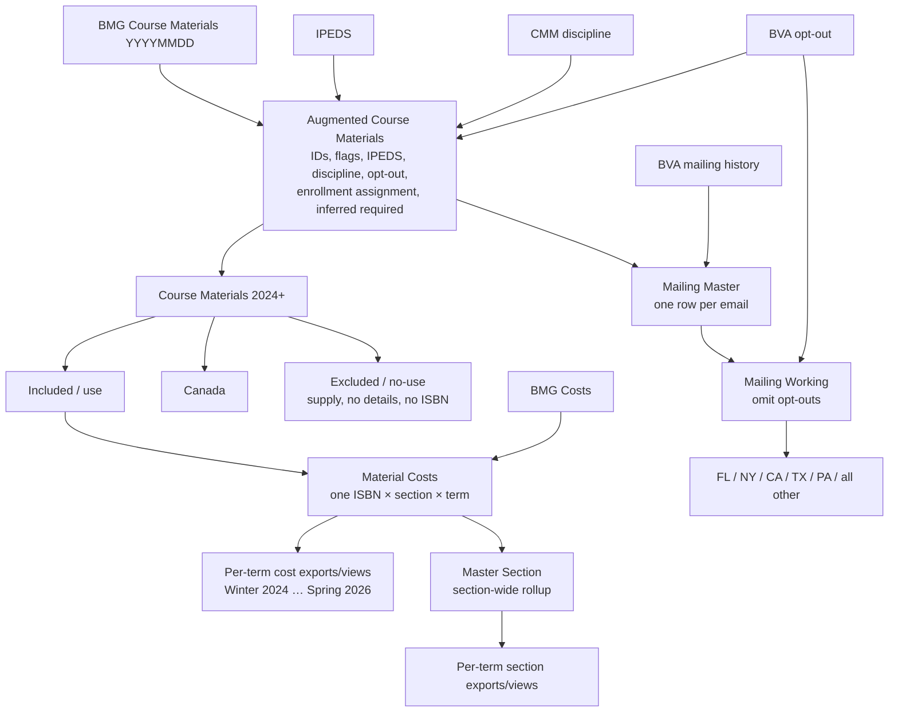

# Whiteboard data flow

## Sources written across the top

- `CMM - Supplies`
- `CMM - IA` with parenthetical notes that appear to say “institutional” and “ISBN”
- `CMM - external` with “Amazon +” beneath it
- “Keep History”
- `BMG course mat`
- `BMG costs`
- `IPEDS`
- `BVA opt-out`
- `CMM Discipline`
- `BVA Mailing History`
- `TEST 25 institutions`

The board also says: “Exports for each in full and sample 25 institutions.”

## Course-material path

`BMG CourseMat YYYYMMDD` is annotated as:

- one record per ISBN per section
- CMM flags (`is_XXX`, etc.)
- course/section IDs
- IPEDS enrichment
- discipline enrichment
- opt-out enrichment
- enrollment assignments
- required inferred

This produces `CourseMat`, then omits pre-2024 records to produce `CourseMat for 2024+`.

The 2024+ dataset is split into:

- `CM use post 24` when the exclusion conditions do not apply
- `CM noUse post 24` for supplies, Canada, no-details, or no-ISBN records

“Canada” is partially obscured in the photograph but agrees with the accompanying Word workflow, which calls for a separate Canada output and places all omitted records in the NoUse file.

## Cost and section paths

`CM use post 24` and BMG costs feed a cost-enrichment step annotated as:

- add all cost data
- new column: bookstore URL in pricing
- one record per ISBN per section

The resulting `Costs` dataset is divided by term for export/view, from `Costs Winter 24` through `Costs Spring 26`.

The same costs dataset rolls up to `Master Section` (described as “section-wide”), which is also divided by term. A note says additional columns are needed to explain the rolled-up columns.

## Mailing path

`Mailing Master` is combined with `BVA mailing history`, opt-outs are omitted, and `Mailing working` is split into:

- FL
- NY
- CA
- TX
- PA
- all other

## Normalized flow

