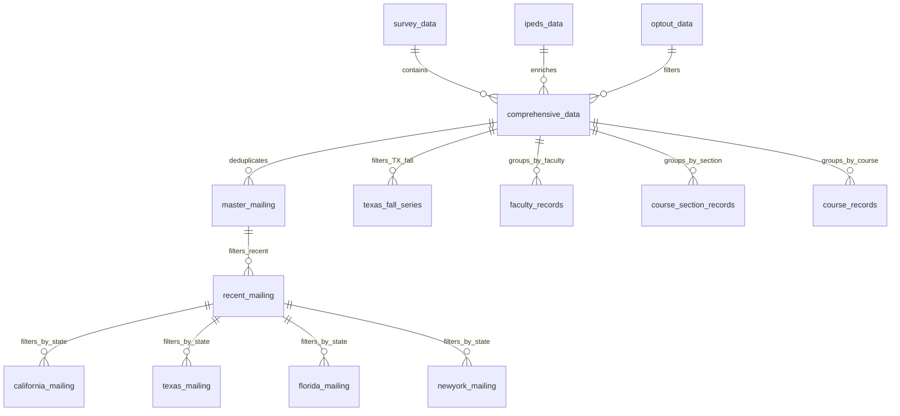
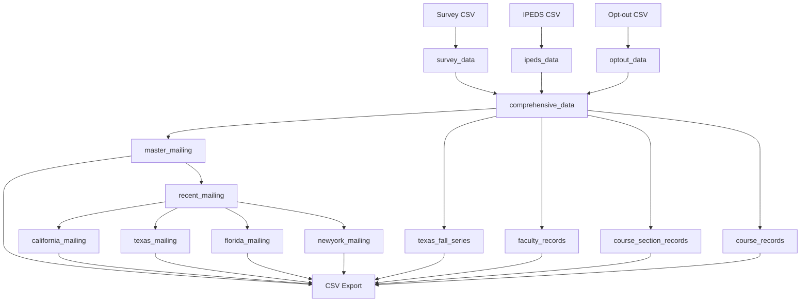

# Data Dictionary

## Overview
This document describes the database structure, including all tables, views, columns, and their relationships. The database is built using DuckDB and processes survey data combined with institutional (IPEDS) and opt-out information.

## Tables and Views

### Input Tables

#### survey_data
Primary table containing survey responses from instructors.
- **Source**: CSV file (`Bayview.YYYYMMDD.csv`)
- **Update Frequency**: Monthly
- **Key Fields**:
  - `"E-Mail"` (varchar): Instructor's email address
  - `"Instructor"` (varchar): Instructor's name
  - `"School"` (varchar): Institution name
  - `"Period"` (varchar): Academic period (e.g., "Fall 2023")
  - `"Enrollments"` (integer): Number of students enrolled
  - `"IPED ID"` (integer): Institution identifier for IPEDS data

#### ipeds_data
Institutional information from the IPEDS database.
- **Source**: CSV file (`hdic_dist_2022_selected.csv`)
- **Update Frequency**: Annually
- **Key Fields**:
  - `unitid` (integer): Unique institution identifier
  - `instnm` (varchar): Institution name
  - `sector` (varchar): Institution sector
  - `iclevel` (varchar): Institution level
  - `control` (varchar): Control type
  - `instsize` (varchar): Institution size category
  - `efydetot_tot_22` (integer): Total enrollment
  - `efyde_tot_22` (integer): Degree-seeking enrollment
  - `typeinst` (varchar): Institution type
  - `insttype` (varchar): Detailed institution type

#### optout_data
List of opted-out email addresses.
- **Source**: CSV file (`Master_optOut.csv`)
- **Update Frequency**: As needed
- **Key Fields**:
  - `Emails` (varchar): Email address
  - `Source` (varchar): Source of opt-out

### Views

#### comprehensive_data
Main view combining all data sources.
- **Generated By**: `0_setup.sql`
- **Purpose**: Primary data access point
- **Fields**: All survey fields plus:
  - IPEDS institutional information
  - Opt-out status (`is_opted_out`)
  - Opt-out source (`opt_out_source`)
  - Standardized period format (`period_sortable`)

#### master_mailing
Deduplicated mailing list.
- **Generated By**: `1_mailing_lists.sql`
- **Purpose**: Primary mailing list
- **Key Fields**: All fields from comprehensive_data
- **Deduplication Logic**:
  - Most recent period first
  - Largest enrollment next
  - Random selection for ties

#### recent_mailing
Filtered view showing the most recent 8 periods (approximately 2 years).
- **Generated By**: `1_mailing_lists.sql`
- **Purpose**: Recent trend analysis
- **Fields**: All master_mailing fields

#### State-Specific Mailing Lists
Four views for state-specific mailing lists:
- **california_mailing**: Records from California
- **texas_mailing**: Records from Texas
- **florida_mailing**: Records from Florida
- **newyork_mailing**: Records from New York
- **Generated By**: `1_mailing_lists.sql`
- **Purpose**: Regional analysis and targeted mailings
- **Fields**: All recent_mailing fields filtered by state

#### texas_fall_series
Time series of all Fall term records from Texas.
- **Generated By**: `1_mailing_lists.sql`
- **Purpose**: Longitudinal analysis of Texas data
- **Fields**: All comprehensive_data fields filtered for Texas and Fall terms

#### faculty_records
Consolidated faculty member records.
- **Generated By**: `2_merged_records.sql`
- **Purpose**: Faculty-level analysis
- **Key Fields**:
  - `faculty_id` (varchar): Unique identifier (email or name+school)
  - `"Instructor"` (varchar): Faculty name
  - `"School"` (varchar): Institution
  - `"E-Mail"` (varchar): Email address
  - `"Department"` (varchar): Department
  - `"State"` (varchar): State
  - `record_counts_by_period` (list): Count of records by period
  - `section_counts_by_period` (list): Count of unique sections by period

#### course_section_records
Unique course section records.
- **Generated By**: `2_merged_records.sql`
- **Purpose**: Section-level analysis
- **Key Fields**:
  - `"Course Number"` (varchar): Course identifier
  - `"Section"` (varchar): Section identifier
  - `"Course Title"` (varchar): Course name
  - `"School"` (varchar): Institution
  - `period_sortable` (varchar): Standardized period
  - `records_in_period` (integer): Count of records
  - `publishers` (list): List of publishers used

#### course_records
Consolidated course records (combining all sections).
- **Generated By**: `2_merged_records.sql`
- **Purpose**: Course-level analysis
- **Key Fields**:
  - `"Course Number"` (varchar): Course identifier
  - `"Course Title"` (varchar): Course name
  - `"School"` (varchar): Institution
  - `period_sortable` (varchar): Standardized period
  - `sections_in_period` (integer): Count of sections
  - `total_enrollment` (integer): Sum of enrollments
  - `publishers` (list): List of publishers used

## Relationships

## Data Flow

## Column Types and Constraints

### Common Data Types
- `varchar`: Text fields
- `integer`: Numeric fields
- `date`: Date fields
- `boolean`: True/false fields

### Key Constraints
1. Email addresses must be unique in master_mailing
2. Period format must be "[Season] [Year]" (e.g., "Fall 2023")
3. IPED ID must exist in ipeds_data for institutional information
4. All required fields must be non-null in master_mailing

## Data Quality Rules

1. **Email Validation**
   - Must be non-null
   - Must not be empty string
   - Must not be in opt-out list

2. **Period Validation**
   - Must be in format "[Season] [Year]"
   - Season must be one of: Winter, Spring, Summer, Fall
   - Year must be 4 digits between 1900 and 2100

3. **Institutional Data**
   - IPED ID must match existing institution
   - All required IPEDS fields must be present

4. **Opt-out Status**
   - Must be boolean (0 or 1)
   - Source must be non-null if opted out
