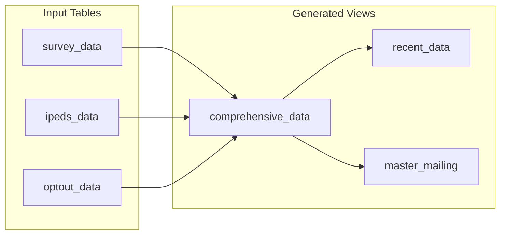
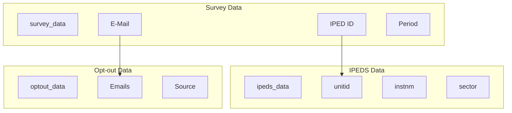
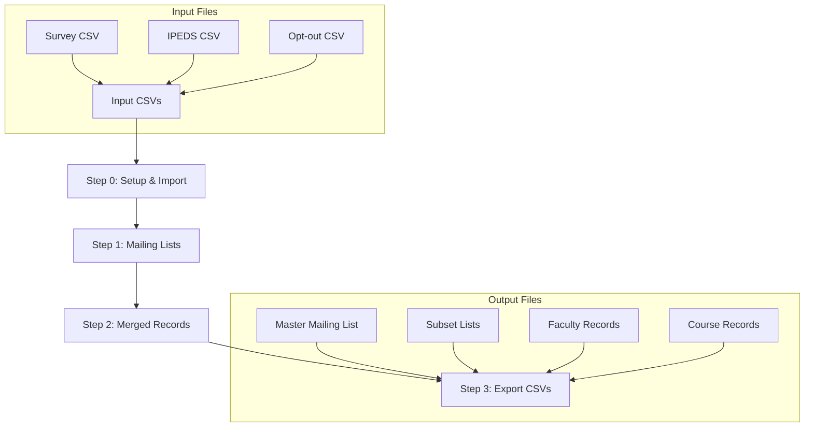
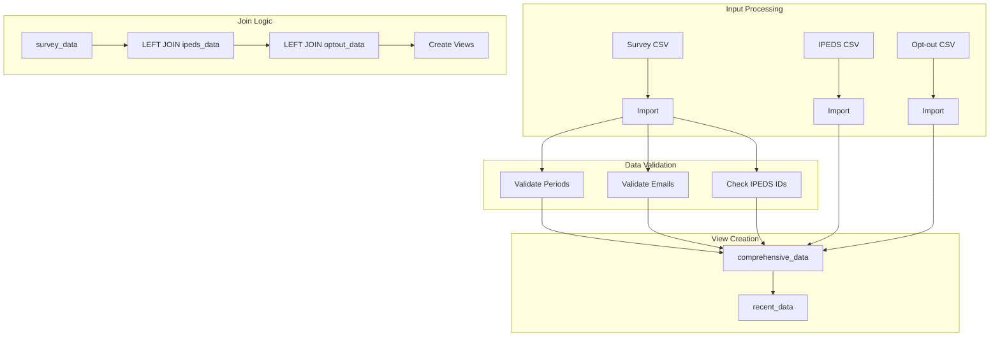
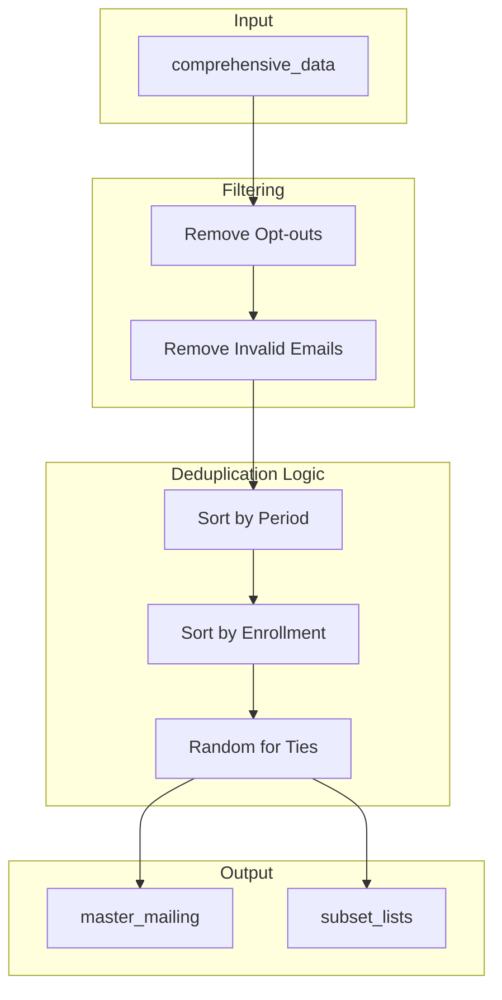
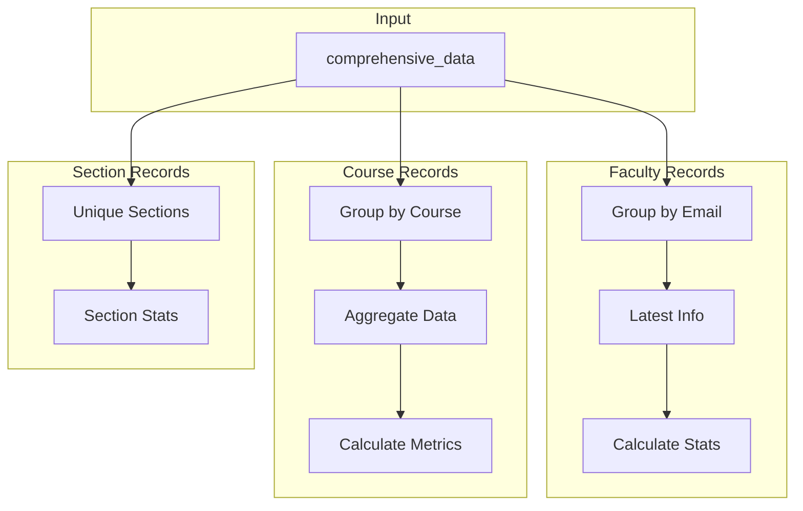
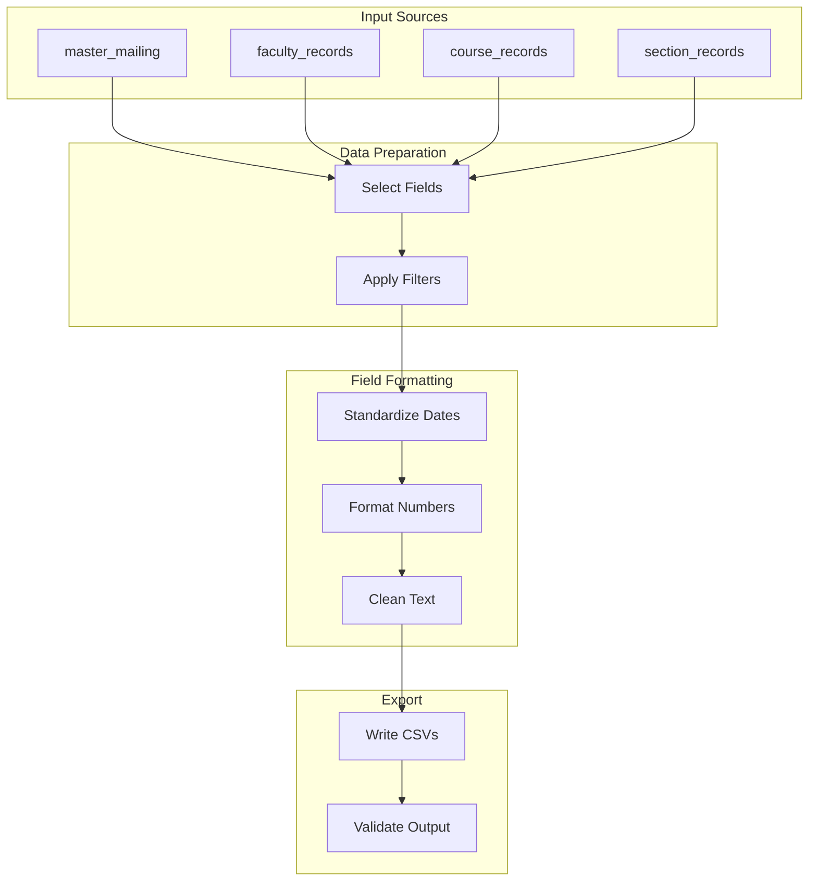

# Process Documentation

## Overview
This document describes the data processing pipeline that transforms raw survey data into actionable mailing lists and analysis-ready datasets. The process is implemented using DuckDB and shell scripts, with each step building upon the previous ones.

For detailed information about tables, columns, and relationships, see the [Data Dictionary](data_dictionary.md).

## Database Structure

### Core Tables and Relationships


### Join Relationships


## Overall Process Flow



## Step 0: Setup and Import

### Overview
This step initializes the database and imports all source data. It performs data validation and creates the foundation for all subsequent processing.

### Data Flow and Joins


### Key Operations
1. **Configuration**
   - Set up DuckDB with appropriate memory limits
   - Configure thread count for parallel processing

2. **Data Import**
   - Import survey data from CSV
   - Import IPEDS institutional data
   - Import opt-out list

3. **Data Validation**
   - Validate period formats
   - Check email addresses
   - Verify IPEDS IDs
   - Log invalid records

4. **View Creation**
   - Create comprehensive_data view
   - Create recent_data view
   - Create invalid_periods table

## Step 1: Mailing Lists

### Overview
This step creates the primary mailing lists by deduplicating records and applying opt-out filters.

### Data Flow and Deduplication


### Key Operations
1. **Record Filtering**
   - Remove opted-out records
   - Remove records with invalid emails
   - Apply any additional filters

2. **Deduplication**
   - Sort by recency (most recent first)
   - Sort by enrollment size
   - Use random selection for ties

3. **List Creation**
   - Create master mailing list
   - Create subset lists based on criteria

## Step 2: Merged Records

### Overview
This step creates consolidated records by faculty member and course, enabling analysis at different levels.

### Data Flow and Aggregation


### Key Operations
1. **Faculty Records**
   - Group records by email
   - Select latest information
   - Calculate faculty-level statistics

2. **Course Records**
   - Group by course identifier
   - Aggregate enrollment data
   - Calculate course-level metrics

3. **Section Records**
   - Create unique section records
   - Calculate section-level statistics

## Step 3: Export CSVs

### Overview
This step exports the processed data into CSV files for various uses.

### Data Flow and Export


### Key Operations
1. **Data Preparation**
   - Select required fields
   - Apply final filters
   - Sort records

2. **Field Formatting**
   - Standardize date formats
   - Format numeric fields
   - Clean text fields

3. **Export**
   - Write CSV files
   - Validate output files
   - Create checksums

## Running the Pipeline

### Command Line Usage
```bash
# Run entire pipeline
./scripts/run_all.sh [CSV_DATE]

# Run individual steps
./scripts/0_setup.sh [CSV_DATE]
./scripts/1_mailing_lists.sh
./scripts/2_merged_records.sh
./scripts/3_export_csv.sh
```

### Configuration
The pipeline is configured through the `dot.env` file. Key settings include:
- Database path
- CSV file paths
- Memory limits
- Thread count
- Debug settings

For detailed configuration options, see the [README](../README.md).

### Output Files
All output files are stored in the `output` directory:
- Mailing lists
- Merged records
- Export files
- Log files

For a complete list of output files and their formats, see the [Data Dictionary](data_dictionary.md). 